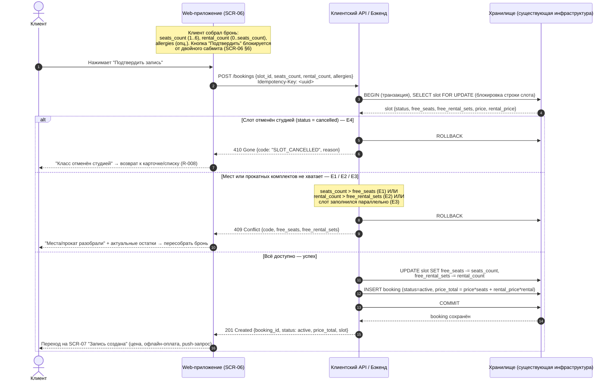
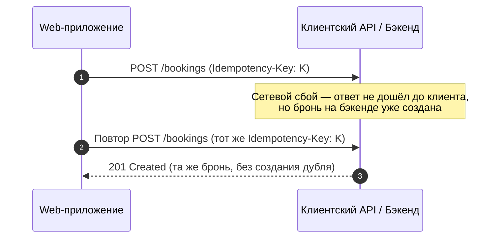

# Sequence-диаграмма: createBooking (201 / 409 / 410)

> Этап 3. Проектирование. Поток создания брони на класс с ветвлением по ответам бэкенда.
>
> **Скоуп — клиентское web-приложение «Шеф-стол» и API для него.** Атомарная проверка свободных
> мест и прокатного фонда, гарантия «0 двойных броней» и идемпотентность — на стороне **бэкенда**
> (black-box, NFR-4/R-004). Клиент собирает бронь и **корректно обрабатывает ответ** сервера.
>
> Источники: [UC-2](../2-requirements/use-cases.md) (осн. поток, A1, A2, E1–E4),
> [SCR-06](../3-design-brief/SCR-06_оформление-записи.md),
> [SCR-07](../3-design-brief/SCR-07_запись-создана.md), FR-6…FR-13, FR-18, NFR-4, NFR-10, R-004, R-008;
> [модель данных](data-model.md).

## Семантика ответов

| Код | Ветка | Когда | Реакция клиента (UI) |
| :-- | :-- | :-- | :-- |
| **201 Created** | Успех | Бэкенд атомарно списал места/прокат и создал бронь | Переход на **SCR-07** «Запись создана» с параметрами брони и итоговой ценой; запрос разрешения на push (FR-19) |
| **409 Conflict** | Конфликт ресурсов | Не хватает мест (E1), не хватает прокатных комплектов (E2) или слот заполнился параллельно / гонка (E3) — овербукинг предотвращён | Показать актуальные `free_seats` / `free_rental_sets` из ответа; предложить **пересобрать бронь** под свежие цифры (без двойной брони) |
| **410 Gone** | Ресурс недоступен | Слот отменён студией к моменту подтверждения (E4); повторная запись запрещена (R-008) | Объяснить, что класс отменён; увести к карточке/списку (SCR-05/SCR-03); CTA записи неактивна |

> Клиент никогда не пересчитывает лимиты локально и не «обещает место» до ответа сервера
> (SCR-06 §7). Все счётчики берутся из ответов API.

## Диаграмма последовательности

## Идемпотентность и защита от дублей

- **`Idempotency-Key`** привязан к клиенту и семантике запроса: повтор после сетевого сбоя
  возвращает **ту же** бронь, а не создаёт дубль (SCR-06 §7, R-004). Логика идемпотентности —
  на бэкенде; UI лишь не плодит параллельные запросы (блокировка кнопки на время отправки).
- **Защита от двойного сабмита** на клиенте обязательна: пока идёт запрос, повторное
  «Подтвердить» невозможно (SCR-06 §6, §7).

## Обработка ошибок в UI (сводка по веткам)

| Ответ | Экран/состояние | Что показываем | Куда ведём |
| :-- | :-- | :-- | :-- |
| 201 | SCR-07 | Бронь создана, итоговая цена, напоминание об офлайн-оплате и правиле 24 ч, запрос push | «Мои бронирования» (SCR-08) |
| 409 (E1) | SCR-06, состояние ошибки | «Мест не осталось столько» + актуальные `free_seats` | Остаться, уменьшить число мест |
| 409 (E2) | SCR-06, состояние ошибки | «Прокатных комплектов не хватает» + остаток; два выхода: меньше проката или «своя экипировка» | Остаться, пересобрать экипировку |
| 409 (E3) | SCR-06, состояние ошибки | «Места разобрали, пока вы оформляли» + свежие остатки | Остаться, пересобрать бронь |
| 410 (E4) | SCR-06 → SCR-05/SCR-03 | «Класс отменён студией», причина; повторная запись запрещена | Карточка класса / список |
| сеть/5xx | SCR-06, состояние ошибки | «Не удалось оформить запись, попробуйте ещё раз»; ничего не забронировано | Повтор (тот же Idempotency-Key) |
