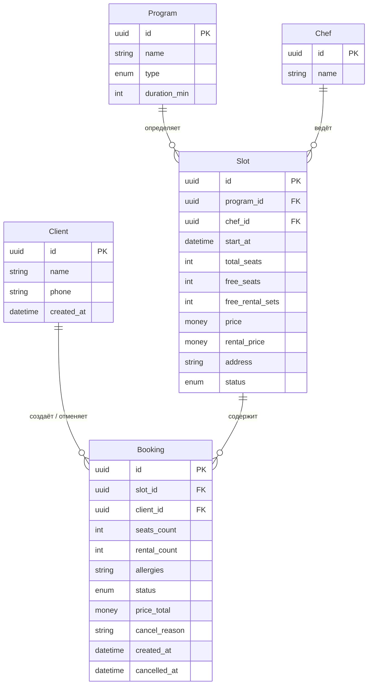
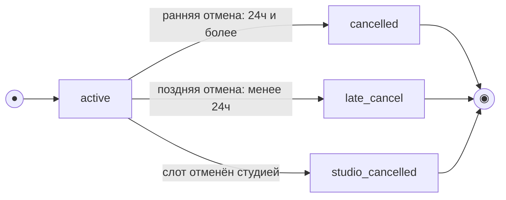
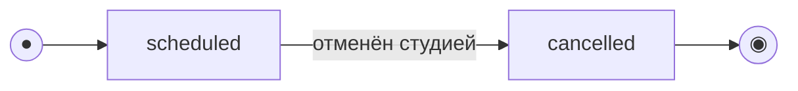

# Модель данных (ER-модель и описание сущностей)

> Этап 3. Проектирование. Описание сущностей, атрибутов и связей + ER-диаграмма.
>
> **Скоуп — клиентское web-приложение студии «Шеф-стол» и API для него.** Это **ресурсная
> модель API** (что клиент читает / создаёт / изменяет), а **не** схема БД: хранение, расписание
> и бизнес-логика принадлежат **существующей инфраструктуре** (домен → «Границы скоупа», R-004).
>
> - **Program, Chef, Slot** — read-only-проекция ресурсов существующего бэкенда: приходят через
>   API, клиент их **только читает**, не создаёт и не редактирует (FR-3…FR-5, NFR-8, NFR-10).
> - **Client, Booking** — ресурсы, которыми клиентский API **оперирует** (регистрация/вход и
>   бронирования): клиент их создаёт и изменяет в рамках своих прав (FR-1, FR-2, FR-6…FR-18).
> - Сущности оценок/рейтингов шефа — **Phase 2** (R-001), в модель MVP не входят.
> - **Данные существующей инфраструктуры (R-015).** Проект учебный/тестовый, легаси-данных нет:
>   эта модель считается **канонической** и совпадает с контрактом API. Миграция/backfill вне
>   скоупа — бэкенд по условию отдаёт ровно поля модели (домен → R-015).

## Что приложение читает, а что меняет

> Ключевое разделение из домена: расписание (классы, программы, шефы) формируется в существующей
> инфраструктуре и доступно клиенту **только для чтения**; клиент управляет лишь своей учётной
> записью и своими бронями.

| Сущность | Доступ клиента | Источник истины | Операции клиентского API |
| :-- | :-- | :-- | :-- |
| **Program** (Программа/меню) | **Только чтение** (read-only) | Существующая инфраструктура | Проекция в карточке слота |
| **Chef** (Шеф) | **Только чтение** (read-only) | Существующая инфраструктура | Проекция в карточке слота |
| **Slot** (Класс/слот) | **Только чтение** (read-only) | Существующая инфраструктура | `listSlots`, `getSlot` (счётчики мест/проката меняет бэкенд атомарно) |
| **Client** (Клиент) | **Чтение + изменение своего** | Клиентский API | `requestOtp`, `verifyOtp`, `getProfile` |
| **Booking** (Запись/бронь) | **Чтение + создание/отмена своих** | Клиентский API | `createBooking`, `listBookings`, `getBooking`, `cancelBooking` |

> `Slot.free_seats` и `Slot.free_rental_sets` формально «меняются» при бронировании/отмене, но
> клиент **их не пишет** — их пересчитывает **бэкенд атомарно** (гарантия «0 двойных броней»,
> NFR-4/R-004). Клиент лишь читает актуальные значения из ответов API и **не пересчитывает
> лимиты локально** (SCR-06 §7).

## Сущности и атрибуты

### Client (Клиент) — read/write (свой профиль)
| Атрибут | Тип | Описание |
| :-- | :-- | :-- |
| id | UUID (PK) | Идентификатор клиента |
| name | string | Имя (указывается при первом входе, FR-1) |
| phone | string (unique) | Номер телефона — логин; вход подтверждается одноразовым кодом (OTP), FR-2 |
| created_at | datetime | Дата регистрации |

> Вход/регистрация — по телефону с подтверждением кодом (OTP): телефон → код → имя для нового
> пользователя (UC-5, [SCR-01](../3-design-brief/SCR-01_вход-телефон.md),
> [SCR-02](../3-design-brief/SCR-02_подтверждение-otp.md)). Сам код OTP и его проверка — на стороне
> бэкенда, отдельной сущностью в модели **не хранится**. ПДн клиента защищены (NFR-7).

### Program (Программа / меню) — справочник, read-only
| Атрибут | Тип | Описание |
| :-- | :-- | :-- |
| id | UUID (PK) | Идентификатор программы |
| name | string | Название меню (например, «Простая итальянская кухня») |
| type | enum (`novice`/`experienced`) | Тип: новичковый / опытный (FR-4, FR-5) |
| duration_min | int | Длительность класса, мин (≈180, «около 3 часов») |

### Chef (Шеф) — справочник, read-only
| Атрибут | Тип | Описание |
| :-- | :-- | :-- |
| id | UUID (PK) | Идентификатор шефа |
| name | string | Имя шефа (справочные данные слота для клиента) |

### Slot (Класс / слот) — предзаполняется, read-only для клиента
| Атрибут | Тип | Описание |
| :-- | :-- | :-- |
| id | UUID (PK) | Идентификатор слота |
| program_id | FK → Program | Программа/меню класса |
| chef_id | FK → Chef | Назначенный шеф |
| start_at | datetime (UTC) | Дата и время старта в UTC (~3 ч); **источник истины — сервер**. Клиент показывает в локальной зоне студии, но право/тип отмены (правило 24 ч) вычисляет сервер |
| total_seats | int | Всего мест (в людях; ≤ вместимость стола 6) |
| free_seats | int | Свободно мест (денормализованное; пересчитывает бэкенд, FR-9) |
| free_rental_sets | int | Свободно прокатных комплектов на стол (0..6; учитывается **отдельно** от мест, FR-10) |
| price | money (RUB) | Цена за место |
| rental_price | money (RUB) | Тариф проката за один комплект (фартук + набор ножей); своя экипировка бесплатна (домен → R-015) |
| address | string | Адрес студии (FR-5) |
| status | enum (`scheduled`/`cancelled`) | Статус слота; `cancelled` — отменён студией (R-008) |

> Понятие «стол» — единица учёта на бэкенде (12 столов × до 6 человек). Клиент **не выбирает стол**:
> одна бронь помещается в пределах одного стола, лимиты (`min(free_seats, 6)` мест и до 6 прокатных
> комплектов на стол) обеспечивает бэкенд (SCR-06 §3, §7). Отдельной клиентской сущности `Table` в
> модели нет.

### Booking (Запись / бронь) — read/write (свои брони клиента)
| Атрибут | Тип | Описание |
| :-- | :-- | :-- |
| id | UUID (PK) | Идентификатор записи |
| slot_id | FK → Slot | Слот, на который сделана бронь |
| client_id | FK → Client | Кто записал (владелец брони) |
| seats_count | int | Число мест в записи (1..6: себя + до 5 гостей, в пределах одного стола). Только агрегат, без сущности `BookingSeat` (FR-8) |
| rental_count | int | Сколько из мест — на прокатной экипировке (0..seats_count); своя экипировка занимает место, но не прокатный фонд (FR-10) |
| allergies | string? (nullable) | Аллергии — **одно опциональное поле на всю бронь**; передаётся шефу через бэкенд (FR-12) |
| status | enum (`active`/`cancelled`/`late_cancel`/`studio_cancelled`) | Статус записи (см. модель состояний) |
| price_total | money (RUB), read-only | Итоговая цена, рассчитанная **сервером**: `price × seats_count + rental_price × rental_count`; клиент показывает как есть и не пересчитывает; оплата офлайн (FR-13) |
| cancel_reason | string? (nullable) | Причина отмены студией — заполняется при `studio_cancelled` (R-008, FR-18) |
| created_at | datetime | Время создания |
| cancelled_at | datetime? (nullable) | Время отмены (если была) |

> По гостям хранятся **только** агрегаты `seats_count` и `rental_count` — отдельной сущности по
> каждому гостю (имя/контакты/экипировка построчно) **нет** (FR-8). Разбивка экипировки выводится
> из `rental_count` (прокат) и `seats_count − rental_count` (своя).
>
> **«Прошедшая» — не хранимый статус.** Признак «прошедшая» — производное отображение по
> `Slot.start_at` в прошлом, а не значение `Booking.status`. Отменённые и поздние отмены из истории
> «Мои бронирования» не исчезают (FR-14, FR-18).

## ER-диаграмма

> **Легенда read-only / read-write.** `Program`, `Chef`, `Slot` — read-only-проекция существующей
> инфраструктуры (клиент читает); `Client`, `Booking` — управляются клиентским API (клиент создаёт
> и изменяет **только своё**, NFR-8).

## Модель состояний (жизненный цикл)

> Явный жизненный цикл имеют **Booking** (управляется клиентским API) и **Slot** (read-only-проекция;
> переходы делает существующая инфраструктура, клиент только читает статус). «Прошедшая» у обеих —
> **производное** по `Slot.start_at`, а не значение enum.

### Booking (Запись / бронь)

`status ∈ {active, cancelled, late_cancel, studio_cancelled}`. Создаётся в `active`; отмена —
терминальный переход (повторная отмена не выполняется, UC-3 E2). Ранняя/поздняя отмена определяется
**сервером** по времени до старта: граница «ровно за 24 часа» трактуется как **ранняя** (`≥ 24 ч`,
FR-16). При отмене слота студией (`Slot.status → cancelled`) связанные брони переходят в
`studio_cancelled` — «Отменён студией» — с причиной, не по инициативе клиента (R-008, FR-18).

| Из | Событие / условие | В | Эффект на слот | Трасса |
| :-- | :-- | :-- | :-- | :-- |
| — | Клиент подтверждает бронь | `active` | `free_seats −= seats_count`; `free_rental_sets −= rental_count` (атомарно на бэкенде) | UC-2, FR-6, FR-10 |
| `active` | Отмена, до старта `≥ 24 ч` | `cancelled` | Места и прокатные комплекты **возвращаются** в слот/фонд | UC-3, FR-16 |
| `active` | Отмена, до старта `< 24 ч` | `late_cancel` | Место и прокатный комплект **НЕ освобождаются**, штрафов нет | UC-3 A1, FR-17 |
| `active` | Слот отменён студией (`Slot.status → cancelled`) | `studio_cancelled` | Слот снят; клиент уведомляется (push), повторная запись запрещена | R-008, FR-18 |
| `cancelled` / `late_cancel` / `studio_cancelled` | — (терминальные) | — | Повторная отмена не выполняется | UC-3 E2 |

> Отмена возможна только пока класс не начался (`start_at` в будущем) — после старта CTA недоступна
> (UC-3 E1). Отметка явки/неявки — вне скоупа клиента (существующая инфраструктура).

### Slot (Класс / слот)

`status ∈ {scheduled, cancelled}` — read-only для клиента. Переход в `cancelled` инициирует студия
в существующей инфраструктуре (срыв поставки / поломка оборудования); массовое уведомление — вне
скоупа клиента. Клиент видит статус и реагирует в UI: при `cancelled` запись недоступна (UC-4, R-008).

| Статус | Что видит клиент | Запись |
| :-- | :-- | :-- |
| `scheduled` (старт в будущем) | Слот в списке/карточке; при `free_seats = 0` — «Мест нет» | Доступна при `free_seats > 0` |
| `scheduled` (старт в прошлом) — *производное «Прошедший»* | Не предлагается к записи | Недоступна |
| `cancelled` | «Класс отменён студией» + причина | Недоступна; повторная запись запрещена (R-008) |

## Ключевые инварианты (целостность данных)

- `Slot.free_seats = Slot.total_seats − Σ(seats_count по active + late_cancel броням)` — место при поздней отмене НЕ освобождается (FR-17).
- `Slot.free_rental_sets = исходный прокатный фонд стола − Σ(rental_count по active + late_cancel броням)`; прокатный фонд ограничен **на стол** — до 6 комплектов (FR-10). Прокат при поздней отмене тоже НЕ освобождается.
- `1 ≤ seats_count ≤ min(free_seats, 6)`; `0 ≤ rental_count ≤ seats_count` (FR-8, FR-9, FR-10).
- Учёт мест и прокатного фонда **раздельный**: возможна валидная ситуация «места есть, проката нет» (SCR-06 §7, E2).
- Только **ранняя** отмена (`≥ 24 ч`) возвращает места и прокатные комплекты (`cancelled`); `late_cancel` удерживает и место, и комплект (FR-16/FR-17).
- Запись/отмена выполняются **атомарно на бэкенде**: овербукинг и двойная бронь исключены при параллельных операциях; гарантия «0 двойных броней» — на стороне бэкенда (NFR-4, R-004).
- Клиент видит и изменяет **только свои** брони и профиль; доступ к чужим бронированиям запрещён (NFR-8).

## Связь с sequence-диаграммой

Поток создания брони (`createBooking`) с ветками ответов `201 / 409 / 410` вынесен в
[createBooking-sequence.md](createBooking-sequence.md).
