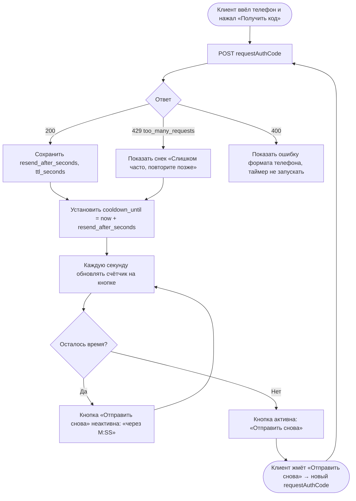

# Таймер повторной отправки OTP

**ID:** LOGIC-001  
**Тип:** Логика  
**Домен:** 09. Логики  
**Приоритет:** High  
**Функциональные блоки:** FB-AUTH-001 (запрос кода), FB-AUTH-002 (таймер повторной отправки)

---

## История изменений

| Релиз | ТЗ | Описание изменений |
|-------|-----|-------------------|
| — | — | Первоначальная документация |

---

## Входные данные

| Название | Тип | Возможные значения | Описание |
|----------|-----|-------------------|----------|
| `resend_after_seconds` | Состояние (из ответа `requestAuthCode`) | `60` (по умолчанию) | Сколько секунд нельзя повторно запрашивать код |
| `ttl_seconds` | Состояние (из ответа `requestAuthCode`) | `300` (по умолчанию) | Срок жизни кода (для подсказки на SCR-02) |
| `cooldown_until` | Состояние (клиент) | `timestamp` | Момент, до которого кнопка «Отправить снова» заблокирована |

---

## Обзор

Логика управляет обратным отсчётом до повторной отправки OTP-кода. После успешного `requestAuthCode` кнопка «Отправить снова» блокируется на `resend_after_seconds` секунд и показывает обратный отсчёт («Отправить снова через 0:59»). По истечении таймера кнопка снова активна. Логика также обрабатывает ответ `429 too_many_requests` (частые запросы) и восстанавливает таймер при возврате на экран.

Значения `resend_after_seconds` и `ttl_seconds` берутся **из ответа сервера**, а не хардкодятся, чтобы бэкенд мог менять политику без релиза клиента.

### User Story

> Как клиент, который не получил SMS с кодом,
> я хочу видеть, через сколько секунд можно запросить код повторно, и запросить его,
> чтобы войти в приложение, не упираясь в молчаливую блокировку.

### Бизнес-ценность

- Снижает расходы на SMS и защищает от перебора номеров (лимит отправок).
- Уменьшает недоумение клиента: он видит, что запрос принят и когда можно повторить.
- Соответствует границе входа с минимальным трением (NFR-3).

---

## Точки применения

| Экран/Компонент | Элемент/Триггер | Условие |
|-----------------|-----------------|---------|
| [SCR-01 Вход по телефону](../SCR-01_вход-телефон.md) | Кнопка «Получить код» → запуск таймера | После успешного `requestAuthCode` |
| [SCR-02 Подтверждение OTP](../SCR-02_подтверждение-otp.md) | Кнопка «Отправить снова» | Пока `cooldown_until` не наступил — заблокирована |

---

## Флоу

---

## Описание логики

### Шаг 1: Запуск таймера после запроса кода

После успешного `requestAuthCode` (200) клиент сохраняет `resend_after_seconds` и `ttl_seconds` из тела ответа и вычисляет `cooldown_until = now + resend_after_seconds`. Кнопка «Отправить снова» переводится в неактивное состояние.

### Шаг 2: Обратный отсчёт

Раз в секунду обновляется подпись кнопки в формате `M:SS` (например, «Отправить снова через 0:47»). Отсчёт ведётся от `cooldown_until − now`, а не декрементом переменной, — чтобы таймер оставался корректным при потере фокуса вкладки/переходе между SCR-01 и SCR-02.

### Шаг 3: Разблокировка

Когда `now ≥ cooldown_until`, счётчик убирается, кнопка становится активной, подпись — «Отправить снова».

### Шаг 4: Обработка 429

Если сервер вернул `429 too_many_requests` (превышен лимит отправок с номера/устройства), показывается снек и таймер перезапускается на `resend_after_seconds` (либо на значение из заголовка `Retry-After`, если он больше). Демо-код из ответа при этом не показывается.

### Шаг 5: Восстановление при возврате на экран

`cooldown_until` хранится в состоянии сессии входа, поэтому при переходе SCR-01 ↔ SCR-02 и повторном рендере таймер продолжается с корректной точки, а не сбрасывается.

---

## API запросы

### POST /auth/request-code — `requestAuthCode`

**Операция:** [`../../api/auth/api.yaml`](../../api/auth/api.yaml) → `requestAuthCode`

**Триггер:** Нажатие «Получить код» (SCR-01) или «Отправить снова» (SCR-02).

**Headers:**

| Поле | Описание |
|------|----------|
| `Content-Type` | `application/json` |

*Авторизация не требуется (`security: []`).*

**Параметры/Body:**

| Параметр | Тип | Описание | Значение/Источник |
|----------|-----|----------|-------------------|
| `phone` | string (E.164) | Номер телефона клиента | Поле ввода на SCR-01 |

**Обработка ответа:**

| Результат | Действие |
|-----------|----------|
| Загрузка | Кнопка → спиннер, повторные нажатия заблокированы |
| Успех (200) | Сохранить `ttl_seconds`, `resend_after_seconds`; запустить таймер; перейти на SCR-02 |
| Ошибка 400 | Показать ошибку под полем телефона; таймер не запускать |
| Ошибка 429 | Снек «Слишком много запросов. Повторите позже»; перезапустить таймер |
| Ошибка 5xx | Снек «Произошла ошибка. Попробуйте позже» |
| Ошибка сети | Снек «Нет соединения. Проверьте подключение к интернету» |

---

## Связанные требования

### Функциональные (FR-*)

| ID | Название | Приоритет |
|----|----------|-----------|
| [FR-2](../../2-requirements/functional-requirements.md) | Авторизация по телефону с подтверждением OTP | Must |

### Нефункциональные (NFR-*)

| ID | Название | Приоритет |
|----|----------|-----------|
| [NFR-3](../../2-requirements/non-functional-requirements.md) | Лёгкий вход по телефону + OTP без паролей | Высокий |
| [NFR-7](../../2-requirements/non-functional-requirements.md) | Защита персональных данных клиента | Высокий |

### Use cases / User stories

| ID | Название |
|----|----------|
| [UC-5](../../2-requirements/use-cases.md) | Вход по номеру телефона (OTP), альт. поток A1 «Повторная отправка кода» |

---

## Критерии приёмки

| ID | Критерий |
|----|----------|
| AC-001 | **Дано** успешный ответ `requestAuthCode` с `resend_after_seconds=60`, **Когда** открыт SCR-02, **Тогда** кнопка «Отправить снова» неактивна и показывает обратный отсчёт от «0:59» до «0:00». |
| AC-002 | **Дано** истёкший таймер (`now ≥ cooldown_until`), **Когда** клиент смотрит на SCR-02, **Тогда** кнопка «Отправить снова» активна без счётчика. |
| AC-003 | **Дано** активный таймер, **Когда** клиент повторно вызывает отправку и сервер возвращает `429`, **Тогда** показывается снек о частых запросах и таймер перезапускается, демо-код не отображается. |
| AC-004 | **Дано** запущенный таймер, **Когда** клиент переходит с SCR-02 обратно на SCR-01 и снова на SCR-02, **Тогда** отсчёт продолжается с актуального значения, а не сбрасывается. |

---

## Обработка ошибок

| Тип ошибки | Контекст | Действие |
|------------|----------|----------|
| `429 too_many_requests` | Повторный запрос кода | Снек + перезапуск таймера на `resend_after_seconds`/`Retry-After` |
| `400 bad_request` | Неверный формат телефона | Ошибка под полем, таймер не запускается |
| Сетевая ошибка | Нет соединения | Снек, кнопка остаётся в исходном состоянии для повтора |
