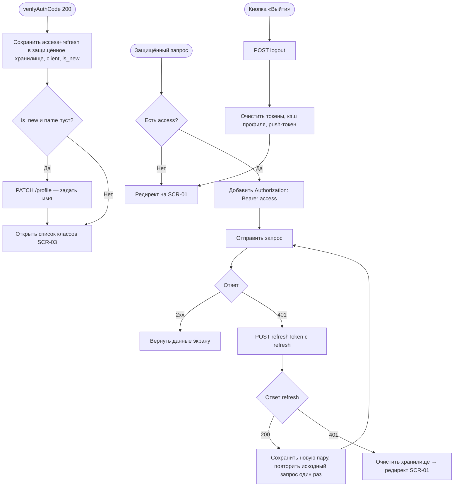

# Сессия и авторизация

**ID:** LOGIC-002  
**Тип:** Логика  
**Домен:** 09. Логики  
**Приоритет:** Critical  
**Функциональные блоки:** FB-AUTH-003 (хранение токенов), FB-AUTH-004 (silent refresh), FB-AUTH-005 (route guard), FB-AUTH-006 (выход)

---

## История изменений

| Релиз | ТЗ | Описание изменений |
|-------|-----|-------------------|
| — | — | Первоначальная документация |

---

## Входные данные

| Название | Тип | Возможные значения | Описание |
|----------|-----|-------------------|----------|
| `access_token` | Защищённое хранилище | JWT-строка | Токен доступа для заголовка `Authorization` |
| `refresh_token` | Защищённое хранилище | строка | Токен обновления пары (ротируется) |
| `access_expires_at` | Состояние | timestamp | Момент истечения access (из `expires_in`) |
| `client` | Кэш | объект `Client` | Профиль текущего клиента, `is_new` |

---

## Обзор

Логика описывает жизненный цикл сессии клиента: сохранение пары токенов после `verifyAuthCode`, подстановку `Authorization: Bearer <access>` во все защищённые запросы, «тихое» обновление пары при `401` через `refreshToken` с ротацией, охрану маршрутов (редирект неавторизованного на SCR-01) и выход (`logout` + очистка хранилища).

Ключевая инвариант-часть: refresh-токен **ротируется** — каждый успешный `refreshToken` возвращает новую пару, старый refresh становится недействительным. Истёкший/использованный/отозванный refresh → `401`, что означает завершение сессии и редирект на вход.

### User Story

> Как авторизованный клиент,
> я хочу оставаться в приложении без повторных вводов кода, пока моя сессия жива,
> чтобы спокойно просматривать классы и бронировать, а при истечении сессии — понятно вернуться ко входу.

### Бизнес-ценность

- Минимальное трение: клиент не вводит OTP на каждый запрос (NFR-3).
- Безопасное хранение и передача персональных данных и токенов (NFR-7).
- Разграничение доступа: без валидного токена нет доступа к чужим/защищённым данным (NFR-8).

---

## Точки применения

| Экран/Компонент | Элемент/Триггер | Условие |
|-----------------|-----------------|---------|
| Все экраны за авторизацией (SCR-03…SCR-10) | HTTP-клиент подставляет `Authorization` | Всегда для защищённых запросов |
| [SCR-02 Подтверждение OTP](../SCR-02_подтверждение-otp.md) | Успешный `verifyAuthCode` → сохранение сессии | После ввода кода |
| Любой защищённый маршрут | Route guard | Нет валидной сессии → редирект на [SCR-01](../SCR-01_вход-телефон.md) |
| [SCR-10 Профиль](../SCR-10_профиль.md) | Кнопка «Выйти» | По нажатию |

---

## Флоу

---

## Описание логики

### Шаг 1: Сохранение сессии

После `verifyAuthCode` (200) сохраняются `tokens.access`, `tokens.refresh`, вычисляется `access_expires_at = now + tokens.expires_in`, кэшируется `client`. Если `is_new=true` и `client.name` пуст — клиент направляется на дозаполнение имени (`updateProfile`, PATCH /profile) перед входом в основной поток (FR-1).

### Шаг 2: Подстановка заголовка Authorization

Единый HTTP-клиент (интерсептор) добавляет `Authorization: Bearer <access_token>` во все запросы к защищённым операциям. Публичные операции входа (`requestAuthCode`, `verifyAuthCode`, `refreshToken`) отправляются без него.

### Шаг 3: Silent refresh при 401

При ответе `401` на защищённый запрос клиент однократно вызывает `refreshToken` с текущим refresh. При успехе сохраняется **новая** пара (ротация), а исходный запрос повторяется один раз с новым access. Параллельные `401` объединяются в один refresh (single-flight), чтобы не гонять несколько обновлений одновременно.

### Шаг 4: Завершение сессии

Если `refreshToken` вернул `401` (refresh истёк, отозван или уже использован) — сессия считается завершённой: хранилище токенов и кэш очищаются, выполняется редирект на SCR-01. Повторный refresh не выполняется во избежание циклов.

### Шаг 5: Route guard

Перед открытием любого защищённого маршрута проверяется наличие сессии. Нет токенов → редирект на SCR-01 с сохранением целевого маршрута для возврата после входа.

### Шаг 6: Выход

По нажатию «Выйти» вызывается `logout` (инвалидация refresh на сервере, 204), удаляется push-токен (см. [LOGIC-009](LOGIC-009_регистрация-push-токена.md)), очищается защищённое хранилище и кэш, выполняется редирект на SCR-01. Даже при ошибке `logout` локальная очистка выполняется всегда.

---

## API запросы

### POST /auth/verify-code — `verifyAuthCode`

**Операция:** [`../../api/auth/api.yaml`](../../api/auth/api.yaml) → `verifyAuthCode`

**Триггер:** Ввод OTP-кода на SCR-02.

**Параметры/Body:**

| Параметр | Тип | Описание | Значение/Источник |
|----------|-----|----------|-------------------|
| `phone` | string (E.164) | Номер телефона | Из шага SCR-01 |
| `code` | string | Введённый код | Поле ввода SCR-02 |

**Обработка ответа:**

| Результат | Действие |
|-----------|----------|
| Успех (200) | Сохранить `tokens`, `client`, `is_new`; при `is_new` → дозаполнить имя |
| Ошибка 400 (`invalid_code`) | Показать «Неверный код», поле активно для повтора |
| Ошибка 429 | Снек о частых попытках |

### POST /auth/refresh — `refreshToken`

**Операция:** [`../../api/auth/api.yaml`](../../api/auth/api.yaml) → `refreshToken`

**Триггер:** Ответ `401` на защищённый запрос.

**Параметры/Body:**

| Параметр | Тип | Описание | Значение/Источник |
|----------|-----|----------|-------------------|
| `refresh_token` | string | Текущий refresh | Защищённое хранилище |

**Обработка ответа:**

| Результат | Действие |
|-----------|----------|
| Успех (200) | Сохранить новую пару (ротация), повторить исходный запрос один раз |
| Ошибка 401 | Завершить сессию: очистить хранилище, редирект на SCR-01 |

### POST /auth/logout — `logout`

**Операция:** [`../../api/auth/api.yaml`](../../api/auth/api.yaml) → `logout`

**Триггер:** Кнопка «Выйти» на SCR-10.

**Headers:**

| Поле | Описание |
|------|----------|
| `Authorization` | Bearer access-токен текущего клиента |

**Обработка ответа:**

| Результат | Действие |
|-----------|----------|
| Успех (204) | Локально очистить токены/кэш, редирект на SCR-01 |
| Ошибка (любая) | Всё равно очистить локально и выполнить редирект |

---

## Локальное хранение

| Ключ | Тип хранения | Описание |
|------|--------------|----------|
| `access_token` | Защищённое хранилище | Токен доступа для заголовка `Authorization` |
| `refresh_token` | Защищённое хранилище | Токен обновления пары (ротируется) |
| `access_expires_at` | Локальный кэш | Момент истечения access (из `expires_in`) |
| `client` | Локальный кэш | Профиль текущего клиента |

---

## Связанные требования

### Функциональные (FR-*)

| ID | Название | Приоритет |
|----|----------|-----------|
| [FR-1](../../2-requirements/functional-requirements.md) | Лёгкая регистрация/вход (имя + телефон) | Must |
| [FR-2](../../2-requirements/functional-requirements.md) | Авторизация по телефону + OTP | Must |
| [FR-20](../../2-requirements/functional-requirements.md) | Просмотр данных профиля | Should |

### Нефункциональные (NFR-*)

| ID | Название | Приоритет |
|----|----------|-----------|
| [NFR-7](../../2-requirements/non-functional-requirements.md) | Безопасное хранение и передача персональных данных | Высокий |
| [NFR-8](../../2-requirements/non-functional-requirements.md) | Клиент видит и управляет только своими данными | Высокий |

### Use cases / User stories

| ID | Название |
|----|----------|
| [UC-5](../../2-requirements/use-cases.md) | Вход по номеру телефона (OTP) |

---

## Критерии приёмки

| ID | Критерий |
|----|----------|
| AC-001 | **Дано** успешный `verifyAuthCode`, **Когда** пара токенов сохранена, **Тогда** последующие защищённые запросы содержат `Authorization: Bearer <access>`. |
| AC-002 | **Дано** протухший access и валидный refresh, **Когда** защищённый запрос возвращает `401`, **Тогда** выполняется один `refreshToken`, пара ротируется и исходный запрос повторяется прозрачно для клиента. |
| AC-003 | **Дано** истёкший/использованный refresh, **Когда** `refreshToken` возвращает `401`, **Тогда** хранилище очищается и клиент редиректится на SCR-01. |
| AC-004 | **Дано** неавторизованный пользователь, **Когда** он открывает защищённый маршрут, **Тогда** он редиректится на SCR-01. |
| AC-005 | **Дано** клиент на SCR-10, **Когда** он нажимает «Выйти», **Тогда** вызывается `logout`, push-токен удаляется, локальное хранилище очищается и открывается SCR-01 (даже если `logout` завершился ошибкой). |

---

## Обработка ошибок

| Тип ошибки | Контекст | Действие |
|------------|----------|----------|
| `401` на защищённый запрос | Протух access | Silent refresh + повтор запроса один раз |
| `401` на `refreshToken` | Refresh недействителен | Завершить сессию, редирект на SCR-01 |
| Ошибка `logout` | Выход | Локальная очистка + редирект выполняются всегда |
| Параллельные `401` | Несколько запросов сразу | Один общий refresh (single-flight), остальные ждут результат |
