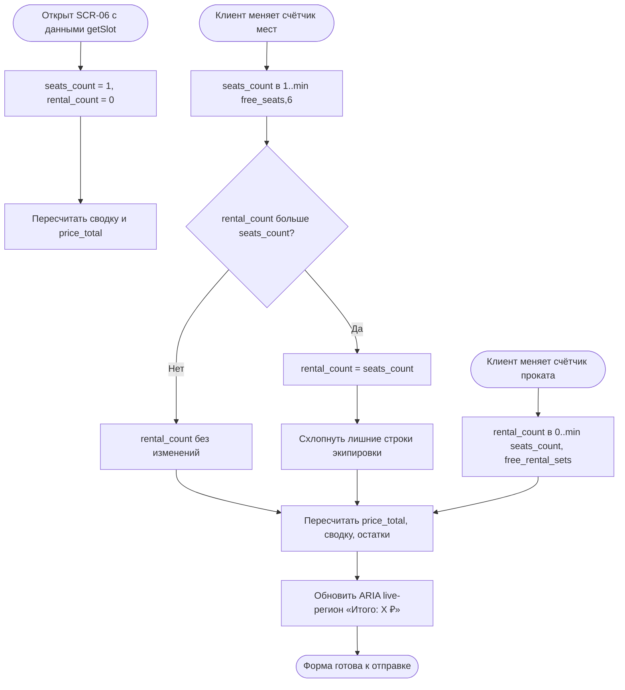

# Живой пересчёт брони

**ID:** LOGIC-003  
**Тип:** Логика  
**Домен:** 09. Логики  
**Приоритет:** High  
**Функциональные блоки:** FB-BOOK-001 (счётчик мест), FB-BOOK-002 (счётчик проката), FB-BOOK-003 (пересчёт цены и остатков)

---

## История изменений

| Релиз | ТЗ | Описание изменений |
|-------|-----|-------------------|
| — | — | Первоначальная документация |

---

## Входные данные

| Название | Тип | Возможные значения | Описание |
|----------|-----|-------------------|----------|
| `free_seats` | Состояние (из `getSlot`) | целое ≥ 0 | Свободные места слота |
| `free_rental_sets` | Состояние (из `getSlot`) | целое ≥ 0 | Свободные прокатные комплекты на стол |
| `price` | Состояние (из `getSlot`) | число | Цена одного места |
| `rental_price` | Состояние (из `getSlot`) | число | Цена одного прокатного комплекта |
| `seats_count` | Состояние (клиент) | `1..min(free_seats,6)` | Выбранное число мест |
| `rental_count` | Состояние (клиент) | `0..min(seats_count,free_rental_sets)` | Число прокатных комплектов |

---

## Обзор

Логика выполняет **клиентский** живой пересчёт формы записи на SCR-06 без обращения к API: ограничивает счётчик мест диапазоном `1..min(free_seats, 6)`, счётчик проката — `0..min(seats_count, free_rental_sets)`, и в реальном времени пересчитывает `price_total`, сводку («Мест: N, из них прокат: M») и остатки. При уменьшении числа мест «лишние» строки экипировки схлопываются, а `rental_count` при необходимости уменьшается, чтобы не превышать `seats_count`.

Своя экипировка занимает место, но **не** занимает прокатный комплект: `rental_count` — это только «прокатные» места из общего `seats_count`.

Все данные для расчёта берутся из ранее загруженного `getSlot`; сама валидация лимитов на бэкенде происходит при отправке (см. [LOGIC-004](LOGIC-004_идемпотентное-создание-брони.md)).

### User Story

> Как клиент, оформляющий запись на себя и гостей,
> я хочу сразу видеть итоговую цену и допустимые лимиты мест и проката,
> чтобы собрать корректную бронь без ошибок и сюрпризов при подтверждении.

### Бизнес-ценность

- Прозрачность цены до подтверждения (FR-13) — меньше отказов на последнем шаге.
- Раздельный учёт мест и проката снижает число отклонённых бронирований (FR-9, FR-10).
- Мгновенная обратная связь повышает удобство самостоятельной записи (NFR-2).

---

## Точки применения

| Экран/Компонент | Элемент/Триггер | Условие |
|-----------------|-----------------|---------|
| [SCR-06 Оформление записи](../SCR-06_оформление-записи.md) | Счётчики мест и проката, блок «Итого» | При каждом изменении счётчиков |

---

## Флоу

---

## Описание логики

### Шаг 1: Инициализация

При открытии SCR-06 из `getSlot` берутся `free_seats`, `free_rental_sets`, `price`, `rental_price`. Начальные значения: `seats_count = 1`, `rental_count = 0`. Верхняя граница мест — `seatsMax = min(free_seats, 6)`.

### Шаг 2: Изменение числа мест

`seats_count` ограничивается диапазоном `1..seatsMax`. Кнопки «+»/«−» блокируются на границах. Если после уменьшения `rental_count > seats_count`, то `rental_count` понижается до `seats_count`, а лишние строки выбора экипировки схлопываются (визуально убираются места, которых больше нет).

### Шаг 3: Изменение числа проката

`rental_count` ограничивается диапазоном `0..min(seats_count, free_rental_sets)`. Если свободных комплектов меньше, чем мест, — верхняя граница проката ниже числа мест, а остаток мест трактуется как «своя экипировка».

### Шаг 4: Пересчёт цены и сводки

`price_total = price · seats_count + rental_price · rental_count`. Сводка показывает число мест, число прокатных комплектов, число мест «со своей экипировкой» = `seats_count − rental_count`, и остатки: «Свободно мест: `free_seats`», «Прокат свободно: `free_rental_sets`».

### Шаг 5: Доступность

Пересчитанный итог помещается в контейнер с `aria-live="polite"` (ARIA live-регион), чтобы скринридер озвучивал изменение суммы и числа мест при работе со счётчиками (NFR-2, доступность).

---

## API запросы

> Логика не выполняет собственных запросов. Все исходные данные берутся из ранее выполненного `getSlot` ([`../../api/slots/api.yaml`](../../api/slots/api.yaml) → `getSlot`). Отправка формы описана в [LOGIC-004](LOGIC-004_идемпотентное-создание-брони.md).

---

## Связанные требования

### Функциональные (FR-*)

| ID | Название | Приоритет |
|----|----------|-----------|
| [FR-7](../../2-requirements/functional-requirements.md) | Выбор экипировки: своя / прокатная | Must |
| [FR-8](../../2-requirements/functional-requirements.md) | До 6 человек одной бронью (себя + до 5 гостей) | Must |
| [FR-9](../../2-requirements/functional-requirements.md) | Лимит мест `min(free_seats, 6)` | Must |
| [FR-10](../../2-requirements/functional-requirements.md) | Отдельный учёт прокатного фонда на стол | Must |
| [FR-13](../../2-requirements/functional-requirements.md) | Показ цены (оплата офлайн) | Must |

### Нефункциональные (NFR-*)

| ID | Название | Приоритет |
|----|----------|-----------|
| [NFR-2](../../2-requirements/non-functional-requirements.md) | Понятный интерфейс без обучения | Высокий |

### Use cases / User stories

| ID | Название |
|----|----------|
| [UC-2](../../2-requirements/use-cases.md) | Запись на класс (себя и гостей), шаги 2–4, A1/A2 |

---

## Критерии приёмки

| ID | Критерий |
|----|----------|
| AC-001 | **Дано** слот с `free_seats=4`, **Когда** клиент увеличивает число мест, **Тогда** счётчик не превышает `min(4,6)=4`, а кнопка «+» блокируется на границе. |
| AC-002 | **Дано** `seats_count=3, rental_count=3`, **Когда** клиент уменьшает места до 2, **Тогда** `rental_count` автоматически становится 2, а лишняя строка экипировки схлопывается. |
| AC-003 | **Дано** `price=2000, rental_price=500, seats_count=2, rental_count=1`, **Когда** значения заданы, **Тогда** `price_total = 2000·2 + 500·1 = 4500 ₽` и это значение видно в блоке «Итого». |
| AC-004 | **Дано** `free_rental_sets=1, seats_count=3`, **Когда** клиент увеличивает прокат, **Тогда** `rental_count` ограничен 1, а остальные 2 места считаются «своя экипировка». |
| AC-005 | **Дано** активный скринридер, **Когда** меняется число мест или проката, **Тогда** ARIA live-регион озвучивает обновлённый итог. |
