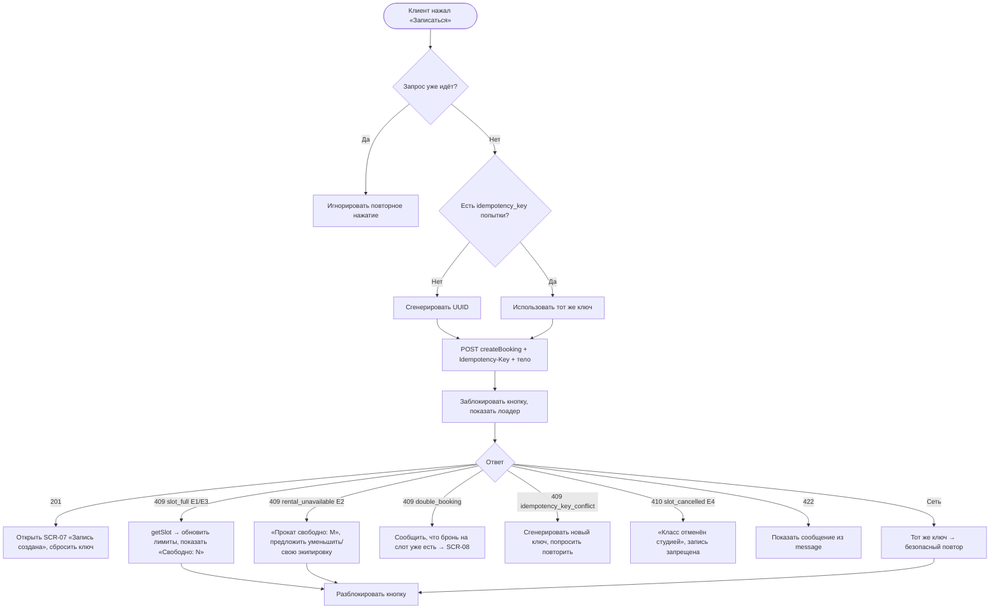

# Идемпотентное создание брони

**ID:** LOGIC-004  
**Тип:** Логика  
**Домен:** 09. Логики  
**Приоритет:** Critical  
**Функциональные блоки:** FB-BOOK-004 (генерация Idempotency-Key), FB-BOOK-005 (защита от двойной отправки), FB-BOOK-006 (маппинг ответов и ошибок)

---

## История изменений

| Релиз | ТЗ | Описание изменений |
|-------|-----|-------------------|
| — | — | Первоначальная документация |

---

## Входные данные

| Название | Тип | Возможные значения | Описание |
|----------|-----|-------------------|----------|
| `idempotency_key` | Состояние (клиент) | UUID | Ключ идемпотентности текущей попытки записи |
| `slot_id` | Состояние | UUID | Слот, на который оформляется бронь |
| `seats_count` | Состояние | `1..min(free_seats,6)` | Число мест (из LOGIC-003) |
| `rental_count` | Состояние | `0..seats_count` | Число прокатных комплектов |
| `allergies` | Состояние | строка/пусто | Аллергии одним полем на бронь (опц., FR-12) |

---

## Обзор

Логика обеспечивает **безопасное создание брони** на SCR-06: генерирует `Idempotency-Key` (UUID), отправляет `createBooking` с этим заголовком, защищает от двойной отправки (блокировка кнопки + один активный запрос на ключ), и корректно маппит все исходы: `201` (успех/повтор того же ключа+тела), `409` (`slot_full`, `rental_unavailable`, `double_booking`, `idempotency_key_conflict`), `410` (`slot_cancelled`), `422`. Для динамических сообщений («Свободно: N мест» / «Прокат свободно: M») используются `details.available_seats` / `details.available_rental_sets`. При исчерпании мест (E1/E3) слот перезагружается через `getSlot`, чтобы форма показала актуальные лимиты.

Один и тот же `Idempotency-Key` сохраняется на всё время попытки (в т.ч. при ретраях после сетевого сбоя) и меняется только при осознанном формировании новой брони.

### User Story

> Как клиент, подтверждающий запись при нестабильной сети,
> я хочу быть уверенным, что повторная отправка не создаст дубль брони,
> а понятная ошибка подскажет, сколько мест реально осталось.

### Бизнес-ценность

- Исключение двойных броней и овербукинга — главная боль заказчика (NFR-4, R-004).
- Безопасный ретрай после сетевого сбоя без дублей (идемпотентность, R-004).
- Понятные динамические сообщения об остатках снижают фрустрацию (UC-2 E1/E2).

---

## Точки применения

| Экран/Компонент | Элемент/Триггер | Условие |
|-----------------|-----------------|---------|
| [SCR-06 Оформление записи](../SCR-06_оформление-записи.md) | Кнопка «Записаться» | По подтверждению записи |

---

## Флоу

---

## Описание логики

### Шаг 1: Генерация Idempotency-Key

При первом нажатии «Записаться» генерируется UUID и сохраняется как ключ текущей попытки. При ретраях (сетевой сбой, повтор) используется **тот же** ключ — это гарантирует, что бэкенд вернёт результат ранее созданной брони, а не создаст дубль.

### Шаг 2: Защита от двойной отправки

Пока запрос в полёте, кнопка «Записаться» заблокирована и показывает лоадер; повторные нажатия игнорируются (одновременно допускается только один активный `createBooking` на ключ).

### Шаг 3: Формирование тела

Тело: `slot_id`, `seats_count`, `rental_count`, `allergies` (опц.). Значения берутся из формы после живого пересчёта (LOGIC-003). Тело для одного ключа должно быть стабильным — изменение состава = новая бронь = новый ключ.

### Шаг 4: Маппинг ответов

- **201** — бронь создана; переход на SCR-07, ключ сбрасывается. Повтор с тем же ключом и телом вернёт тот же `201` (идемпотентность).
- **409 `slot_full`** (E1/E3) — мест не хватило (в т.ч. гонка запросов). Показать «Свободно: `details.available_seats` мест», перезагрузить слот `getSlot` и обновить лимиты формы.
- **409 `rental_unavailable`** (E2) — не хватает прокатных комплектов. Показать «Прокат свободно: `details.available_rental_sets`», предложить уменьшить `rental_count` или выбрать «свою экипировку».
- **409 `double_booking`** — на этот слот уже есть активная бронь клиента; предложить перейти в «Мои бронирования» (SCR-08).
- **409 `idempotency_key_conflict`** — тот же ключ отправлен с другим телом; сгенерировать новый ключ и попросить повторить.
- **410 `slot_cancelled`** (E4) — слот отменён студией; запись запрещена (R-008), кнопка отключается.
- **422** — операция невозможна по бизнес-правилу; показать `message`.

### Шаг 5: Обновление слота при исчерпании мест

При `slot_full` (E1/E3) выполняется `getSlot`, чтобы форма и счётчики LOGIC-003 отобразили фактические `free_seats`/`free_rental_sets` — клиент видит реальную картину, а не устаревшую.

---

## API запросы

### POST /bookings — `createBooking`

**Операция:** [`../../api/bookings/api.yaml`](../../api/bookings/api.yaml) → `createBooking`

**Триггер:** Нажатие «Записаться» на SCR-06.

**Headers:**

| Поле | Описание |
|------|----------|
| `Authorization` | Bearer access-токен текущего клиента |
| `Idempotency-Key` | UUID попытки; повтор с тем же ключом+телом → тот же `201` |
| `Content-Type` | `application/json` |

**Параметры/Body:**

| Параметр | Тип | Описание | Значение/Источник |
|----------|-----|----------|-------------------|
| `slot_id` | uuid | Слот записи | Контекст SCR-06 |
| `seats_count` | int (1..6) | Число мест | LOGIC-003 |
| `rental_count` | int (0..seats_count) | Прокатные комплекты | LOGIC-003 |
| `allergies` | string (опц.) | Аллергии на всю бронь | Поле формы |

**Обработка ответа:**

| Результат | Действие |
|-----------|----------|
| Загрузка | Лоадер на кнопке, блокировка повторного нажатия |
| Успех (201) | Переход на SCR-07, сброс ключа |
| 409 `slot_full` | «Свободно: N мест» из `details.available_seats`, вызвать `getSlot` |
| 409 `rental_unavailable` | «Прокат свободно: M» из `details.available_rental_sets` |
| 409 `double_booking` | Сообщить о существующей брони, ссылка на SCR-08 |
| 409 `idempotency_key_conflict` | Новый ключ, попросить повторить |
| 410 `slot_cancelled` | «Класс отменён студией», отключить запись |
| 422 | Показать `message` |
| 5xx | Снек «Произошла ошибка. Попробуйте позже» (можно повторить тем же ключом) |
| Ошибка сети | Снек «Нет соединения»; повтор безопасен с тем же ключом |

### GET /slots/{slotId} — `getSlot`

**Операция:** [`../../api/slots/api.yaml`](../../api/slots/api.yaml) → `getSlot`

**Триггер:** Ошибка `slot_full` (E1/E3) — обновить актуальные лимиты слота.

**Обработка ответа:**

| Результат | Действие |
|-----------|----------|
| Успех (200) | Обновить `free_seats`/`free_rental_sets`, пересчитать форму (LOGIC-003) |
| 404 | Слот исчез — сообщить и вернуть в список классов |

---

## Локальное хранение

| Ключ | Тип хранения | Описание |
|------|--------------|----------|
| `booking_idempotency_key` | Локальный кэш (на время попытки) | UUID текущей попытки записи для безопасного ретрая |

---

## Связанные требования

### Функциональные (FR-*)

| ID | Название | Приоритет |
|----|----------|-----------|
| [FR-6](../../2-requirements/functional-requirements.md) | Запись на слот в пределах свободных мест | Must |
| [FR-11](../../2-requirements/functional-requirements.md) | Запрет превышения лимитов, без двойной брони/овербукинга | Must |
| [FR-12](../../2-requirements/functional-requirements.md) | Аллергии одним полем на бронь | Must |
| [FR-18](../../2-requirements/functional-requirements.md) | Запрет записи на отменённый студией слот | Must |

### Нефункциональные (NFR-*)

| ID | Название | Приоритет |
|----|----------|-----------|
| [NFR-4](../../2-requirements/non-functional-requirements.md) | Отсутствие двойных броней и овербукинга | Высокий (Must) |
| [NFR-10](../../2-requirements/non-functional-requirements.md) | Корректная обработка отказа бэкенда | Высокий |

### Use cases / User stories

| ID | Название |
|----|----------|
| [UC-2](../../2-requirements/use-cases.md) | Запись на класс, исключения E1/E2/E3/E4 |

---

## Критерии приёмки

| ID | Критерий |
|----|----------|
| AC-001 | **Дано** заполненная форма записи, **Когда** клиент нажимает «Записаться», **Тогда** отправляется `createBooking` с заголовком `Idempotency-Key` (UUID) и кнопка блокируется до ответа. |
| AC-002 | **Дано** сетевой сбой после отправки, **Когда** клиент повторяет запись, **Тогда** используется тот же `Idempotency-Key` и сервер возвращает тот же `201` без создания дубля. |
| AC-003 | **Дано** ответ `409 slot_full` с `details.available_seats=2`, **Когда** он получен, **Тогда** показывается «Свободно: 2 места» и слот перезагружается через `getSlot`. |
| AC-004 | **Дано** ответ `409 rental_unavailable` с `details.available_rental_sets=1`, **Когда** он получен, **Тогда** показывается «Прокат свободно: 1» с предложением уменьшить прокат или выбрать свою экипировку. |
| AC-005 | **Дано** ответ `410 slot_cancelled`, **Когда** он получен, **Тогда** показывается «Класс отменён студией» и повторная запись запрещена. |
| AC-006 | **Дано** повтор того же ключа с изменённым телом, **Когда** сервер возвращает `409 idempotency_key_conflict`, **Тогда** генерируется новый ключ и клиенту предлагается повторить. |

---

## Обработка ошибок

| Тип ошибки | Контекст | Действие |
|------------|----------|----------|
| `409 slot_full` (E1/E3) | Мест не хватило / гонка | Сообщение из `details.available_seats` + `getSlot` |
| `409 rental_unavailable` (E2) | Не хватает проката | Сообщение из `details.available_rental_sets` |
| `409 double_booking` | Бронь уже есть | Ссылка на SCR-08 |
| `409 idempotency_key_conflict` | Ключ + другое тело | Новый ключ, повтор |
| `410 slot_cancelled` (E4) | Слот отменён студией | Запрет записи |
| Сетевая ошибка | Нестабильная сеть | Повтор с тем же ключом (идемпотентно) |
