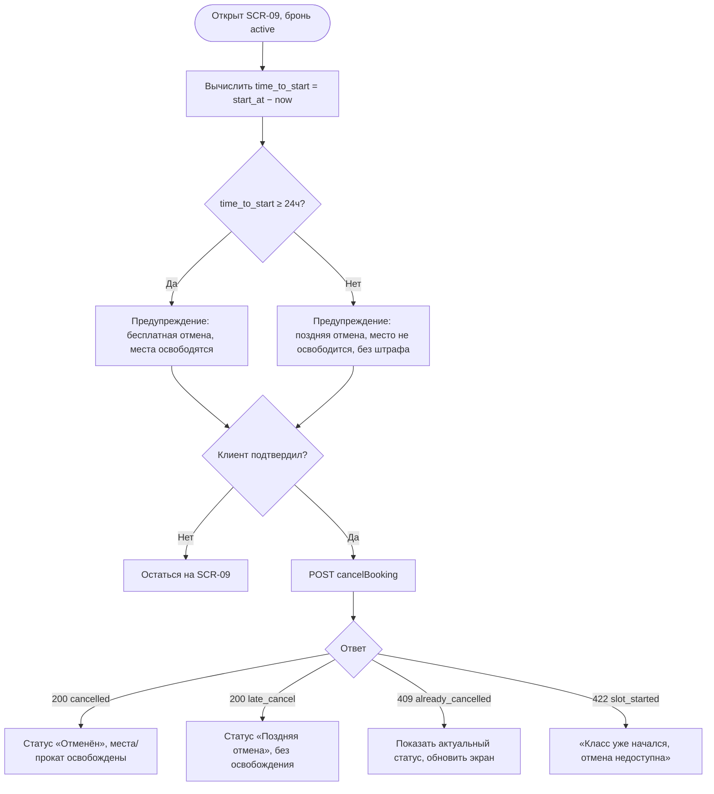

# Правило отмены 24 часа

**ID:** LOGIC-005  
**Тип:** Логика  
**Домен:** 09. Логики  
**Приоритет:** High  
**Функциональные блоки:** FB-CANCEL-001 (расчёт времени до старта), FB-CANCEL-002 (предупреждение и подтверждение), FB-CANCEL-003 (маппинг ответов отмены)

---

## История изменений

| Релиз | ТЗ | Описание изменений |
|-------|-----|-------------------|
| — | — | Первоначальная документация |

---

## Входные данные

| Название | Тип | Возможные значения | Описание |
|----------|-----|-------------------|----------|
| `slot.start_at` | Состояние (из брони) | date-time | Время старта класса |
| `booking.status` | Состояние | `active` / … | Текущий статус брони |
| `now` | Состояние | timestamp | Текущее время клиента (для предпросмотра типа отмены) |

---

## Обзор

Логика управляет отменой брони на SCR-09. Клиент отменяет бронь **только целиком**. До отправки клиент оценивает время до старта (`start_at − now`) и показывает соответствующее предупреждение: при `≥24 ч` — «бесплатная отмена, места освободятся», при `<24 ч` — «поздняя отмена: место не освобождается, без штрафа». После подтверждения вызывается `cancelBooking`.

**Источник истины — сервер:** окончательный тип отмены определяет бэкенд по времени до старта (граница ровно 24 ч трактуется как ранняя). Клиентский расчёт используется только для предупреждения; финальный статус берётся из ответа (`cancelled` / `late_cancel`).

### User Story

> Как клиент, планы которого изменились,
> я хочу отменить запись и заранее понимать, освободится ли место и не будет ли штрафа,
> чтобы принять осознанное решение до подтверждения.

### Бизнес-ценность

- Прозрачная политика отмен снижает конфликты и неявки (FR-16, FR-17).
- Ранняя отмена возвращает места и прокат другим клиентам (NFR-5).
- Отсутствие денежных штрафов при поздней отмене — по договорённости с заказчиком.

---

## Точки применения

| Экран/Компонент | Элемент/Триггер | Условие |
|-----------------|-----------------|---------|
| [SCR-09 Детали брони / отмена](../SCR-09_детали-брони-отмена.md) | Кнопка «Отменить запись» | Бронь `active` и слот ещё не стартовал |

---

## Флоу

---

## Описание логики

### Шаг 1: Расчёт времени до старта (предпросмотр)

`time_to_start = slot.start_at − now`. Если `time_to_start ≥ 24 ч` — предполагается ранняя (бесплатная) отмена; если `< 24 ч` — поздняя. Граница ровно 24 ч — ранняя (включительно). Это только предупреждение для клиента; финальное решение — за сервером.

### Шаг 2: Предупреждение и подтверждение

Показывается диалог подтверждения с пояснением последствий:
- Ранняя: «Отмена бесплатна, места и прокат вернутся в слот».
- Поздняя: «До старта меньше 24 часов: место не освобождается, но штрафов нет».

Отмена возможна только целиком (частичная не поддерживается, FR-15).

### Шаг 3: Вызов cancelBooking

После подтверждения вызывается `cancelBooking`. Кнопка блокируется на время запроса.

### Шаг 4: Маппинг ответа

- **200 `cancelled`** — ранняя отмена: места и прокатные комплекты освобождены (FR-16); показать статус «Отменён», заполнить `cancelled_at`.
- **200 `late_cancel`** — поздняя отмена: без освобождения, без штрафа (FR-17); показать статус «Поздняя отмена».
- **409 `already_cancelled`** — бронь уже отменена; обновить экран текущим статусом, повтор не выполнять.
- **422 `slot_started`** — класс уже начался; отмена недоступна, кнопку скрыть/отключить.

### Шаг 5: Синхронизация экрана

После любого финального ответа данные брони обновляются, а группировка в списке (см. [LOGIC-006](LOGIC-006_группировка-броней.md)) и бейдж статуса пересчитываются.

---

## API запросы

### POST /bookings/{bookingId}/cancel — `cancelBooking`

**Операция:** [`../../api/bookings/api.yaml`](../../api/bookings/api.yaml) → `cancelBooking`

**Триггер:** Подтверждение отмены на SCR-09.

**Headers:**

| Поле | Описание |
|------|----------|
| `Authorization` | Bearer access-токен текущего клиента |

**Параметры/Body:**

| Параметр | Тип | Описание | Значение/Источник |
|----------|-----|----------|-------------------|
| `bookingId` | uuid (path) | Идентификатор брони | Контекст SCR-09 |

**Обработка ответа:**

| Результат | Действие |
|-----------|----------|
| Загрузка | Лоадер на кнопке, блокировка повторного нажатия |
| 200 `cancelled` | Статус «Отменён»; места/прокат освобождены; показать подтверждение |
| 200 `late_cancel` | Статус «Поздняя отмена»; без освобождения; пояснение политики |
| 409 `already_cancelled` | Обновить экран текущим статусом |
| 422 `slot_started` | «Класс уже начался, отмена недоступна» |
| 403 | «Доступ запрещён» (чужая бронь, NFR-8) |
| 5xx | Снек «Произошла ошибка. Попробуйте позже» |
| Ошибка сети | Снек «Нет соединения. Проверьте подключение к интернету» |

---

## Связанные требования

### Функциональные (FR-*)

| ID | Название | Приоритет |
|----|----------|-----------|
| [FR-15](../../2-requirements/functional-requirements.md) | Отмена записи целиком до старта | Must |
| [FR-16](../../2-requirements/functional-requirements.md) | Ранняя отмена (≥24 ч) освобождает места и прокат | Must |
| [FR-17](../../2-requirements/functional-requirements.md) | Поздняя отмена (<24 ч) без освобождения и штрафа | Must |

### Нефункциональные (NFR-*)

| ID | Название | Приоритет |
|----|----------|-----------|
| [NFR-5](../../2-requirements/non-functional-requirements.md) | Согласованность мест и прокатного фонда при отменах | Высокий |
| [NFR-8](../../2-requirements/non-functional-requirements.md) | Доступ только к своим бронированиям | Высокий |

### Use cases / User stories

| ID | Название |
|----|----------|
| [UC-3](../../2-requirements/use-cases.md) | Отмена записи, A1 (поздняя), E1/E2 |

---

## Критерии приёмки

| ID | Критерий |
|----|----------|
| AC-001 | **Дано** бронь с `start_at` через 30 ч, **Когда** клиент открывает отмену, **Тогда** показывается предупреждение о бесплатной отмене с освобождением мест. |
| AC-002 | **Дано** бронь со стартом через 10 ч, **Когда** клиент открывает отмену, **Тогда** показывается предупреждение о поздней отмене без освобождения и без штрафа. |
| AC-003 | **Дано** подтверждённая ранняя отмена, **Когда** сервер возвращает `200 cancelled`, **Тогда** статус брони становится «Отменён», а места и прокат освобождаются. |
| AC-004 | **Дано** уже отменённая бронь, **Когда** клиент повторно подтверждает отмену и сервер возвращает `409 already_cancelled`, **Тогда** экран обновляется текущим статусом без повторного действия. |
| AC-005 | **Дано** слот, который уже начался, **Когда** сервер возвращает `422 slot_started`, **Тогда** показывается «Класс уже начался, отмена недоступна». |

---

## Обработка ошибок

| Тип ошибки | Контекст | Действие |
|------------|----------|----------|
| `409 already_cancelled` | Повторная отмена | Обновить статус, не повторять |
| `422 slot_started` | Слот стартовал | Скрыть/отключить кнопку отмены |
| `403 forbidden` | Чужая бронь | «Доступ запрещён» |
| Сетевая ошибка | Нет соединения | Снек, кнопка доступна для повтора |
