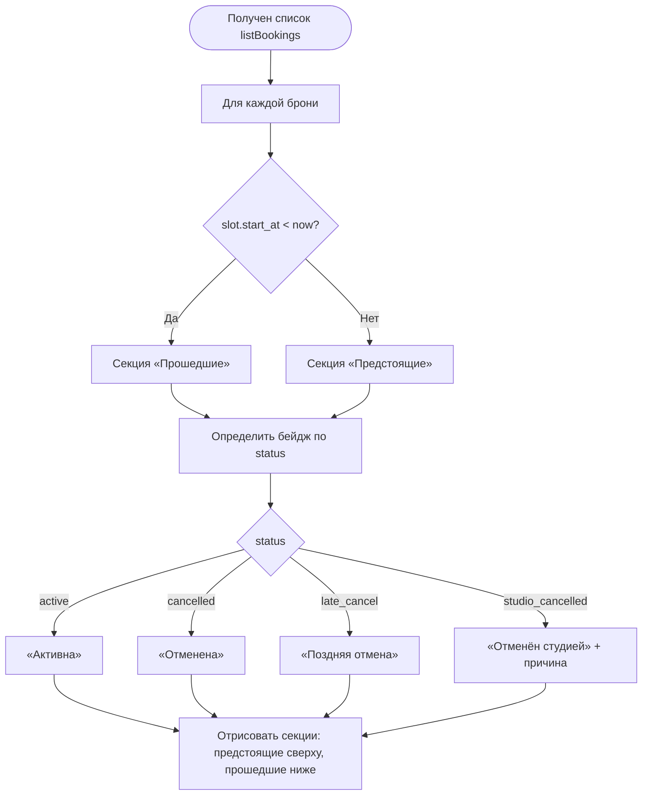

# Группировка броней

**ID:** LOGIC-006  
**Тип:** Логика  
**Домен:** 09. Логики  
**Приоритет:** Medium  
**Функциональные блоки:** FB-BOOK-007 (деление предстоящие/прошедшие), FB-BOOK-008 (маппинг статусов в бейджи)

---

## История изменений

| Релиз | ТЗ | Описание изменений |
|-------|-----|-------------------|
| — | — | Первоначальная документация |

---

## Входные данные

| Название | Тип | Возможные значения | Описание |
|----------|-----|-------------------|----------|
| `bookings[]` | Состояние (из `listBookings`) | список броней | Брони клиента с вложенным `slot.start_at` и `status` |
| `now` | Состояние | timestamp | Текущее время клиента для деления предстоящие/прошедшие |

---

## Обзор

Логика — **клиентская** обработка списка «Мои бронирования» (SCR-08) без обращения к API. Она делит брони на «Предстоящие» и «Прошедшие» по признаку «Прошедший», который **выводится из `slot.start_at`** (не хранится отдельным статусом): бронь прошедшая, если `slot.start_at < now`. Также логика маппит статус брони (`active` / `cancelled` / `late_cancel` / `studio_cancelled`) в бейдж с понятной подписью и оформлением.

Список приходит отсортированным по `slot.start_at` по убыванию; отменённые и поздние отмены остаются видимыми в истории (FR-14, FR-18).

### User Story

> Как клиент,
> я хочу видеть свои записи разделёнными на предстоящие и прошедшие с понятными статусами,
> чтобы быстро находить актуальные брони и историю участия.

### Бизнес-ценность

- Удобная навигация по бронированиям (NFR-2), быстрый доступ к предстоящим.
- Сохранение истории (в т.ч. отмен и отмен студией) повышает прозрачность (FR-14, FR-18).
- Единый маппинг статусов исключает разночтения между экранами.

---

## Точки применения

| Экран/Компонент | Элемент/Триггер | Условие |
|-----------------|-----------------|---------|
| [SCR-08 Мои бронирования](../SCR-08_мои-бронирования.md) | Формирование секций и бейджей | При загрузке/обновлении списка |
| [SCR-09 Детали брони / отмена](../SCR-09_детали-брони-отмена.md) | Бейдж статуса, признак «прошедший» | При открытии деталей |

---

## Флоу

---

## Описание логики

### Шаг 1: Определение признака «Прошедший»

Для каждой брони вычисляется `is_past = slot.start_at < now`. Признак не хранится в данных — он выводится динамически при рендере, поэтому корректен без обновления с сервера.

### Шаг 2: Деление на секции

Брони с `is_past = false` → секция «Предстоящие» (сортировка по `start_at` по возрастанию для удобства — ближайшие сверху); с `is_past = true` → секция «Прошедшие» (по убыванию — недавние сверху). Исходный список приходит по убыванию `start_at`; при необходимости предстоящие переупорядочиваются по возрастанию на клиенте.

### Шаг 3: Маппинг статуса в бейдж

| `status` | Подпись бейджа | Оформление |
|----------|----------------|------------|
| `active` | «Активна» | Акцентный/успех |
| `cancelled` | «Отменена» | Нейтральный/приглушённый |
| `late_cancel` | «Поздняя отмена» | Предупреждение |
| `studio_cancelled` | «Отменён студией» | Ошибка/особый + показ `cancel_reason` |

### Шаг 4: Особые правила

- `studio_cancelled` дополнительно показывает причину (`cancel_reason`); повторная запись на слот запрещена (R-008, FR-18).
- Отменённые (`cancelled`), поздние (`late_cancel`) и отменённые студией брони **не скрываются** из истории (FR-14).
- Пустой список → empty state «У вас пока нет бронирований».

---

## API запросы

> Логика не выполняет собственных запросов. Список берётся из `listBookings` ([`../../api/bookings/api.yaml`](../../api/bookings/api.yaml) → `listBookings`); пагинация — см. [LOGIC-008](LOGIC-008_пагинация-списков.md). Деление и маппинг выполняются на клиенте.

---

## Связанные требования

### Функциональные (FR-*)

| ID | Название | Приоритет |
|----|----------|-----------|
| [FR-14](../../2-requirements/functional-requirements.md) | Список броней со статусами, включая отменённые | Must |
| [FR-18](../../2-requirements/functional-requirements.md) | Отображение статуса «Отменён студией» с причиной | Must |

### Нефункциональные (NFR-*)

| ID | Название | Приоритет |
|----|----------|-----------|
| [NFR-2](../../2-requirements/non-functional-requirements.md) | Понятный интерфейс без обучения | Высокий |

### Use cases / User stories

| ID | Название |
|----|----------|
| [UC-3](../../2-requirements/use-cases.md) | Отмена записи (статусы отмен) |
| [UC-4](../../2-requirements/use-cases.md) | Отмена класса студией (статус «Отменён студией») |

---

## Критерии приёмки

| ID | Критерий |
|----|----------|
| AC-001 | **Дано** список броней с разными `slot.start_at`, **Когда** открыт SCR-08, **Тогда** брони со `start_at < now` попадают в «Прошедшие», остальные — в «Предстоящие». |
| AC-002 | **Дано** бронь со статусом `late_cancel`, **Когда** она отображается, **Тогда** показывается бейдж «Поздняя отмена». |
| AC-003 | **Дано** бронь со статусом `studio_cancelled` с `cancel_reason`, **Когда** она отображается, **Тогда** показывается бейдж «Отменён студией» и причина, а запись на слот недоступна. |
| AC-004 | **Дано** отменённые и поздние отмены в ответе, **Когда** список рендерится, **Тогда** они остаются видимыми в истории и не скрываются. |
| AC-005 | **Дано** пустой ответ `listBookings`, **Когда** список рендерится, **Тогда** показывается empty state «У вас пока нет бронирований». |
