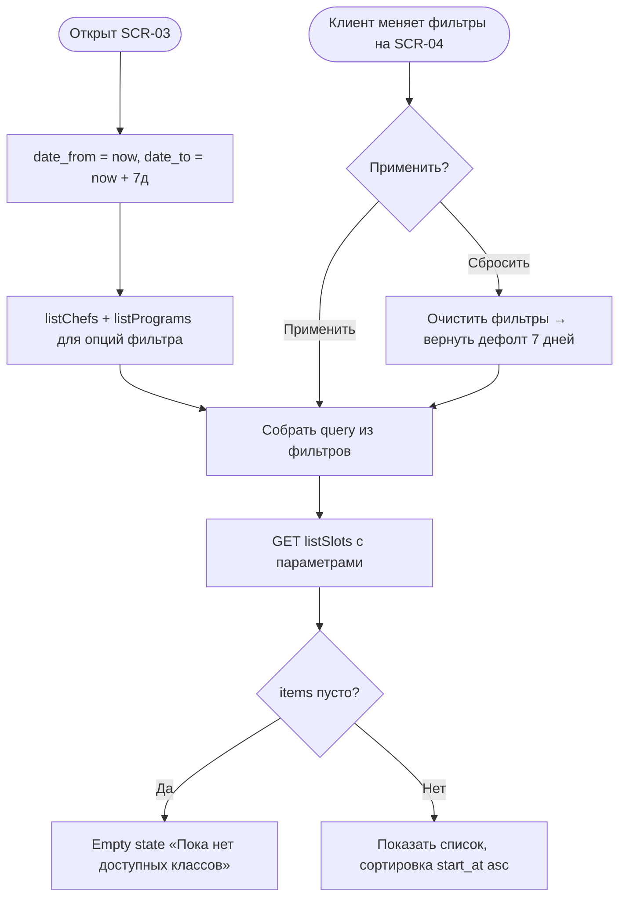

# Фильтры каталога классов

**ID:** LOGIC-007  
**Тип:** Логика  
**Домен:** 09. Логики  
**Приоритет:** High  
**Функциональные блоки:** FB-CAT-001 (диапазон дат по умолчанию), FB-CAT-002 (сборка query), FB-CAT-003 (применение/сброс), FB-CAT-004 (справочники шефов/программ)

---

## История изменений

| Релиз | ТЗ | Описание изменений |
|-------|-----|-------------------|
| — | — | Первоначальная документация |

---

## Входные данные

| Название | Тип | Возможные значения | Описание |
|----------|-----|-------------------|----------|
| `date_from` | Состояние | date-time / пусто | Начало периода; по умолчанию — текущий момент |
| `date_to` | Состояние | date-time / пусто | Конец периода; по умолчанию — `date_from + 7 дней` |
| `program_type[]` | Состояние | `novice`, `experienced` | Тип программы (множественный выбор) |
| `chef_id[]` | Состояние | список UUID | Выбранные шефы (множественный выбор) |
| `only_available` | Состояние | bool (default `false`) | Только слоты со свободными местами |

---

## Обзор

Логика формирует query-параметры для `listSlots` на основе фильтров SCR-03/SCR-04: применяет **диапазон по умолчанию 7 дней** (`date_from` = сейчас, `date_to` = `date_from + 7д`, границы включительные), собирает множественные фильтры `program_type[]` и `chef_id[]`, флаг `only_available`. Внутри одной группы значения объединяются по **OR**, между группами — по **AND**. Логика также умеет применять/сбрасывать фильтры и подгружает справочники шефов (`listChefs`) и программ (`listPrograms`) для отображения опций.

Сортировка выдачи — `start_at` по возрастанию (на стороне сервера). Пустой результат → empty state «Пока нет доступных классов».

### User Story

> Как клиент,
> я хочу отфильтровать классы по датам, типу программы, шефу и наличию мест,
> чтобы быстро найти подходящий класс без просмотра всего расписания.

### Бизнес-ценность

- Быстрый подбор класса под предпочтения (FR-4) — меньше трения, выше конверсия записи.
- Дефолт «7 дней» совпадает с горизонтом планирования расписания (R-027).
- Понятные пустые состояния и сброс фильтров (NFR-2).

---

## Точки применения

| Экран/Компонент | Элемент/Триггер | Условие |
|-----------------|-----------------|---------|
| [SCR-03 Список классов](../SCR-03_список-классов.md) | Первичная загрузка списка | При открытии — дефолтный диапазон 7 дней |
| [SCR-04 Фильтры](../SCR-04_фильтры.md) | Кнопки «Применить» / «Сбросить», выбор опций | По действию клиента |

---

## Флоу

---

## Описание логики

### Шаг 1: Диапазон по умолчанию

При открытии SCR-03 без явных дат: `date_from` = текущий момент, `date_to` = `date_from + 7 дней`. Границы включительные (FR-3, R-027). Клиент может расширить период через фильтр дат (UC-1 A1).

### Шаг 2: Загрузка справочников

Для опций фильтра параллельно загружаются `listChefs` (список шефов) и `listPrograms` (программы/меню с типом). Справочники read-only; клиент не создаёт/не редактирует их (NFR-8, NFR-10).

### Шаг 3: Сборка query

Из выбранных фильтров формируются query-параметры `listSlots`:
- `date_from`, `date_to` — период;
- `program_type` — повторяющийся параметр (`explode`), значения `novice`/`experienced`;
- `chef_id` — повторяющийся параметр (`explode`), UUID шефов;
- `only_available` — `true`, если включён (иначе можно опустить, дефолт `false`).

**Семантика:** внутри группы (например, несколько `program_type`) — OR; между группами (`program_type` И `chef_id`) — AND (FR-4).

### Шаг 4: Применение и сброс

- «Применить» — собрать query и вызвать `listSlots`, сбросить пагинацию на первую страницу (см. [LOGIC-008](LOGIC-008_пагинация-списков.md)).
- «Сбросить» — очистить `program_type[]`, `chef_id[]`, `only_available`, вернуть дефолтный диапазон 7 дней, перезапросить список (UC-1 A2).

### Шаг 5: Пустые состояния

- Фильтр не дал результатов → подсказка изменить/сбросить фильтры (UC-1 E1).
- В горизонте нет слотов вовсе → empty state «Пока нет доступных классов» (UC-1 E2).

---

## API запросы

### GET /slots — `listSlots`

**Операция:** [`../../api/slots/api.yaml`](../../api/slots/api.yaml) → `listSlots`

**Триггер:** Открытие SCR-03, «Применить»/«Сбросить» на SCR-04.

**Headers:**

| Поле | Описание |
|------|----------|
| `Authorization` | Bearer access-токен текущего клиента |

**Параметры/Body:**

| Параметр | Тип | Описание | Значение/Источник |
|----------|-----|----------|-------------------|
| `date_from` | date-time | Начало периода (вкл.) | Фильтр дат; дефолт — now |
| `date_to` | date-time | Конец периода (вкл.) | Фильтр дат; дефолт — now + 7д |
| `program_type` | array (explode) | Тип программы (OR внутри) | Чекбоксы SCR-04 |
| `chef_id` | array (explode) | Шефы (OR внутри) | Мультивыбор SCR-04 |
| `only_available` | bool | Только со свободными местами | Переключатель SCR-04 |
| `limit` / `offset` | int | Пагинация | LOGIC-008 |

**Обработка ответа:**

| Результат | Действие |
|-----------|----------|
| Загрузка | Скелетон списка |
| Успех (200) | Показать `items` (sort `start_at` asc) + `meta` для пагинации |
| Пусто | Empty state «Пока нет доступных классов» / подсказка сбросить фильтры |
| Ошибка 400 | Снек о неверных параметрах фильтра |
| Ошибка 5xx | Снек «Произошла ошибка. Попробуйте позже» |
| Ошибка сети | Снек «Нет соединения. Проверьте подключение к интернету» |

### GET /chefs — `listChefs`

**Операция:** [`../../api/catalog/api.yaml`](../../api/catalog/api.yaml) → `listChefs`

**Триггер:** Открытие фильтров — опции по шефам.

**Обработка ответа:** Успех (200) → заполнить список шефов; ошибка → фильтр по шефу временно недоступен, остальные фильтры работают.

### GET /programs — `listPrograms`

**Операция:** [`../../api/catalog/api.yaml`](../../api/catalog/api.yaml) → `listPrograms`

**Триггер:** Открытие фильтров — опции по программам/типу.

**Обработка ответа:** Успех (200) → заполнить программы и их тип; ошибка → показать типы `novice`/`experienced` без детализации программ.

---

## Связанные требования

### Функциональные (FR-*)

| ID | Название | Приоритет |
|----|----------|-----------|
| [FR-3](../../2-requirements/functional-requirements.md) | Список на ближайшие 7 дней по умолчанию | Must |
| [FR-4](../../2-requirements/functional-requirements.md) | Фильтрация по дате, типу программы, наличию мест, шефу | Must |

### Нефункциональные (NFR-*)

| ID | Название | Приоритет |
|----|----------|-----------|
| [NFR-2](../../2-requirements/non-functional-requirements.md) | Понятный интерфейс, empty state | Высокий |
| [NFR-10](../../2-requirements/non-functional-requirements.md) | Read-only справочники, интеграция с бэкендом | Высокий |

### Use cases / User stories

| ID | Название |
|----|----------|
| [UC-1](../../2-requirements/use-cases.md) | Просмотр и фильтрация классов, A1/A2, E1/E2 |

---

## Критерии приёмки

| ID | Критерий |
|----|----------|
| AC-001 | **Дано** первое открытие SCR-03 без фильтров, **Когда** запрашивается `listSlots`, **Тогда** `date_from` = текущий момент, `date_to` = `date_from + 7 дней` (границы включительные). |
| AC-002 | **Дано** выбраны два типа программы и один шеф, **Когда** собирается query, **Тогда** типы объединяются по OR, а связка «типы И шеф» — по AND. |
| AC-003 | **Дано** включён `only_available`, **Когда** отправляется запрос, **Тогда** в выдаче только слоты со свободными местами. |
| AC-004 | **Дано** применённые фильтры, **Когда** клиент нажимает «Сбросить», **Тогда** фильтры очищаются, возвращается диапазон 7 дней и список перезапрашивается. |
| AC-005 | **Дано** фильтр без результатов, **Когда** `items` пуст, **Тогда** показывается пустое состояние с подсказкой изменить/сбросить фильтры. |

---

## Обработка ошибок

| Тип ошибки | Контекст | Действие |
|------------|----------|----------|
| `400 bad_request` | Неверные параметры фильтра | Снек, откат к последнему валидному состоянию |
| Ошибка `listChefs`/`listPrograms` | Справочники недоступны | Показать базовые опции (типы) без детализации, не блокировать список |
| Сетевая ошибка | Нет соединения | Снек, кнопка «Повторить» |
