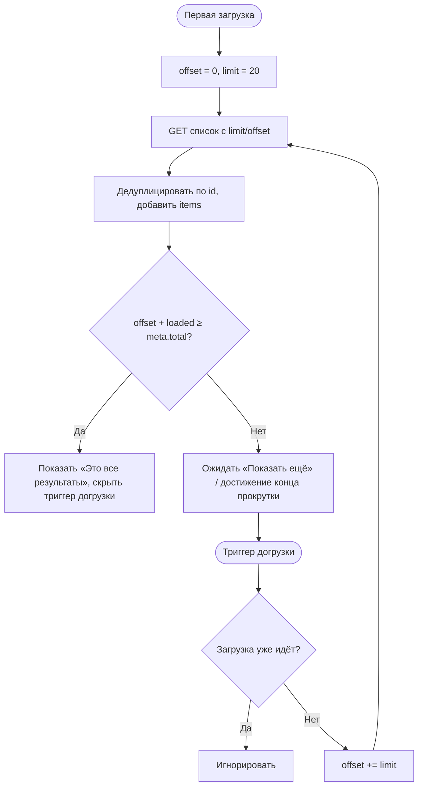

# Пагинация списков

**ID:** LOGIC-008  
**Тип:** Логика  
**Домен:** 09. Логики  
**Приоритет:** Medium  
**Функциональные блоки:** FB-PAGE-001 (limit/offset), FB-PAGE-002 (load-more/infinite scroll), FB-PAGE-003 (дедупликация и конец списка)

---

## История изменений

| Релиз | ТЗ | Описание изменений |
|-------|-----|-------------------|
| — | — | Первоначальная документация |

---

## Входные данные

| Название | Тип | Возможные значения | Описание |
|----------|-----|-------------------|----------|
| `limit` | Состояние | `1..100` (default `20`) | Размер страницы |
| `offset` | Состояние | `≥0` (default `0`) | Смещение от начала выборки |
| `meta.total` | Состояние (из ответа) | целое ≥ 0 | Общее число элементов (`PaginationMeta`) |
| `loaded[]` | Состояние | список id | Уже загруженные элементы для дедупликации |

---

## Обзор

Логика реализует постраничную догрузку списков по схеме `limit`/`offset` с использованием `PaginationMeta{limit, offset, total}`. Поддерживает «Показать ещё» и/или бесконечную прокрутку: увеличивает `offset` на `limit`, догружает следующую страницу, дедуплицирует элементы по id и определяет конец списка через `offset + items.length ≥ total`. Применяется к списку классов (`listSlots`, SCR-03) и списку броней (`listBookings`, SCR-08).

Дедупликация нужна, потому что данные динамические (слоты/брони могут появляться/исчезать между страницами) — одинаковые id не должны дублироваться в UI.

### User Story

> Как клиент с длинным списком классов или броней,
> я хочу подгружать элементы порциями,
> чтобы список открывался быстро и не перегружал экран.

### Бизнес-ценность

- Быстрый первый рендер и отзывчивость в пиковые часы (NFR-6).
- Экономия трафика и ресурсов — загрузка по мере необходимости.
- Понятный конец списка без «пустой бесконечности» (NFR-2).

---

## Точки применения

| Экран/Компонент | Элемент/Триггер | Условие |
|-----------------|-----------------|---------|
| [SCR-03 Список классов](../SCR-03_список-классов.md) | «Показать ещё» / прокрутка к концу | Есть ещё элементы (`offset + loaded < total`) |
| [SCR-08 Мои бронирования](../SCR-08_мои-бронирования.md) | «Показать ещё» / прокрутка к концу | Есть ещё элементы |

---

## Флоу

---

## Описание логики

### Шаг 1: Инициализация

Первая загрузка: `offset = 0`, `limit = 20` (можно 1..100). Список очищается, `loaded[]` пуст.

### Шаг 2: Загрузка страницы

Запрос с текущими `limit`/`offset`. Ответ содержит `items` и `meta{limit, offset, total}`.

### Шаг 3: Дедупликация и добавление

Новые `items` фильтруются по уже присутствующим id (`loaded[]`), затем добавляются в список. Это исключает дубли при сдвиге данных между страницами.

### Шаг 4: Определение конца

Список закончился, если `offset + items.length ≥ meta.total` (или пришло меньше `limit` элементов). Тогда триггер догрузки скрывается и показывается «Это все результаты».

### Шаг 5: Догрузка

По «Показать ещё» или достижению конца прокрутки: если загрузка не идёт и не достигнут конец — `offset += limit` и запрашивается следующая страница. Одновременно допускается только один активный запрос догрузки (защита от параллельных вызовов при быстрой прокрутке).

### Шаг 6: Взаимодействие с фильтрами

При смене фильтров (LOGIC-007) пагинация сбрасывается: `offset = 0`, список и `loaded[]` очищаются, загрузка начинается заново.

---

## API запросы

### GET /slots — `listSlots`

**Операция:** [`../../api/slots/api.yaml`](../../api/slots/api.yaml) → `listSlots`

**Триггер:** Догрузка на SCR-03.

**Параметры/Body:**

| Параметр | Тип | Описание | Значение/Источник |
|----------|-----|----------|-------------------|
| `limit` | int (1..100, def 20) | Размер страницы | Состояние пагинации |
| `offset` | int (≥0, def 0) | Смещение | Состояние пагинации |
| *(фильтры)* | — | См. LOGIC-007 | Активные фильтры |

**Обработка ответа:**

| Результат | Действие |
|-----------|----------|
| Загрузка | Индикатор внизу списка / скелетон |
| Успех (200) | Дедуп + добавить `items`; обновить конец по `meta.total` |
| Пусто на первой странице | Empty state |
| Ошибка 5xx / сеть | Кнопка «Повторить» у конца списка, ранее загруженное остаётся |

### GET /bookings — `listBookings`

**Операция:** [`../../api/bookings/api.yaml`](../../api/bookings/api.yaml) → `listBookings`

**Триггер:** Догрузка на SCR-08 (сортировка по `slot.start_at` по убыванию).

**Параметры/Body:**

| Параметр | Тип | Описание | Значение/Источник |
|----------|-----|----------|-------------------|
| `limit` | int (1..100, def 20) | Размер страницы | Состояние пагинации |
| `offset` | int (≥0, def 0) | Смещение | Состояние пагинации |
| `status` | array (опц.) | Фильтр статусов | Опционально |

**Обработка ответа:**

| Результат | Действие |
|-----------|----------|
| Успех (200) | Дедуп + добавить; группировка — LOGIC-006 |
| Конец | «Это все бронирования» |
| Ошибка | «Повторить», ранее загруженное сохраняется |

---

## Связанные требования

### Функциональные (FR-*)

| ID | Название | Приоритет |
|----|----------|-----------|
| [FR-3](../../2-requirements/functional-requirements.md) | Список слотов | Must |
| [FR-14](../../2-requirements/functional-requirements.md) | Список броней | Must |

### Нефункциональные (NFR-*)

| ID | Название | Приоритет |
|----|----------|-----------|
| [NFR-6](../../2-requirements/non-functional-requirements.md) | Быстрый отклик списков, отзывчивость в пик | Высокий |
| [NFR-2](../../2-requirements/non-functional-requirements.md) | Понятный интерфейс | Высокий |

### Use cases / User stories

| ID | Название |
|----|----------|
| [UC-1](../../2-requirements/use-cases.md) | Просмотр списка классов |

---

## Критерии приёмки

| ID | Критерий |
|----|----------|
| AC-001 | **Дано** `meta.total=45`, `limit=20`, **Когда** загружена первая страница, **Тогда** показаны 20 элементов и доступна догрузка (`offset+20 < 45`). |
| AC-002 | **Дано** загружены 40 из 45, **Когда** клиент догружает, **Тогда** `offset` становится 40 и приходят оставшиеся 5, после чего показывается «Это все результаты». |
| AC-003 | **Дано** элемент с id уже присутствует, **Когда** он повторно приходит на следующей странице, **Тогда** он не дублируется в списке. |
| AC-004 | **Дано** идёт загрузка страницы, **Когда** триггер догрузки срабатывает снова, **Тогда** повторный запрос не отправляется. |
| AC-005 | **Дано** изменение фильтров, **Когда** применяются новые условия, **Тогда** пагинация сбрасывается (`offset=0`) и список загружается заново. |

---

## Обработка ошибок

| Тип ошибки | Контекст | Действие |
|------------|----------|----------|
| Ошибка догрузки (5xx/сеть) | Загрузка следующей страницы | Ранее загруженное сохраняется, показать «Повторить» |
| Дубли id между страницами | Сдвиг динамических данных | Дедупликация по id |
