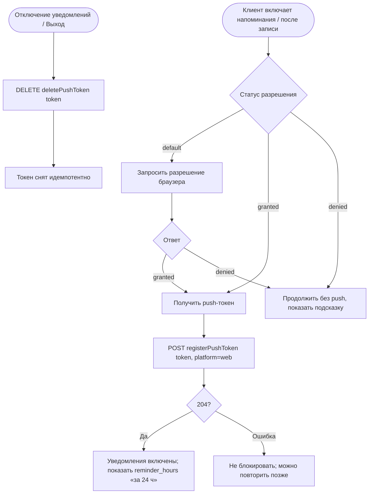

# Регистрация push-токена

**ID:** LOGIC-009  
**Тип:** Логика  
**Домен:** 09. Логики  
**Приоритет:** Medium  
**Функциональные блоки:** FB-PUSH-001 (запрос разрешения), FB-PUSH-002 (получение и регистрация токена), FB-PUSH-003 (снятие регистрации), FB-PUSH-004 (информирование о напоминании)

---

## История изменений

| Релиз | ТЗ | Описание изменений |
|-------|-----|-------------------|
| — | — | Первоначальная документация |

---

## Входные данные

| Название | Тип | Возможные значения | Описание |
|----------|-----|-------------------|----------|
| `permission` | Состояние (браузер) | `default` / `granted` / `denied` | Разрешение на web push |
| `push_token` | Состояние | строка / пусто | Токен push, полученный от браузера/сервиса |
| `reminder_hours` | Состояние (сервер) | напр. `[24]` | За сколько часов до старта приходит напоминание |

---

## Обзор

Логика регистрирует web push-токен клиента, чтобы доставлять напоминание о классе (по умолчанию за 24 ч, но значение `reminder_hours` — серверное, не хардкодится). Она запрашивает разрешение браузера, получает токен и вызывает `registerPushToken` (204, идемпотентно). При отказе (`denied`) приложение продолжает работать штатно **без push** — брони остаются видимыми в «Мои бронирования». При выходе/отключении уведомлений токен снимается через `deletePushToken`.

`platform` фиксирован как `web`. Повторная регистрация с тем же токеном идемпотентна (обновляет привязку).

### User Story

> Как клиент,
> я хочу получать напоминание о предстоящем классе,
> чтобы не забыть о записи; при этом отказ от уведомлений не должен ломать приложение.

### Бизнес-ценность

- Снижение неявок за счёт заблаговременного напоминания (FR-19, NFR-9).
- Graceful-деградация: без разрешения приложение полностью функционально (NFR-9).
- Серверное `reminder_hours` позволяет менять политику напоминаний без релиза.

---

## Точки применения

| Экран/Компонент | Элемент/Триггер | Условие |
|-----------------|-----------------|---------|
| [SCR-07 Запись создана](../SCR-07_запись-создана.md) | Предложение включить напоминания | После успешной записи |
| [SCR-10 Профиль](../SCR-10_профиль.md) | Переключатель уведомлений; выход | Включение/отключение push, logout |

---

## Флоу

---

## Описание логики

### Шаг 1: Проверка/запрос разрешения

Проверяется статус разрешения браузера. Если `default` — по действию клиента (не автоматически при старте) запрашивается разрешение. Если уже `granted` — сразу к получению токена. Если `denied` — переход к graceful-деградации.

### Шаг 2: Получение токена и регистрация

При `granted` получается push-токен и отправляется `registerPushToken` с `{token, platform: "web"}`. Ответ 204 — успех. Повтор с тем же токеном идемпотентен, дублей не создаёт.

### Шаг 3: Информирование о напоминании

После успешной регистрации клиенту показывается, за сколько часов придёт напоминание, на основе серверного `reminder_hours` (например, «Напомним за 24 часа до класса»). Значение не хардкодится.

### Шаг 4: Graceful-деградация при отказе

При `denied` приложение работает штатно: запись, список броней и детали доступны; показывается ненавязчивая подсказка, что напоминания отключены и их можно включить в настройках браузера. Повторно диалог не навязывается.

### Шаг 5: Снятие регистрации

При отключении уведомлений в профиле или при выходе (см. [LOGIC-002](LOGIC-002_сессия-и-авторизация.md)) вызывается `deletePushToken` с текущим токеном. Операция идемпотентна: если токен уже отсутствует — 204/404 обрабатываются как успех очистки.

---

## API запросы

### POST /auth/push-tokens — `registerPushToken`

**Операция:** [`../../api/auth/api.yaml`](../../api/auth/api.yaml) → `registerPushToken`

**Триггер:** Включение напоминаний (SCR-07/SCR-10) при `granted`.

**Headers:**

| Поле | Описание |
|------|----------|
| `Authorization` | Bearer access-токен текущего клиента |
| `Content-Type` | `application/json` |

**Параметры/Body:**

| Параметр | Тип | Описание | Значение/Источник |
|----------|-----|----------|-------------------|
| `token` | string | Push-токен браузера | Из web push API |
| `platform` | string | Платформа | Константа `web` |

**Обработка ответа:**

| Результат | Действие |
|-----------|----------|
| Успех (204) | Уведомления включены; показать `reminder_hours` |
| Ошибка 400 | Логировать; не блокировать работу |
| Ошибка 401 | Через LOGIC-002 (refresh/редирект) |
| Ошибка 5xx / сеть | Не блокировать; повторить позже |

### DELETE /auth/push-tokens — `deletePushToken`

**Операция:** [`../../api/auth/api.yaml`](../../api/auth/api.yaml) → `deletePushToken`

**Триггер:** Отключение уведомлений (SCR-10) или выход (LOGIC-002).

**Параметры/Body:**

| Параметр | Тип | Описание | Значение/Источник |
|----------|-----|----------|-------------------|
| `token` | string | Снимаемый push-токен | Текущий токен клиента |

**Обработка ответа:**

| Результат | Действие |
|-----------|----------|
| Успех (204) | Токен снят |
| 404 | Токена уже нет — считать успехом (идемпотентно) |
| Ошибка сети | При выходе локальную очистку всё равно выполнить |

---

## Локальное хранение

| Ключ | Тип хранения | Описание |
|------|--------------|----------|
| `push_token` | Локальный кэш | Текущий зарегистрированный push-токен (для снятия при выходе/отключении) |
| `push_permission` | Локальный кэш | Последний известный статус разрешения (для UX-подсказок) |

---

## Связанные требования

### Функциональные (FR-*)

| ID | Название | Приоритет |
|----|----------|-----------|
| [FR-19](../../2-requirements/functional-requirements.md) | Push-напоминание за 24 ч; работа без push при отказе | Should |

### Нефункциональные (NFR-*)

| ID | Название | Приоритет |
|----|----------|-----------|
| [NFR-9](../../2-requirements/non-functional-requirements.md) | Заблаговременное напоминание; штатная работа без разрешения | Средний |
| [NFR-7](../../2-requirements/non-functional-requirements.md) | Безопасная передача данных | Высокий |

### Use cases / User stories

| ID | Название |
|----|----------|
| [UC-4](../../2-requirements/use-cases.md) | Отмена класса студией — push-уведомление (A1: без разрешения статус виден в списке) |

---

## Критерии приёмки

| ID | Критерий |
|----|----------|
| AC-001 | **Дано** разрешение `granted` и полученный токен, **Когда** клиент включает напоминания, **Тогда** вызывается `registerPushToken` с `platform=web` и ответ 204 означает успех. |
| AC-002 | **Дано** клиент отклонил разрешение (`denied`), **Когда** это произошло, **Тогда** приложение продолжает работать без push, а брони остаются видимыми в «Мои бронирования». |
| AC-003 | **Дано** уже зарегистрированный токен, **Когда** `registerPushToken` вызывается повторно с тем же токеном, **Тогда** операция идемпотентна и дубль не создаётся. |
| AC-004 | **Дано** авторизованный клиент с push-токеном, **Когда** он выходит или отключает уведомления, **Тогда** вызывается `deletePushToken`, а отсутствие токена (404) трактуется как успех. |
| AC-005 | **Дано** успешная регистрация и `reminder_hours=[24]`, **Когда** показывается статус, **Тогда** клиенту сообщается «Напомним за 24 часа до класса» (значение из сервера, не захардкожено). |

---

## Обработка ошибок

| Тип ошибки | Контекст | Действие |
|------------|----------|----------|
| Разрешение `denied` | Запрос permission | Graceful-деградация, подсказка, без навязчивого повтора |
| Ошибка `registerPushToken` | Регистрация токена | Не блокировать приложение, повтор позже |
| `404` на `deletePushToken` | Токена уже нет | Считать успехом (идемпотентно) |
| Ошибка сети при выходе | logout + delete | Локальная очистка выполняется всегда (LOGIC-002) |
