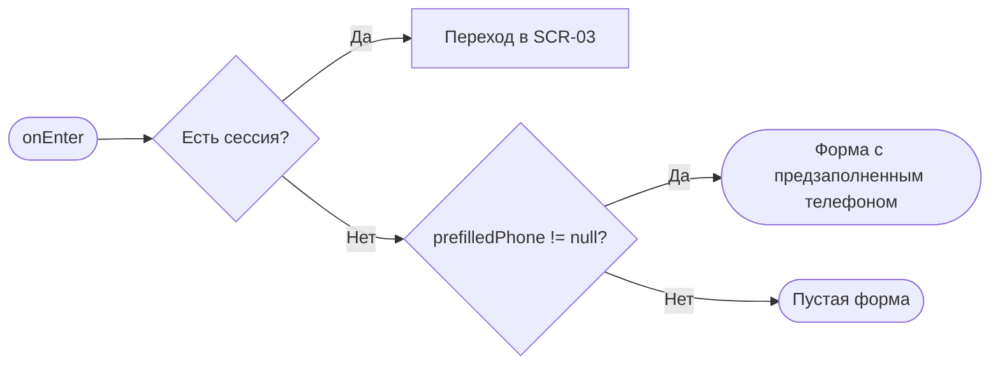
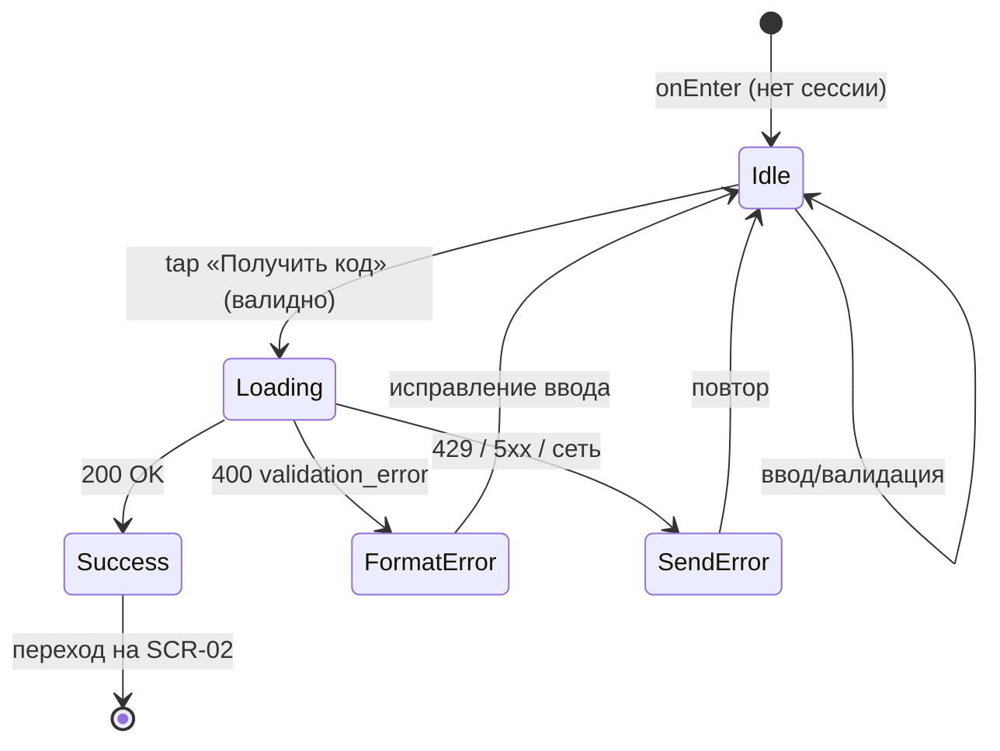

# Вход: телефон и имя

**ID:** SCR-01  
**Тип:** Экран  
**Домен:** 01. Авторизация  
**Приоритет:** Critical  
**Статус:** Черновик  
**Функциональные блоки:** —  
**Зона авторизации:** НЗ  
**Дизайн-макет:** — (макет не создан, этап дизайна)

---

## Содержание

- [История изменений](#история-изменений)
- [Обзор](#обзор)
- [Навигация](#навигация)
- [Входные данные](#входные-данные)
- [Применяемые логики](#применяемые-логики)
- [Свойства Bottom Sheet](#свойства-bottom-sheet)
- [Инициализация](#инициализация)
- [Используемые запросы](#используемые-запросы)
- [Макет экрана](#макет-экрана)
- [Элементы экрана](#элементы-экрана)
- [Состояния экрана](#состояния-экрана)
- [Действия пользователя](#действия-пользователя)
- [Связанные требования](#связанные-требования)
- [Критерии приёмки](#критерии-приёмки)

---

## История изменений

| Релиз | ТЗ | Описание изменений |
|-------|-----|-------------------|
| 0.1.0 | [SCR-01 Вход: телефон и имя](SCR-01_вход-телефон.md) | Первичная версия ТЗ на основе [дизайн-брифа SCR-01](../3-design-brief/SCR-01_вход-телефон.md) |

---

## Обзор

Это входная дверь в «Шеф-стол» — тёплую кулинарную студию в лофте. Экран открывает не авторизованному гостю лёгкий вход по номеру телефона: без пароля и лишних учёток. Клиент вводит телефон (и имя при первом знакомстве), получает одноразовый код и переходит к его подтверждению на [SCR-02](SCR-02_подтверждение-otp.md).

Телефон здесь — рабочий инструмент, а не формальность: на него придёт код для входа и напоминание за 24 часа до класса. Экран спокойно объясняет это, чтобы человек понимал, зачем оставляет номер, и не боялся спама.

До ввода номера приложение не знает, новый это клиент или вернувшийся (идентификатор — сам номер). Поэтому оба поля («Имя» и «Телефон») показываются на одном экране: имя помечено как нужное только для новых гостей, а фактическая «новизна» определяется бэкендом на шаге подтверждения кода.

### User Story

> Как гость кулинарной студии, я хочу быстро войти по номеру телефона (и указать имя при первом входе),
> чтобы за пару минут начать смотреть классы и записываться, не вспоминая пароль.

### Бизнес-ценность

- Минимальный порог входа (NFR-3): вход по телефону + OTP без паролей.
- Достоверный контакт клиента для кода входа и напоминаний за 24 ч.
- Единая точка входа для первого и повторного визита без выбора роли.

---

## Навигация

### Входящая (откуда открывается)

| Источник | Триггер | Условие | Передаваемые параметры |
|----------|---------|---------|------------------------|
| Первый запуск приложения | Открытие приложения | Нет действующей сессии | — |
| Deep link | `/login` | Нет действующей сессии | — |
| [SCR-03 Классы](SCR-03_список-классов.md) / [SCR-08 Мои брони](SCR-08_мои-бронирования.md) / [SCR-10 Профиль](SCR-10_профиль.md) | Переход в защищённый раздел | Сессия отсутствует/истекла (route guard, [LOGIC-002](09_Логики/LOGIC-002_сессия-и-авторизация.md)) | — |
| [SCR-10 Профиль](SCR-10_профиль.md) | Выход из аккаунта (logout) | После завершения сессии | — |
| [SCR-02 Подтверждение кода (OTP)](SCR-02_подтверждение-otp.md) | «Изменить номер» / назад | Всегда | `phone` (предзаполнение) |

### Исходящая (куда ведёт)

| Назначение | Триггер | Передаваемые параметры |
|------------|---------|------------------------|
| [SCR-02 Подтверждение кода (OTP)](SCR-02_подтверждение-otp.md) | Успешная отправка кода (`requestAuthCode` → 200) | `phone`, `ttl_seconds`, `resend_after_seconds`, `code` (демо) |

---

## Входные данные

| Название | Тип | Возможные значения | Описание |
|----------|-----|-------------------|----------|
| `prefilledPhone` | Состояние (навигация) | `+7XXXXXXXXXX` / `null` | Номер, переданный при возврате с [SCR-02](SCR-02_подтверждение-otp.md) для правки. При наличии — предзаполняет поле «Телефон». |
| `hasSession` | Кэш (токены) | `true` / `false` | Признак действующей сессии. Если `true` — экран не показывается, route guard уводит в [SCR-03](SCR-03_список-классов.md) ([LOGIC-002](09_Логики/LOGIC-002_сессия-и-авторизация.md)). |

---

## Применяемые логики

| Логика | Элемент/Триггер | Описание |
|--------|-----------------|----------|
| [LOGIC-002 Сессия и авторизация](09_Логики/LOGIC-002_сессия-и-авторизация.md) | Открытие экрана (route guard) | Если действующая сессия уже есть — не показывать экран входа, увести в приложение. Экран доступен только в НЗ. |

---

## Свойства Bottom Sheet

Не применимо — экран, не Bottom Sheet.

---

## Инициализация

> При открытии экран **не отправляет** сетевых запросов: форма пустая (или телефон предзаполнен из `prefilledPhone`). Запрос уходит только по действию пользователя («Получить код»).

### Диаграмма загрузки



### Запросы при открытии

| № | Запрос | Критичный | Зависит от | Условие |
|---|--------|-----------|------------|---------|
| — | Нет запросов при открытии | — | — | Данные из навигации/кэша |

> Полное описание запроса действия см. в секции [Используемые запросы](#используемые-запросы).

---

## Используемые запросы

> Все API-запросы экрана с полным описанием параметров и обработки ответов.

### requestAuthCode

**Тип:** REST  
**Метод:** POST  
**Спецификация:** [../api/auth/api.yaml](../api/auth/api.yaml) → `requestAuthCode`  
**Security:** none (публичный)

**Триггер:** Тап на кнопку «Получить код» (или Enter при валидном номере)

**Параметры:**

| Параметр | Тип | Обязательность | Источник | Описание |
|----------|-----|----------------|----------|----------|
| `phone` | string | Да | Поле «Телефон» | Номер в формате E.164, `^\+[1-9]\d{1,14}$` (`RequestCodeRequest.phone`). |

**Обработка ответа:**

| Результат | Условие | UI-реакция |
|-----------|---------|------------|
| Загрузка | — | Индикатор на кнопке «Получить код», поля и кнопка заблокированы (защита от двойной отправки) |
| Успех 200 | `RequestCodeResponse` | Переход на [SCR-02](SCR-02_подтверждение-otp.md) с передачей `phone`, `ttl_seconds` (=300), `resend_after_seconds` (=60), `code` (демо) |
| HTTP 400 | `code = validation_error` | Подсветить поле «Телефон», показать «Проверьте номер — кажется, не хватает цифр» |
| HTTP 429 | Слишком частые запросы / лимит SMS | Снек «Слишком много запросов. Попробуйте немного позже»; кнопка снова активна по завершении |
| HTTP 5xx | `default` (InternalError) | Снек «Не удалось отправить код, попробуйте ещё раз»; введённые данные сохранены |
| Сеть | Нет соединения | Снек «Нет соединения. Проверьте подключение»; данные сохранены |

> **Имя** на этом шаге в API не передаётся: `requestAuthCode` принимает только `phone`. Имя нового клиента дозаполняется через `updateProfile` уже после входа (см. [SCR-02](SCR-02_подтверждение-otp.md), FR-1). Введённое на этом экране имя сохраняется в состоянии клиента и переносится в шаг дозаполнения имени.

---

**Доступные спецификации** (REST, многофайловый OpenAPI, `../api/`):

- `auth/api.yaml` — авторизация, OTP, токены, push-токены
- `slots/api.yaml` — слоты классов (read-only)
- `bookings/api.yaml` — бронирования и отмены
- `profile/api.yaml` — профиль клиента
- `catalog/api.yaml` — программы/меню и шефы (read-only справочники)

---

## Макет экрана

### Структура

```
┌─────────────────────────────────────┐
│           Шеф-стол (лого)            │  ← Бренд-блок
│  Групповые кулинарные классы.        │
│  Запишитесь за пару минут            │
├─────────────────────────────────────┤
│  Имя (для новых гостей)              │  ← Поле «Имя»
│  [ Как к вам обращаться?          ]  │
│                                     │
│  Телефон*                           │  ← Поле «Телефон»
│  [ +7 ___ ___-__-__               ]  │
│  Пришлём код для входа — пароль не  │
│  нужен. Напомним о классе за 24 ч.  │  ← Микротекст
│                                     │
│  [ Область ошибки ]                 │
├─────────────────────────────────────┤
│         [ Получить код ]            │  ← Primary button
│  Продолжая, вы соглашаетесь с        │
│  обработкой номера · Условия         │  ← Правовая сноска
└─────────────────────────────────────┘
```

### Компоненты

| Компонент | Описание | Обязательность |
|-----------|----------|----------------|
| Бренд-блок | Лого/название «Шеф-стол» + тёплая строка о сути | Да |
| Поле «Имя» | Текстовое поле имени (первый вход) | Да (видимо всегда) |
| Поле «Телефон» | Телефонное поле с маской | Да |
| Микротекст «Зачем телефон» | Пояснение про код и напоминание | Да |
| Кнопка «Получить код» | Первичное действие | Да |
| Область ошибки | Место под текст ошибки без сдвига макета | Да |
| Правовая сноска | Согласие на обработку номера + ссылка на условия | Да |

---

## Элементы экрана

### 1. Бренд-блок

| Элемент | Описание | Источник данных | Валидация | Действие |
|---------|----------|-----------------|-----------|----------|
| Лого / название «Шеф-стол» | Опознавательный знак бренда | Статика | — | — |
| Слоган | «Групповые кулинарные классы. Запишитесь за пару минут» | Статика | — | — |

### 2. Форма входа

| Элемент | Описание | Источник данных | Валидация | Действие |
|---------|----------|-----------------|-----------|----------|
| Поле «Имя» | Имя клиента (нужно только новым гостям) | `prefilledName` из состояния / пусто | Мягкая: не пустое при первом входе, 1–100 символов. Ошибка: «Укажите, как к вам обращаться» | — |
| Поле «Телефон*» | Номер телефона с маской, тип `tel` | `prefilledPhone` из навигации / пусто | Формат E.164 `^\+[1-9]\d{1,14}$`. Ошибка: «Проверьте номер — кажется, не хватает цифр» | — |
| Микротекст «Зачем телефон» | «Пришлём одноразовый код для входа — пароль не нужен. И напомним о классе за 24 часа» | Статика | — | — |
| Область ошибки | Текст ошибки формата/отправки | Ответ `requestAuthCode` | — | — |
| Кнопка «Получить код» | Primary button | — | — | Валидация → [requestAuthCode](#requestauthcode) → [SCR-02](SCR-02_подтверждение-otp.md) |
| Правовая сноска | Согласие на обработку номера + ссылка «Условия» | Статика | — | Открыть условия/политику |

**Момент валидации:** телефон — при попытке отправки и при потере фокуса с заполненного поля (не на первом символе); имя — при отправке.

**Логика:**
- Кнопка «Получить код»: при тапе → валидация полей → при успехе отправить [requestAuthCode](#requestauthcode); на время запроса кнопка в состоянии загрузки и заблокирована.
- Поле «Телефон»: маска форматирует ввод по мере набора; вставка из буфера с пробелами/скобками/дефисами нормализуется под маску, а не отвергается.
- Enter в поле «Телефон» (и «Имя») эквивалентен нажатию «Получить код» при валидных данных.

**Условия доступности:**
- Кнопка «Получить код» активна, если: телефон прошёл базовую валидацию формата И (при первом входе) имя не пустое.
- В состоянии загрузки кнопка и поля заблокированы.

---

## Состояния экрана

### Таблица состояний

| Состояние | Условие | Отображение |
|-----------|---------|-------------|
| Idle | Экран открыт, форма готова | Поля пустые (или телефон предзаполнен), кнопка неактивна до валидного номера, виден микротекст |
| Отправка (loading) | `requestAuthCode` в процессе | Индикатор на кнопке, поля и кнопка заблокированы |
| Ошибка формата | Валидация телефона/имени не пройдена | Поле подсвечено, текст ошибки под ним, фокус в поле, ввод сохранён |
| Ошибка отправки | HTTP 429 / 5xx / сеть | Снек/текст ошибки, кнопка снова активна, данные сохранены |
| Успех | `requestAuthCode` → 200 | Переход на [SCR-02](SCR-02_подтверждение-otp.md) (отдельного «успешного» состояния на экране нет) |

### Диаграмма переходов



---

## Действия пользователя

| Действие | Элемент | Триггер | Результат |
|----------|---------|---------|-----------|
| Ввод имени | Поле «Имя» | Ввод текста | Сохранение в состоянии для дозаполнения профиля |
| Ввод телефона | Поле «Телефон» | Ввод / вставка | Маска форматирует, кнопка активируется при валидном номере |
| Запросить код | Кнопка «Получить код» | Tap / Enter | Валидация → [requestAuthCode](#requestauthcode) → [SCR-02](SCR-02_подтверждение-otp.md) |
| Открыть условия | Правовая сноска | Tap на ссылку | Открытие условий/политики обработки данных |

---

## Связанные требования

### Функциональные (FR-*)

Источник: [functional-requirements.md](../2-requirements/functional-requirements.md)

| ID | Название | Приоритет |
|----|----------|-----------|
| FR-1 | Лёгкая регистрация/вход по имени и телефону без паролей | Must |
| FR-2 | Авторизация по телефону с подтверждением OTP (запрос кода) | Must |

### Нефункциональные (NFR-*)

Источник: [non-functional-requirements.md](../2-requirements/non-functional-requirements.md)

| ID | Название | Приоритет |
|----|----------|-----------|
| NFR-3 | Минимальный порог входа (вход по телефону + OTP) | — |
| NFR-7 | Приватность персональных данных (номер, имя) | — |
| NFR-10 | Корректная обработка ответов/ошибок API | — |

### Use cases / User stories

Источники: [use-cases.md](../2-requirements/use-cases.md), [user-stories.md](../2-requirements/user-stories.md)

| ID | Название | Приоритет |
|----|----------|-----------|
| UC-5 | Регистрация/вход по телефону и OTP (шаги 1–2) | Must |
| US-1 | Быстрый вход клиента по номеру телефона и коду | Must |

---

## Критерии приёмки

### Позитивные сценарии

| ID | Критерий | Приоритет |
|----|----------|-----------|
| AC-001 | **Дано** пустая форма, **Когда** клиент вводит корректный телефон и нажимает «Получить код», **Тогда** уходит запрос `requestAuthCode` и при 200 происходит переход на SCR-02 с переданным номером | P0 |
| AC-002 | **Дано** первый вход, **Когда** клиент заполнил имя и телефон, **Тогда** кнопка «Получить код» становится активной | P0 |
| AC-003 | **Дано** возврат с SCR-02 «Изменить номер», **Когда** экран открыт, **Тогда** поле «Телефон» предзаполнено ранее введённым значением, фокус в нём | P1 |
| AC-004 | **Дано** введён корректный номер, **Когда** клиент нажимает Enter в поле, **Тогда** это эквивалентно нажатию «Получить код» | P2 |

### Негативные сценарии

| ID | Критерий | Приоритет |
|----|----------|-----------|
| AC-N01 | **Дано** некорректный номер телефона, **Когда** отправка формы, **Тогда** поле подсвечено и показан текст «Проверьте номер — кажется, не хватает цифр», запрос не уходит | P0 |
| AC-N02 | **Дано** ответ сервера 5xx или отсутствие сети, **Когда** нажата «Получить код», **Тогда** показано «Не удалось отправить код, попробуйте ещё раз», введённые данные сохранены, кнопка снова активна | P0 |
| AC-N03 | **Дано** первый вход с пустым именем, **Когда** отправка формы, **Тогда** показана мягкая ошибка «Укажите, как к вам обращаться» | P1 |
| AC-N04 | **Дано** сервер вернул 429 (слишком часто), **Когда** нажата «Получить код», **Тогда** показано понятное сообщение с предложением повторить позже | P1 |

### Граничные условия (Edge Cases)

| ID | Критерий | Приоритет |
|----|----------|-----------|
| AC-E01 | **Дано** номер вставлен из буфера с пробелами/скобками/дефисами, **Когда** вставка в поле, **Тогда** номер нормализуется под маску, а не отвергается | P1 |
| AC-E02 | **Дано** запрос кода в процессе (loading), **Когда** клиент повторно жмёт «Получить код», **Тогда** повторная отправка не происходит (кнопка заблокирована) | P0 |
| AC-E03 | **Дано** действующая сессия уже есть, **Когда** открывается `/login`, **Тогда** route guard уводит в SCR-03 без показа формы входа | P1 |
| AC-E04 | **Дано** повторный вход существующего клиента, **Когда** введён телефон без имени, **Тогда** вход возможен (имя игнорируется, «новизна» определяется на SCR-02) | P1 |

---
