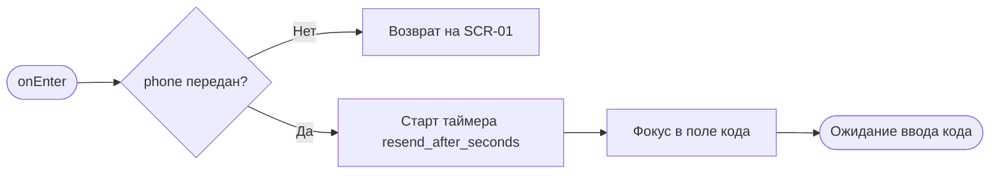
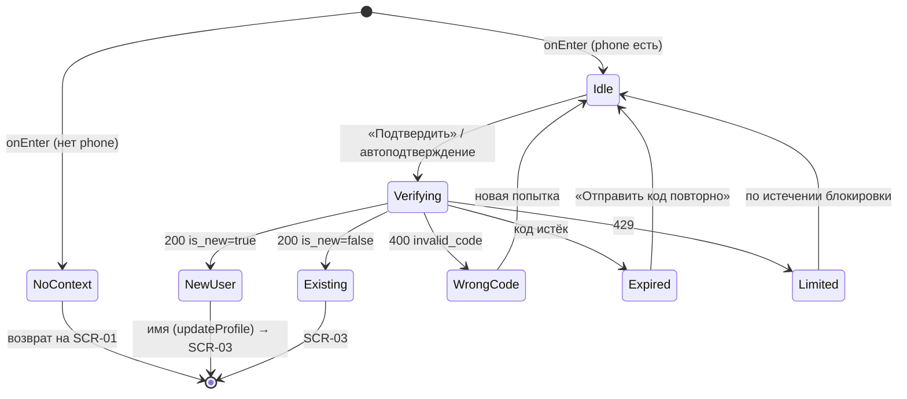

# Подтверждение кода (OTP)

**ID:** SCR-02  
**Тип:** Экран  
**Домен:** 01. Авторизация  
**Приоритет:** Critical  
**Статус:** Черновик  
**Функциональные блоки:** —  
**Зона авторизации:** НЗ  
**Дизайн-макет:** — (макет не создан, этап дизайна)

---

## Содержание

- [История изменений](#история-изменений)
- [Обзор](#обзор)
- [Навигация](#навигация)
- [Входные данные](#входные-данные)
- [Применяемые логики](#применяемые-логики)
- [Свойства Bottom Sheet](#свойства-bottom-sheet)
- [Инициализация](#инициализация)
- [Используемые запросы](#используемые-запросы)
- [Макет экрана](#макет-экрана)
- [Элементы экрана](#элементы-экрана)
- [Состояния экрана](#состояния-экрана)
- [Действия пользователя](#действия-пользователя)
- [Связанные требования](#связанные-требования)
- [Критерии приёмки](#критерии-приёмки)

---

## История изменений

| Релиз | ТЗ | Описание изменений |
|-------|-----|-------------------|
| 0.1.0 | [SCR-02 Подтверждение кода (OTP)](SCR-02_подтверждение-otp.md) | Первичная версия ТЗ на основе [дизайн-брифа SCR-02](../3-design-brief/SCR-02_подтверждение-otp.md) |

---

## Обзор

Второй и последний шаг лёгкого входа в «Шеф-стол». Клиент только что попросил код на [SCR-01](SCR-01_вход-телефон.md) — теперь вводит короткий одноразовый код из СМС и попадает в приложение к классам. Задача узкая, поэтому экран максимально сфокусирован: ввод кода, подтверждение — и всё.

Экран страхует типичные заминки по-человечески: «код не пришёл» (повторная отправка по таймеру, [LOGIC-001](09_Логики/LOGIC-001_таймер-повторной-отправки-otp.md)) и «ввёл не тот код» (понятная ошибка без сброса всего процесса). После успешного подтверждения стартует сессия ([LOGIC-002](09_Логики/LOGIC-002_сессия-и-авторизация.md)); нового клиента (`is_new=true`) экран ведёт к дозаполнению имени, существующего — сразу в [SCR-03 «Классы»](SCR-03_список-классов.md).

### User Story

> Как гость студии, я хочу ввести код из СМС и сразу войти,
> чтобы без лишнего трения попасть к списку классов.

### Бизнес-ценность

- Завершение входа без пароля — минимальный порог (NFR-3).
- Устойчивость к типовым сбоям (код не пришёл / неверный код) без потери клиента.
- Старт защищённой сессии и корректная развилка новый/существующий клиент.

---

## Навигация

### Входящая (откуда открывается)

| Источник | Триггер | Условие | Передаваемые параметры |
|----------|---------|---------|------------------------|
| [SCR-01 Вход: телефон и имя](SCR-01_вход-телефон.md) | Успешная отправка кода (`requestAuthCode` → 200) | Всегда | `phone`, `ttl_seconds`, `resend_after_seconds`, `code` (демо), `pendingName` (имя из SCR-01, если было) |

### Исходящая (куда ведёт)

| Назначение | Триггер | Передаваемые параметры |
|------------|---------|------------------------|
| Шаг дозаполнения имени → [SCR-03 Классы](SCR-03_список-классов.md) | `verifyAuthCode` → 200 и `is_new = true` | `client` (без имени); имя задаётся через `updateProfile` |
| [SCR-03 Классы](SCR-03_список-классов.md) | `verifyAuthCode` → 200 и `is_new = false` | — (сессия установлена) |
| [SCR-01 Вход: телефон и имя](SCR-01_вход-телефон.md) | «Изменить номер» / назад | `phone` (предзаполнение) |

---

## Входные данные

| Название | Тип | Возможные значения | Описание |
|----------|-----|-------------------|----------|
| `phone` | Состояние (навигация) | `+7XXXXXXXXXX` | Номер, на который отправлен код. Показывается на экране; обязателен для `verifyAuthCode`. |
| `ttl_seconds` | Состояние (навигация) | `300` (по умолчанию) | Срок жизни кода; по истечении показывается «Срок действия кода истёк». |
| `resend_after_seconds` | Состояние (навигация) | `60` (по умолчанию) | Задержка перед повторной отправкой; вход в таймер ([LOGIC-001](09_Логики/LOGIC-001_таймер-повторной-отправки-otp.md)). |
| `code` | Кэш (демо) | `^\d{4,6}$` / отсутствует | Демонстрационный код из `RequestCodeResponse` (в production не приходит). Может использоваться для автоподстановки в демо. |
| `pendingName` | Состояние (навигация) | строка / `null` | Имя, введённое на SCR-01; используется на шаге дозаполнения имени для нового клиента. |

---

## Применяемые логики

| Логика | Элемент/Триггер | Описание |
|--------|-----------------|----------|
| [LOGIC-001 Таймер повторной отправки OTP](09_Логики/LOGIC-001_таймер-повторной-отправки-otp.md) | Блок «Отправить код повторно» | Обратный отсчёт `resend_after_seconds`; по нулю активируется ссылка повторной отправки, после отправки таймер перезапускается. |
| [LOGIC-002 Сессия и авторизация](09_Логики/LOGIC-002_сессия-и-авторизация.md) | Успех `verifyAuthCode` | Сохранение пары токенов, старт сессии, ротация refresh, дальнейший route guard. |

---

## Свойства Bottom Sheet

Не применимо — экран, не Bottom Sheet.

---

## Инициализация

> При открытии экран **не отправляет** сетевых запросов: всё нужное (номер, тайминги) пришло из навигации с [SCR-01](SCR-01_вход-телефон.md). Сразу запускается таймер повторной отправки ([LOGIC-001](09_Логики/LOGIC-001_таймер-повторной-отправки-otp.md)) и фокус ставится в поле кода.

### Диаграмма загрузки



### Запросы при открытии

| № | Запрос | Критичный | Зависит от | Условие |
|---|--------|-----------|------------|---------|
| — | Нет запросов при открытии | — | — | Данные переданы из [SCR-01](SCR-01_вход-телефон.md) |

> Полное описание запросов действий см. в секции [Используемые запросы](#используемые-запросы).

---

## Используемые запросы

> Все API-запросы экрана с полным описанием параметров и обработки ответов.

### verifyAuthCode

**Тип:** REST  
**Метод:** POST  
**Спецификация:** [../api/auth/api.yaml](../api/auth/api.yaml) → `verifyAuthCode`  
**Security:** none (публичный)

**Триггер:** Тап «Подтвердить» / автоподтверждение по последней цифре / Enter при полном коде

**Параметры:**

| Параметр | Тип | Обязательность | Источник | Описание |
|----------|-----|----------------|----------|----------|
| `phone` | string | Да | Входные данные `phone` | Номер в формате E.164 (`VerifyCodeRequest.phone`). |
| `code` | string | Да | Поле ввода кода | OTP-код, `^\d{4,6}$` (`VerifyCodeRequest.code`). |

**Обработка ответа:**

| Результат | Условие | UI-реакция |
|-----------|---------|------------|
| Загрузка | — | Индикатор на кнопке/поле, ввод заблокирован |
| Успех 200 | `is_new = false` | Сохранить токены ([LOGIC-002](09_Логики/LOGIC-002_сессия-и-авторизация.md)), перейти в [SCR-03](SCR-03_список-классов.md) |
| Успех 200 | `is_new = true` | Сохранить токены, перейти к шагу дозаполнения имени → `updateProfile` → [SCR-03](SCR-03_список-классов.md) |
| HTTP 400 | `code = invalid_code` | «Неверный код, попробуйте ещё раз» **или** «Срок действия кода истёк» (по семантике ответа); поле активно, ввод очищается, фокус в начало (E1) |
| HTTP 429 | Превышен лимит попыток | Временная блокировка действий, «Слишком много попыток. Попробуйте позже» (с временем, если сервер сообщил) |
| HTTP 5xx | `default` (InternalError) | Снек «Произошла ошибка. Попробуйте позже», введённый код по возможности сохранён |
| Сеть | Нет соединения | Снек «Нет соединения. Проверьте подключение», код сохранён |

---

### requestAuthCode

**Тип:** REST  
**Метод:** POST  
**Спецификация:** [../api/auth/api.yaml](../api/auth/api.yaml) → `requestAuthCode`  
**Security:** none (публичный)

**Триггер:** Тап «Отправить код повторно» (после истечения таймера, A1)

**Параметры:**

| Параметр | Тип | Обязательность | Источник | Описание |
|----------|-----|----------------|----------|----------|
| `phone` | string | Да | Входные данные `phone` | Тот же номер, что и на входе (`RequestCodeRequest.phone`). |

**Обработка ответа:**

| Результат | Условие | UI-реакция |
|-----------|---------|------------|
| Загрузка | — | Ссылка повторной отправки заблокирована на время запроса |
| Успех 200 | `RequestCodeResponse` | Поле кода очищается, таймер `resend_after_seconds` перезапускается ([LOGIC-001](09_Логики/LOGIC-001_таймер-повторной-отправки-otp.md)); прежний код может стать недействительным |
| HTTP 429 | Повтор запрошен слишком рано / лимит | «Запросить новый код можно позже», таймер продолжает идти |
| HTTP 5xx | `default` | Снек «Не удалось отправить код, попробуйте ещё раз» |
| Сеть | Нет соединения | Снек «Нет соединения. Проверьте подключение» |

---

### updateProfile

**Тип:** REST  
**Метод:** PATCH  
**Спецификация:** [../api/profile/api.yaml](../api/profile/api.yaml) → `updateProfile`  
**Security:** bearerAuth (сессия уже установлена)

**Триггер:** Подтверждение имени на шаге дозаполнения (только при `is_new = true`)

**Параметры:**

| Параметр | Тип | Обязательность | Источник | Описание |
|----------|-----|----------------|----------|----------|
| `name` | string | Да | `pendingName` / поле «Имя» на шаге дозаполнения | Имя клиента, 1–100 символов (`UpdateProfileRequest.name`). |

**Обработка ответа:**

| Результат | Условие | UI-реакция |
|-----------|---------|------------|
| Загрузка | — | Индикатор на кнопке, поле заблокировано |
| Успех 200 | `Client` с заполненным `name` | Переход в [SCR-03](SCR-03_список-классов.md) |
| HTTP 400 | `code = validation_error` | Подсветить поле «Имя», «Проверьте имя (1–100 символов)» |
| HTTP 401 | Сессия недействительна | Увести на [SCR-01](SCR-01_вход-телефон.md) ([LOGIC-002](09_Логики/LOGIC-002_сессия-и-авторизация.md)) |
| HTTP 5xx | `default` | Снек «Произошла ошибка. Попробуйте позже», имя сохранено |
| Сеть | Нет соединения | Снек «Нет соединения. Проверьте подключение» |

---

**Доступные спецификации** (REST, многофайловый OpenAPI, `../api/`):

- `auth/api.yaml` — авторизация, OTP, токены, push-токены
- `slots/api.yaml` — слоты классов (read-only)
- `bookings/api.yaml` — бронирования и отмены
- `profile/api.yaml` — профиль клиента
- `catalog/api.yaml` — программы/меню и шефы (read-only справочники)

---

## Макет экрана

### Структура

```
┌─────────────────────────────────────┐
│ [←]  Введите код из СМС              │  ← Header + «Изменить номер»
├─────────────────────────────────────┤
│  Код отправлен на +7 900 123-45-67  │  ← Показ номера
│                                     │
│      [ _ ][ _ ][ _ ][ _ ]           │  ← Ячейки кода
│                                     │
│  [ Область ошибки ]                 │
│                                     │
│  Запросить новый код можно через    │  ← Таймер / повтор
│  0:45   →   Отправить код повторно  │
├─────────────────────────────────────┤
│         [ Подтвердить ]             │  ← Primary button
└─────────────────────────────────────┘
```

### Компоненты

| Компонент | Описание | Обязательность |
|-----------|----------|----------------|
| Заголовок и пояснение | «Введите код из СМС» + номер получателя | Да |
| Поле ввода кода | Раздельные ячейки (или одно поле) для цифр кода | Да |
| Кнопка «Подтвердить» | Первичное действие | Да |
| Блок повторной отправки | Таймер + ссылка «Отправить код повторно» | Да |
| «Изменить номер» / назад | Возврат на [SCR-01](SCR-01_вход-телефон.md) | Да |
| Область ошибки | Место под текст ошибки без сдвига макета | Да |

---

## Элементы экрана

### 1. Заголовок и номер получателя

| Элемент | Описание | Источник данных | Валидация | Действие |
|---------|----------|-----------------|-----------|----------|
| Заголовок | «Введите код из СМС» | Статика | — | — |
| Строка номера | «Код отправлен на `phone`» | `phone` из навигации | — | — |
| «Изменить номер» | Ссылка возврата на SCR-01 | — | — | Переход [SCR-01](SCR-01_вход-телефон.md) с `phone` |

### 2. Ввод кода

| Элемент | Описание | Источник данных | Валидация | Действие |
|---------|----------|-----------------|-----------|----------|
| Поле кода (ячейки) | Числовой ввод OTP, тип `numeric`, `autocomplete="one-time-code"` | Ввод пользователя | Длина/цифровой состав `^\d{4,6}$`. Истинность проверяет бэкенд. Ошибка: «Неверный код, попробуйте ещё раз» | — |
| Область ошибки | Текст ошибки «неверный код»/«истёк»/«лимит» | Ответ `verifyAuthCode` | — | — |
| Кнопка «Подтвердить» | Primary button | — | — | [verifyAuthCode](#verifyauthcode) |

**Момент валидации:** длина/состав — на клиенте до отправки; истинность — по ответу `verifyAuthCode`.

**Логика:**
- Поле кода: автопереход между ячейками при вводе, возврат фокуса назад при удалении, вставка всего кода из буфера раскладывается по ячейкам; поддержка автозаполнения OTP браузером/ОС.
- Автоподтверждение: по вводу последней цифры допускается автоматический вызов [verifyAuthCode](#verifyauthcode); кнопка «Подтвердить» остаётся явным дублем действия.
- Enter при полном коде эквивалентен «Подтвердить».

**Условия доступности:**
- Кнопка «Подтвердить» активна, если код введён полностью (нужная длина).
- В состоянии проверки кнопка и поле заблокированы.

### 3. Повторная отправка кода

| Элемент | Описание | Источник данных | Валидация | Действие |
|---------|----------|-----------------|-----------|----------|
| Таймер отсчёта | «Запросить новый код можно через 0:45» | `resend_after_seconds` | — | — |
| Ссылка «Отправить код повторно» | Появляется по нулю таймера | — | — | [requestAuthCode](#requestauthcode) → перезапуск таймера |

**Логика:**
- Блок повторной отправки: [LOGIC-001](09_Логики/LOGIC-001_таймер-повторной-отправки-otp.md) — отсчёт `resend_after_seconds`, по нулю активна ссылка; после повторной отправки поле очищается и таймер стартует заново.

**Условия доступности:**
- Ссылка «Отправить код повторно» активна только после завершения отсчёта таймера.

---

## Состояния экрана

### Таблица состояний

| Состояние | Условие | Отображение |
|-----------|---------|-------------|
| Ожидание ввода (idle) | Экран открыт, код не введён | Поле в фокусе, номер показан, таймер идёт, «Подтвердить» неактивна |
| Проверка (loading) | `verifyAuthCode` в процессе | Индикатор на кнопке/поле, ввод заблокирован |
| Неверный код (E1) | 400 `invalid_code` | «Неверный код, попробуйте ещё раз», поле активно, ввод очищен, флоу не сброшен |
| Истёкший код | Код устарел (TTL) | «Срок действия кода истёк», приглашение запросить новый |
| Лимит попыток/отправок | 429 | Временная блокировка действий с понятным объяснением и (если есть) временем |
| Успех | 200 | Развилка `is_new`: шаг имени или сразу [SCR-03](SCR-03_список-классов.md) |
| Нет контекста | `phone` не передан | Возврат на [SCR-01](SCR-01_вход-телефон.md) |

### Диаграмма переходов



---

## Действия пользователя

| Действие | Элемент | Триггер | Результат |
|----------|---------|---------|-----------|
| Ввод кода | Поле кода | Ввод / вставка / автозаполнение | Заполнение ячеек, активация «Подтвердить» при полном коде |
| Подтвердить | Кнопка «Подтвердить» | Tap / Enter / авто | [verifyAuthCode](#verifyauthcode); при успехе — вход |
| Повторно отправить код | Ссылка «Отправить код повторно» | Tap (после таймера) | [requestAuthCode](#requestauthcode), перезапуск таймера, очистка поля |
| Изменить номер | «Изменить номер» / назад | Tap | Переход на [SCR-01](SCR-01_вход-телефон.md) с предзаполненным `phone` |

---

## Связанные требования

### Функциональные (FR-*)

Источник: [functional-requirements.md](../2-requirements/functional-requirements.md)

| ID | Название | Приоритет |
|----|----------|-----------|
| FR-1 | Лёгкая регистрация/вход (дозаполнение имени для нового клиента) | Must |
| FR-2 | Авторизация по телефону с подтверждением OTP (ввод кода) | Must |

### Нефункциональные (NFR-*)

Источник: [non-functional-requirements.md](../2-requirements/non-functional-requirements.md)

| ID | Название | Приоритет |
|----|----------|-----------|
| NFR-3 | Минимальный порог входа | — |
| NFR-7 | Приватность персональных данных | — |
| NFR-10 | Корректная обработка ответов/ошибок API | — |

### Use cases / User stories

Источники: [use-cases.md](../2-requirements/use-cases.md), [user-stories.md](../2-requirements/user-stories.md)

| ID | Название | Приоритет |
|----|----------|-----------|
| UC-5 | Регистрация/вход по телефону и OTP (шаги 3–4, A1 повторная отправка, E1 неверный код) | Must |
| US-1 | Быстрый вход клиента по номеру телефона и коду | Must |

---

## Критерии приёмки

### Позитивные сценарии

| ID | Критерий | Приоритет |
|----|----------|-----------|
| AC-001 | **Дано** экран открыт с переданным номером, **Когда** клиент вводит верный код и подтверждает, **Тогда** `verifyAuthCode` → 200, стартует сессия и происходит переход в SCR-03 | P0 |
| AC-002 | **Дано** `verifyAuthCode` вернул `is_new=true`, **Когда** вход подтверждён, **Тогда** показывается шаг дозаполнения имени, `updateProfile` сохраняет имя и ведёт в SCR-03 | P0 |
| AC-003 | **Дано** истёк таймер повторной отправки, **Когда** клиент жмёт «Отправить код повторно», **Тогда** уходит `requestAuthCode`, поле очищается и таймер перезапускается | P1 |
| AC-004 | **Дано** полный код в поле, **Когда** клиент нажимает Enter, **Тогда** это эквивалентно «Подтвердить» | P2 |

### Негативные сценарии

| ID | Критерий | Приоритет |
|----|----------|-----------|
| AC-N01 | **Дано** введён неверный код, **Когда** подтверждение (400 invalid_code), **Тогда** показано «Неверный код, попробуйте ещё раз», поле остаётся активным, флоу не сбрасывается (E1) | P0 |
| AC-N02 | **Дано** код устарел по TTL, **Когда** подтверждение, **Тогда** показано «Срок действия кода истёк» и приглашение запросить новый | P1 |
| AC-N03 | **Дано** сервер вернул 429, **Когда** много попыток/частые отправки, **Тогда** действия временно заблокированы с понятным объяснением | P1 |
| AC-N04 | **Дано** отсутствие сети, **Когда** подтверждение кода, **Тогда** показано сообщение о соединении, введённый код по возможности сохранён | P1 |

### Граничные условия (Edge Cases)

| ID | Критерий | Приоритет |
|----|----------|-----------|
| AC-E01 | **Дано** код скопирован из СМС, **Когда** вставка в поле, **Тогда** код целиком раскладывается по ячейкам | P1 |
| AC-E02 | **Дано** прямой заход на SCR-02 без контекста номера, **Когда** экран открывается, **Тогда** происходит возврат на SCR-01 | P0 |
| AC-E03 | **Дано** проверка кода в процессе (loading), **Когда** клиент повторно инициирует подтверждение, **Тогда** повторная отправка не происходит | P0 |
| AC-E04 | **Дано** браузер поддерживает автозаполнение OTP, **Когда** приходит СМС, **Тогда** код подставляется и (при включённом автоподтверждении) вход выполняется корректно | P2 |

---
