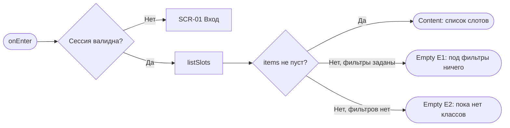
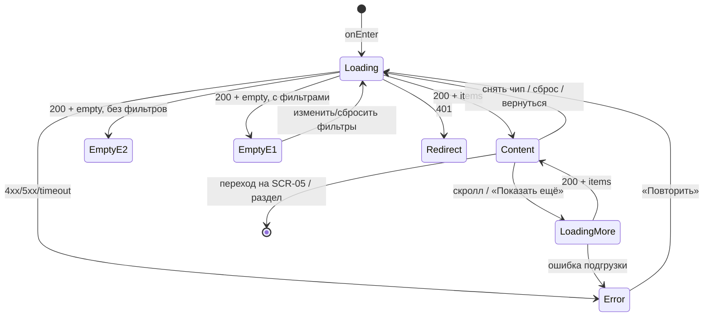

# Список классов (каталог слотов)

**ID:** SCR-03  
**Тип:** Экран  
**Домен:** 03. Каталог классов  
**Приоритет:** Critical  
**Функциональные блоки:** FB-CATALOG-001 (выдача слотов), FB-CATALOG-002 (пагинация), FB-CATALOG-003 (вход в фильтры)  
**Зона авторизации:** АЗ  
**Дизайн-макет:** — (макет не создан, этап дизайна)

---

## Содержание

- [История изменений](#история-изменений)
- [Обзор](#обзор)
- [Навигация](#навигация)
- [Входные данные](#входные-данные)
- [Применяемые логики](#применяемые-логики)
- [Свойства Bottom Sheet](#свойства-bottom-sheet)
- [Инициализация](#инициализация)
- [Используемые запросы](#используемые-запросы)
- [Макет экрана](#макет-экрана)
- [Элементы экрана](#элементы-экрана)
- [Состояния экрана](#состояния-экрана)
- [Действия пользователя](#действия-пользователя)
- [Связанные требования](#связанные-требования)
- [Критерии приёмки](#критерии-приёмки)
---

## История изменений

| Релиз | ТЗ | Описание изменений |
|-------|-----|-------------------|
| 0.1.0 | Черновик | Первичная версия ТЗ экрана «Список классов» для клиентского web-приложения «Шеф-стол». |

---

## Обзор

Это витрина студии «Шеф-стол» и главный экран приложения. Клиент попадает сюда сразу после входа и видит тёплую подборку предстоящих кулинарных классов — «что готовим на ближайшей неделе, с каким шефом, по какой цене и остались ли места». Экран отвечает на простые вопросы клиента и одним касанием ведёт вглубь — к карточке класса.

По умолчанию, без каких-либо действий пользователя, показываются предстоящие слоты на **ближайшие 7 дней** от текущего момента (`date_from` = сейчас, `date_to` = сейчас + 7 дней), отсортированные по времени старта по возрастанию (ближайший — сверху). Больший период доступен через фильтры (SCR-04).

Экран **только для чтения**: слоты, программы и шефы — read-only проекция существующей инфраструктуры (NFR-8, NFR-10). Клиент ничего не создаёт и не редактирует; свободные места — источник истины бэкенда.

### User Story

> Как клиент студии «Шеф-стол», я хочу видеть список ближайших кулинарных классов с ключевой информацией и быстро отфильтровать его,
> чтобы без лишних шагов выбрать подходящий класс и перейти к его деталям.

### Бизнес-ценность

- Даёт клиентам самостоятельно находить и выбирать классы без ручного посредничества (BR-2).
- Показывает актуальную доступность мест из единой системы, снижая путаницу и двойные брони (BR-1).
- Тёплая, «вкусная» витрина формирует доверие и стимулирует запись.

---

## Навигация

### Входящая (откуда открывается)

| Источник | Триггер | Условие | Передаваемые параметры |
|----------|---------|---------|------------------------|
| [SCR-02 Подтверждение входа (OTP)](SCR-02_подтверждение-otp.md) | Успешный вход | Всегда (первый экран после входа) | — |
| Основная навигация (вкладка «Классы») | Тап по пункту навигации | Клиент авторизован | — |
| [SCR-05 Карточка класса](SCR-05_карточка-класса.md) | Тап «Назад» | Всегда | сохранённые фильтры и позиция прокрутки |
| [SCR-04 Фильтры](SCR-04_фильтры.md) | «Применить» / «Сбросить» / закрытие | Всегда | `date_from`, `date_to`, `program_type[]`, `chef_id[]`, `only_available` |
| [SCR-07 Запись создана](SCR-07_запись-создана.md) | Тап «К списку классов» | Всегда | — |
| Deep link | `/classes` | Клиент авторизован | — |

### Исходящая (куда ведёт)

| Назначение | Триггер | Передаваемые параметры |
|------------|---------|------------------------|
| [SCR-05 Карточка класса](SCR-05_карточка-класса.md) | Тап по краткой карточке слота | `slotId` |
| [SCR-04 Фильтры](SCR-04_фильтры.md) | Тап по кнопке/иконке фильтров | текущие `date_from`, `date_to`, `program_type[]`, `chef_id[]`, `only_available` |
| [SCR-08 Мои бронирования](SCR-08_мои-бронирования.md) | Пункт навигации «Мои брони» | — |
| [SCR-10 Профиль](SCR-10_профиль.md) | Пункт навигации «Профиль» | — |
| [SCR-01 Вход](SCR-01_вход-телефон.md) | Истечение сессии (401) | — |

---

## Входные данные

| Название | Тип | Возможные значения | Описание |
|----------|-----|-------------------|----------|
| `filters.date_from` | Состояние | ISO date-time / `null` | Начало периода выдачи. По умолчанию (`null`) бэкенд подставляет текущий момент. |
| `filters.date_to` | Состояние | ISO date-time / `null` | Конец периода выдачи. По умолчанию (`null`) бэкенд подставляет `date_from` + 7 дней. |
| `filters.program_type` | Состояние | `novice`, `experienced` (массив) | Выбранные типы программ (OR внутри группы). Пусто = без ограничения. |
| `filters.chef_id` | Состояние | массив UUID | Выбранные шефы (OR внутри группы). Пусто = без ограничения. |
| `filters.only_available` | Состояние | `true`, `false` | Только слоты со свободными местами. По умолчанию `false`. |
| `pagination.limit` | Состояние | 1..100 (default 20) | Размер страницы для подгрузки (LOGIC-008). |
| `pagination.offset` | Состояние | ≥ 0 (default 0) | Смещение текущей страницы (LOGIC-008). |
| `scrollPosition` | Кэш | число | Сохранённая позиция прокрутки при возврате с SCR-05/SCR-04. |

---

## Применяемые логики

| Логика | Элемент/Триггер | Описание |
|--------|-----------------|----------|
| [LOGIC-002 Сессия и авторизация](09_Логики/LOGIC-002_сессия-и-авторизация.md) | Открытие экрана | Route guard: экран доступен только авторизованному клиенту; при 401/истёкшей сессии — переход на вход (SCR-01). |
| [LOGIC-007 Фильтры каталога](09_Логики/LOGIC-007_фильтры-каталога.md) | Кнопка фильтров, чипы, «Сбросить всё» | Применение и сброс фильтров, дефолтный 7-дневный диапазон, параметры `program_type`/`chef_id`/`only_available`/период. |
| [LOGIC-008 Пагинация списков](09_Логики/LOGIC-008_пагинация-списков.md) | Прокрутка / «Показать ещё» | Постраничная подгрузка по `limit`/`offset` с накоплением элементов. |

---

## Свойства Bottom Sheet

> Не применимо (тип экрана — «Экран»).

---

## Инициализация

> **Примечание:** При открытии экрана отправляется запрос списка слотов с текущими фильтрами. Справочники (шефы, программы) на этом экране не загружаются — они нужны только на SCR-04.

### Диаграмма загрузки



### Запросы при открытии

| № | Запрос | Критичный | Зависит от | Условие |
|---|--------|-----------|------------|---------|
| 1 | [listSlots](#listslots) | Да | — | Всегда (с текущими фильтрами и `offset=0`) |

> Полное описание запросов см. в секции [Используемые запросы](#используемые-запросы).

---

## Используемые запросы

> Все API-запросы экрана с полным описанием параметров и обработки ответов.

### listSlots

**Тип:** REST  
**Метод:** GET  
**Спецификация:** [../api/slots/api.yaml](../api/slots/api.yaml) → `listSlots`

**Триггер:** Инициализация; повторно — при применении/сбросе фильтров, снятии чипа, подгрузке следующей страницы (LOGIC-008), retry.

**Параметры:**

| Параметр | Тип | Обязательность | Источник | Описание |
|----------|-----|----------------|----------|----------|
| `date_from` | string (date-time) | Нет | `filters.date_from` | Начало периода. Если не задан — бэкенд подставляет текущий момент (FR-3, R-027). |
| `date_to` | string (date-time) | Нет | `filters.date_to` | Конец периода. Если не задан — бэкенд подставляет `date_from` + 7 дней. |
| `program_type` | array<string> | Нет | `filters.program_type` | `novice`/`experienced`; OR внутри группы, AND между группами (FR-4). |
| `chef_id` | array<uuid> | Нет | `filters.chef_id` | Идентификаторы шефов; OR внутри группы (FR-4). |
| `only_available` | boolean | Нет | `filters.only_available` | Только слоты с `free_seats > 0`. По умолчанию `false`. |
| `limit` | integer | Нет | `pagination.limit` | Размер страницы, 1..100 (default 20). |
| `offset` | integer | Нет | `pagination.offset` | Смещение страницы (LOGIC-008). |

**Обработка ответа:**

| Результат | Условие | UI-реакция |
|-----------|---------|------------|
| Загрузка (первая страница) | — | Скелетоны нескольких карточек слотов |
| Загрузка (подгрузка) | `offset > 0` | Деликатный индикатор внизу списка, без сброса контента |
| Успех | `items` не пуст | Отрисовать список `SlotSummary`, сгруппировать по дням; обновить `meta` |
| Успех | `items` пуст И фильтры не заданы | Empty state E2 «Пока нет доступных классов» (без «Сбросить фильтры») |
| Успех | `items` пуст И фильтры заданы | Empty state E1 «Под фильтры ничего не нашлось» + «Изменить/Сбросить фильтры»; чипы остаются видны |
| HTTP 400 | Некорректные параметры | Error state «Не удалось загрузить классы» + «Повторить»; фильтры не теряются |
| HTTP 401 | Токен невалиден/истёк | Переход на вход (SCR-01) через LOGIC-002 |
| HTTP 5xx / default | — | Error state с кнопкой «Повторить» |
| Сеть | Нет соединения | Error state с кнопкой «Повторить», фильтры сохраняются |

---

## Макет экрана

### Структура

```
┌─────────────────────────────────────┐
│ Ближайшие классы        [⚲ Фильтры•]│  ← Header + вход в фильтры (бейдж)
│ 6–13 июля                           │  ← Контекст периода
├─────────────────────────────────────┤
│ [Опытный ✕][Со свободными ✕] Сброс  │  ← Чипы активных фильтров (если заданы)
├─────────────────────────────────────┤
│ Сегодня                             │  ← Разделитель-дата (группировка)
│ ┌─────────────────────────────────┐ │
│ │ 10:00 · ~3 ч        Опытный     │ │
│ │ Паста ручной работы             │ │  ← Краткая карточка слота
│ │ Шеф Марко      2500 ₽  свободно 4│ │
│ └─────────────────────────────────┘ │
│ ┌─────────────────────────────────┐ │
│ │ 18:00 · ~3 ч   Новичковый       │ │
│ │ ...                    Мест нет │ │  ← Приглушённая карточка «Мест нет»
│ └─────────────────────────────────┘ │
│ Завтра                              │
│ ...                                 │
│           [ Показать ещё ]          │  ← Подгрузка (LOGIC-008)
└─────────────────────────────────────┘
```

### Компоненты

| Компонент | Описание | Обязательность |
|-----------|----------|----------------|
| Шапка списка | Заголовок «Ближайшие классы» + контекст периода | Да |
| Кнопка фильтров | Иконка/кнопка входа в SCR-04 с бейджем числа активных условий | Да |
| Строка чипов | Горизонтальный ряд чипов активных фильтров + «Сбросить всё» | Опционально (когда фильтры заданы) |
| Разделитель-дата | Заголовок группы дня («Сегодня», «Сб, 11 июля») | Опционально (группировка) |
| Краткая карточка слота | Кликабельная карточка: дата/время, программа+тип, шеф, цена, места | Да |
| Кнопка «Показать ещё» | Подгрузка следующей страницы (LOGIC-008) | Опционально (когда `offset + limit < total`) |
| Скелетоны | Плейсхолдеры карточек при загрузке | Да |
| Блок Empty/Error | Центральный блок пустого/ошибочного состояния | Да |

---

## Элементы экрана

> **Примечания:**
> - Экран read-only; поля ввода отсутствуют, поэтому колонка «Валидация» — «—».
> - Логика описана текстовыми блоками после таблиц.

### 1. Шапка и вход в фильтры

| Элемент | Описание | Источник данных | Валидация | Действие |
|---------|----------|-----------------|-----------|----------|
| Заголовок «Ближайшие классы» | Название раздела | статичный текст | — | — |
| Контекст периода | Диапазон дат выдачи | `filters.date_from`/`date_to` (или дефолт) | — | — |
| Кнопка «Фильтры» | Вход в панель фильтров, бейдж числа активных условий | число активных условий из `filters` | — | Открыть [SCR-04 Фильтры](SCR-04_фильтры.md) |

**Логика:**
- Кнопка «Фильтры»: [LOGIC-007](09_Логики/LOGIC-007_фильтры-каталога.md) — передаёт текущее состояние фильтров в SCR-04; бейдж показывает количество заданных условий (тип, шеф, наличие мест, нестандартный период).

### 2. Чипы активных фильтров

| Элемент | Описание | Источник данных | Валидация | Действие |
|---------|----------|-----------------|-----------|----------|
| Чип условия | Читаемое условие («Опытный», «Шеф: Марко», «6–20 июля», «Со свободными местами») | `filters.*` | — | Тап по крестику — снять условие, пересчитать выдачу |
| «Сбросить всё» | Возврат к дефолтной выдаче | — | — | Сбросить `filters` к дефолту, перезапрос [listSlots](#listslots) |

**Логика:**
- Чипы и «Сбросить всё»: [LOGIC-007](09_Логики/LOGIC-007_фильтры-каталога.md) — снятие чипа мгновенно пересчитывает выдачу (перезапрос с `offset=0`), контекст периода обновляется; «Сбросить всё» возвращает к ближайшим 7 дням (UC-1 A2).

**Условия доступности:**
- Строка чипов и «Сбросить всё» видны, только если задан хотя бы один фильтр, отличный от дефолта.

### 3. Список слотов

| Элемент | Описание | Источник данных | Валидация | Действие |
|---------|----------|-----------------|-----------|----------|
| Разделитель-дата | Заголовок группы дня | `start_at` из `items` | — | — |
| Дата/время старта | «10:00 · ~3 ч» | `start_at`, `program.duration_min` | — | — |
| Метка типа программы | «Новичковый» / «Опытный» (текст + иконка/цвет) | `program.type` | — | — |
| Название программы | Меню класса | `program.name` | — | — |
| Шеф | Имя ведущего | `chef.name` | — | — |
| Цена | Цена за место | `price` (RUB) | — | — |
| Места | «свободно N» или «Мест нет» | `free_seats`, `total_seats` | — | — |
| Карточка целиком | Кликабельная область слота | `SlotSummary` | — | Открыть [SCR-05 Карточка класса](SCR-05_карточка-класса.md) с `slotId` |

**Логика:**
- Карточка: `max_seats = min(free_seats, 6)`. Если `free_seats = 0` — метка «Мест нет», карточка визуально приглушена, но остаётся кликабельной и ведёт на SCR-05.
- Слот со `status = cancelled`: помечается «Отменён студией», запись недоступна (запись на такой слот вернёт 410 на этапе бронирования, R-008/FR-18); карточка остаётся информативной.
- Тип программы и статус «Мест нет» дублируются текстом/иконкой, не только цветом (доступность).

### 4. Подгрузка (пагинация)

| Элемент | Описание | Источник данных | Валидация | Действие |
|---------|----------|-----------------|-----------|----------|
| «Показать ещё» / бесконечная прокрутка | Загрузка следующей страницы | `meta.limit`, `meta.offset`, `meta.total` | — | Перезапрос [listSlots](#listslots) с увеличенным `offset` |

**Логика:**
- Подгрузка: [LOGIC-008](09_Логики/LOGIC-008_пагинация-списков.md) — новые `items` добавляются к уже показанным без сброса скролла; индикатор — деликатный, без полного скелетона.

**Условия доступности:**
- Элемент подгрузки виден, если `meta.offset + meta.limit < meta.total`.

---

## Состояния экрана

### Таблица состояний

| Состояние | Условие | Отображение |
|-----------|---------|-------------|
| Loading | Ожидание первой страницы `listSlots` | Скелетоны карточек слотов |
| Loading-more | Подгрузка при `offset > 0` | Деликатный индикатор внизу, контент сохранён |
| Content | 200 + `items` не пуст | Список слотов, сгруппированный по дням |
| Empty E2 | 200 + `items` пуст + фильтры не заданы | «Пока нет доступных классов» (без «Сбросить фильтры»), мягкое «Обновить» |
| Empty E1 | 200 + `items` пуст + фильтры заданы | «Под фильтры ничего не нашлось» + «Изменить/Сбросить фильтры»; чипы видны |
| Error | 4xx (кроме 401) / 5xx / таймаут / нет сети | «Не удалось загрузить классы» + «Повторить»; фильтры сохранены |
| Redirect | 401 / истёкшая сессия | Переход на вход (SCR-01) через LOGIC-002 |

### Диаграмма переходов



---

## Действия пользователя

| Действие | Элемент | Триггер | Результат |
|----------|---------|---------|-----------|
| Открыть детали слота | Краткая карточка | Tap/Enter | Переход на [SCR-05](SCR-05_карточка-класса.md) с `slotId` |
| Открыть фильтры | Кнопка «Фильтры» | Tap/Enter | Переход на [SCR-04](SCR-04_фильтры.md) |
| Снять один фильтр | Крестик на чипе | Tap | Перезапрос `listSlots`, обновление выдачи и контекста |
| Сбросить все фильтры | «Сбросить всё» | Tap | Возврат к дефолту (ближайшие 7 дней) |
| Подгрузить ещё | «Показать ещё» / скролл | Tap/Scroll | Догрузка следующей страницы (LOGIC-008) |
| Повторить загрузку | Кнопка «Повторить» | Tap | Повтор `listSlots` с текущими фильтрами |
| Обновить (E2) | «Обновить» | Tap | Повтор `listSlots` |

---

## Связанные требования

### Функциональные (FR-*)

| ID | Название | Приоритет |
|----|----------|-----------|
| [FR-3](../2-requirements/functional-requirements.md) | Список предстоящих слотов на 7 дней; empty state «Пока нет доступных классов» | Must |
| [FR-4](../2-requirements/functional-requirements.md) | Вход в фильтрацию слотов (дата, тип, наличие мест, шеф) | Must |
| [FR-5](../2-requirements/functional-requirements.md) | Краткая карточка слота (переход к деталям) | Must |

### Нефункциональные (NFR-*)

| ID | Название | Приоритет |
|----|----------|-----------|
| [NFR-1](../2-requirements/non-functional-requirements.md) | Web-приложение в современном браузере | Высокий |
| [NFR-2](../2-requirements/non-functional-requirements.md) | Самостоятельная запись без обучения, понятные состояния | Высокий |
| [NFR-6](../2-requirements/non-functional-requirements.md) | Отзывчивость списка в пиковые часы выходных | Высокий |
| [NFR-8](../2-requirements/non-functional-requirements.md) | Слоты доступны клиенту только для чтения | Высокий |
| [NFR-10](../2-requirements/non-functional-requirements.md) | Интеграция с бэкендом; бэкенд — источник истины | Высокий |

### Use cases / User stories

| ID | Название | Приоритет |
|----|----------|-----------|
| UC-1 | Просмотр и фильтрация списка классов (осн. поток, A1 больший период, A2 сброс, E1/E2 пустые состояния) | Must |
| US-2 | Просмотр ближайших классов | Must |
| US-3 | Фильтрация классов под себя | Must |
| BR-1 / BR-2 | Единая система записи; самостоятельная запись клиентов | Must |
| R-004 / R-027 | Бэкенд — источник истины; дефолтный горизонт 7 дней | Must |

---

## Критерии приёмки

### Позитивные сценарии

| ID | Критерий | Приоритет |
|----|----------|-----------|
| AC-001 | **Дано** клиент авторизован и фильтры не заданы, **Когда** он открывает экран, **Тогда** отображаются предстоящие слоты на ближайшие 7 дней, отсортированные по `start_at` по возрастанию | P0 |
| AC-002 | **Дано** список загружен, **Когда** клиент тапает по краткой карточке, **Тогда** открывается SCR-05 с корректным `slotId` | P0 |
| AC-003 | **Дано** список загружен, **Когда** клиент тапает по кнопке «Фильтры», **Тогда** открывается SCR-04 с текущим состоянием фильтров | P0 |
| AC-004 | **Дано** в выдаче больше элементов, чем на странице (`offset + limit < total`), **Когда** клиент запрашивает подгрузку, **Тогда** следующая страница добавляется к списку без сброса прокрутки | P1 |
| AC-005 | **Дано** заданы фильтры, **Когда** клиент снимает один чип, **Тогда** выдача мгновенно пересчитывается запросом с `offset=0`, а контекст периода обновляется | P1 |

### Негативные сценарии

| ID | Критерий | Приоритет |
|----|----------|-----------|
| AC-N01 | **Дано** нет соединения / ответ 5xx, **Когда** открытие экрана, **Тогда** отображается error state «Не удалось загрузить классы» с кнопкой «Повторить», фильтры не теряются | P0 |
| AC-N02 | **Дано** сессия истекла (401), **Когда** запрос списка, **Тогда** выполняется переход на вход (SCR-01) через LOGIC-002 | P0 |
| AC-N03 | **Дано** фильтры не заданы и предстоящих слотов нет, **Когда** ответ 200 с пустым `items`, **Тогда** показывается E2 «Пока нет доступных классов» без кнопки «Сбросить фильтры» | P1 |
| AC-N04 | **Дано** фильтры заданы и результатов нет, **Когда** ответ 200 с пустым `items`, **Тогда** показывается E1 с действиями «Изменить/Сбросить фильтры», а активные чипы остаются видны | P1 |

### Граничные условия (Edge Cases)

| ID | Критерий | Приоритет |
|----|----------|-----------|
| AC-E01 | **Дано** слот с `free_seats = 0`, **Когда** он в выдаче, **Тогда** карточка помечена «Мест нет», приглушена, но остаётся кликабельной и ведёт на SCR-05 | P1 |
| AC-E02 | **Дано** слот со `status = cancelled` присутствует в выдаче, **Когда** он отображается, **Тогда** он явно помечен «Отменён студией» и не предлагает запись | P2 |
| AC-E03 | **Дано** задан период шире 7 дней (A1), **Когда** список длинный, **Тогда** применяются группировка по дням и постраничная подгрузка | P1 |
| AC-E04 | **Дано** клиент вернулся с SCR-05/SCR-04, **Когда** экран восстанавливается, **Тогда** сохраняются заданные фильтры и, по возможности, позиция прокрутки | P2 |

---
