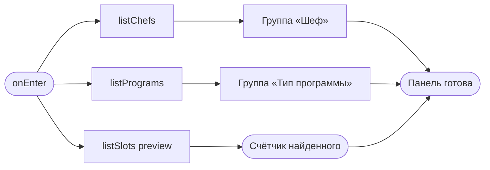
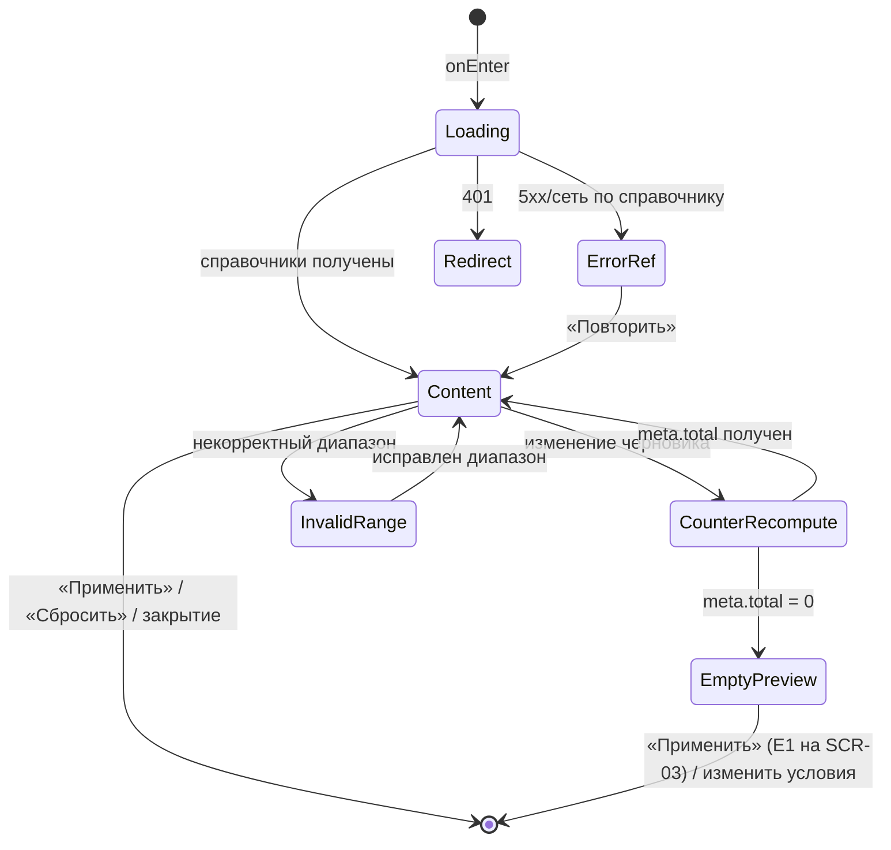

# Фильтры списка классов

**ID:** SCR-04  
**Тип:** Bottom Sheet  
**Домен:** 03. Каталог классов  
**Приоритет:** Critical  
**Функциональные блоки:** FB-CATALOG-004 (выбор условий фильтрации), FB-CATALOG-005 (справочники шефов/программ), FB-CATALOG-006 (применение/сброс)  
**Зона авторизации:** АЗ  
**Дизайн-макет:** — (макет не создан, этап дизайна)

---

## Содержание

- [История изменений](#история-изменений)
- [Обзор](#обзор)
- [Навигация](#навигация)
- [Входные данные](#входные-данные)
- [Применяемые логики](#применяемые-логики)
- [Свойства Bottom Sheet](#свойства-bottom-sheet)
- [Инициализация](#инициализация)
- [Используемые запросы](#используемые-запросы)
- [Макет экрана](#макет-экрана)
- [Элементы экрана](#элементы-экрана)
- [Состояния экрана](#состояния-экрана)
- [Действия пользователя](#действия-пользователя)
- [Связанные требования](#связанные-требования)
- [Критерии приёмки](#критерии-приёмки)
---

## История изменений

| Релиз | ТЗ | Описание изменений |
|-------|-----|-------------------|
| 0.1.0 | Черновик | Первичная версия ТЗ шторки «Фильтры списка классов» для клиентского web-приложения «Шеф-стол». |

---

## Обзор

Это инструмент «сузить каталог под себя», работающий поверх списка классов (SCR-03). Задача клиента — быстро отсечь лишнее и получить только подходящие классы: «покажи опытные классы со свободными местами у Марко на следующие две недели». Панель помогает принять решение здесь же — показывает, сколько классов найдётся, — и не гоняет человека туда-обратно.

Ровно **четыре** группы фильтров (и ни одной сверх требований, FR-4): дата/период старта, тип программы (новичковый/опытный), наличие свободных мест, шеф. Значения справочников (шефы, программы) — read-only из бэкенда; клиент только выбирает из готовых значений.

**Форм-фактор.** На mobile web — модальное окно/bottom-sheet поверх списка с затемнением и закреплённым футером кнопок; на desktop web — боковая панель рядом со списком. Настоящее ТЗ моделирует шторку как Bottom Sheet (свойства — ниже), панель на desktop — её адаптация.

### User Story

> Как клиент студии «Шеф-стол», я хочу задать удобные условия отбора классов (период, тип, наличие мест, шеф) и увидеть, сколько классов найдётся,
> чтобы уверенно применить фильтры и получить на списке только подходящие мне классы.

### Бизнес-ценность

- Ускоряет самостоятельный выбор класса, повышая долю онлайн-записей (BR-2).
- Даёт заглянуть за горизонт недели (A1) без потери простоты (NFR-2).
- Снижает неуверенность за счёт живого счётчика найденного (NFR-6).

---

## Навигация

### Входящая (откуда открывается)

| Источник | Триггер | Условие | Передаваемые параметры |
|----------|---------|---------|------------------------|
| [SCR-03 Список классов](SCR-03_список-классов.md) | Тап по кнопке/иконке «Фильтры» | Клиент авторизован | текущие `date_from`, `date_to`, `program_type[]`, `chef_id[]`, `only_available` |

### Исходящая (куда ведёт)

| Назначение | Триггер | Передаваемые параметры |
|------------|---------|------------------------|
| [SCR-03 Список классов](SCR-03_список-классов.md) | «Применить» | обновлённые `date_from`, `date_to`, `program_type[]`, `chef_id[]`, `only_available` (→ чипы) |
| [SCR-03 Список классов](SCR-03_список-классов.md) | «Сбросить» | дефолтные фильтры (ближайшие 7 дней, чипы исчезают) |
| [SCR-03 Список классов](SCR-03_список-классов.md) | Закрытие (крестик / Esc / тап по затемнению) | без изменений выдачи |

---

## Входные данные

| Название | Тип | Возможные значения | Описание |
|----------|-----|-------------------|----------|
| `filters.date_from` | Состояние | ISO date-time / `null` | Начало периода, переданное со списка. |
| `filters.date_to` | Состояние | ISO date-time / `null` | Конец периода, переданное со списка. |
| `filters.program_type` | Состояние | `novice`, `experienced` (массив) | Выбранные типы программ. |
| `filters.chef_id` | Состояние | массив UUID | Выбранные шефы. |
| `filters.only_available` | Состояние | `true`, `false` | Только со свободными местами. |
| `draftFilters` | Состояние | те же поля | Черновик выбора внутри панели до «Применить». |

---

## Применяемые логики

| Логика | Элемент/Триггер | Описание |
|--------|-----------------|----------|
| [LOGIC-002 Сессия и авторизация](09_Логики/LOGIC-002_сессия-и-авторизация.md) | Открытие панели / запросы справочников | Route guard; при 401 — переход на вход (SCR-01). |
| [LOGIC-007 Фильтры каталога](09_Логики/LOGIC-007_фильтры-каталога.md) | «Применить» / «Сбросить» / выбор условий | Применение и сброс фильтров, дефолтный 7-дневный диапазон, параметры `program_type`/`chef_id`/`only_available`/период, синхронизация с чипами SCR-03. |

---

## Свойства Bottom Sheet

| Свойство | Значение |
|----------|----------|
| Высота | Fullscreen / большая на mobile; на desktop — боковая панель фиксированной ширины |
| Закрытие свайпом | Да (mobile, свайп вниз) |
| Закрытие по тапу вне области | Да (mobile, тап по затемнению) |
| Затемнение фона | Да (mobile); на desktop панель сосуществует со списком без затемнения |
| Кнопка закрытия | Да (крестик в шапке, слева/справа); Esc закрывает; фокус возвращается на кнопку «Фильтры» SCR-03 |

---

## Инициализация

> **Примечание:** При открытии панели загружаются справочники шефов и программ для соответствующих групп фильтров. Группы «дата/период» и «наличие мест» работают сразу, не дожидаясь справочников. Счётчик найденного получается предпросмотром через `listSlots` с `limit=1` по текущему черновику.

### Диаграмма загрузки



### Запросы при открытии

| № | Запрос | Критичный | Зависит от | Условие |
|---|--------|-----------|------------|---------|
| 1 | [listChefs](#listchefs) | Нет | — | Всегда (для группы «Шеф») |
| 2 | [listPrograms](#listprograms) | Нет | — | Всегда (для группы «Тип программы») |
| 3 | [listSlots (preview)](#listslots-preview) | Нет | — | Всегда и при каждом изменении черновика (счётчик) |

> Полное описание запросов см. в секции [Используемые запросы](#используемые-запросы).

---

## Используемые запросы

> Все API-запросы шторки с полным описанием параметров и обработки ответов.

### listChefs

**Тип:** REST  
**Метод:** GET  
**Спецификация:** [../api/catalog/api.yaml](../api/catalog/api.yaml) → `listChefs`

**Триггер:** Инициализация панели.

**Параметры:**

| Параметр | Тип | Обязательность | Источник | Описание |
|----------|-----|----------------|----------|----------|
| `limit` | integer | Нет | константа | Размер страницы справочника (default 20; при длинном списке — догрузка/поиск). |
| `offset` | integer | Нет | состояние | Смещение при догрузке справочника шефов. |

**Обработка ответа:**

| Результат | Условие | UI-реакция |
|-----------|---------|------------|
| Загрузка | — | Скелетоны опций в группе «Шеф» |
| Успех | `items` не пуст | Список шефов с чекбоксами (поиск при длинном списке) |
| Успех | `items` пуст | Группа «Шеф» скрывается/помечается «недоступно»; остальные фильтры работают |
| HTTP 401 | — | Переход на вход (SCR-01) через LOGIC-002 |
| HTTP 5xx / default / сеть | — | Сообщение + «Повторить» в группе «Шеф»; прочие фильтры остаются рабочими |

---

### listPrograms

**Тип:** REST  
**Метод:** GET  
**Спецификация:** [../api/catalog/api.yaml](../api/catalog/api.yaml) → `listPrograms`

**Триггер:** Инициализация панели.

**Параметры:**

| Параметр | Тип | Обязательность | Источник | Описание |
|----------|-----|----------------|----------|----------|
| `limit` | integer | Нет | константа | Размер страницы справочника программ (default 20). |
| `offset` | integer | Нет | состояние | Смещение при догрузке. |

**Обработка ответа:**

| Результат | Условие | UI-реакция |
|-----------|---------|------------|
| Загрузка | — | Скелетоны опций типа программы |
| Успех | `items` не пуст | Доступны типы `novice`/`experienced` (агрегируются из `program.type`) |
| Успех | `items` пуст | Группа «Тип программы» скрывается; прочие фильтры работают |
| HTTP 401 | — | Переход на вход (SCR-01) через LOGIC-002 |
| HTTP 5xx / default / сеть | — | Сообщение + «Повторить» в группе; прочие фильтры рабочие |

> **Примечание:** фильтрация ведётся по `program_type` (`novice`/`experienced`). `listPrograms` служит подтверждением доступных типов и, при необходимости, отображением названий меню; сам параметр запроса slots — именно `program_type`.

---

### listSlots (preview)

**Тип:** REST  
**Метод:** GET  
**Спецификация:** [../api/slots/api.yaml](../api/slots/api.yaml) → `listSlots`

**Триггер:** Инициализация панели; при каждом изменении черновика фильтров (с дебаунсом) — для счётчика найденного.

**Параметры:**

| Параметр | Тип | Обязательность | Источник | Описание |
|----------|-----|----------------|----------|----------|
| `date_from` | string (date-time) | Нет | `draftFilters.date_from` | Начало периода черновика. |
| `date_to` | string (date-time) | Нет | `draftFilters.date_to` | Конец периода черновика. |
| `program_type` | array<string> | Нет | `draftFilters.program_type` | Выбранные типы (OR внутри группы, AND между группами). |
| `chef_id` | array<uuid> | Нет | `draftFilters.chef_id` | Выбранные шефы (OR внутри группы). |
| `only_available` | boolean | Нет | `draftFilters.only_available` | Только со свободными местами. |
| `limit` | integer | Нет | константа `1` | Минимальная выдача — нужен только `meta.total` для счётчика. |
| `offset` | integer | Нет | константа `0` | — |

**Обработка ответа:**

| Результат | Условие | UI-реакция |
|-----------|---------|------------|
| Загрузка | — | Деликатный индикатор пересчёта у счётчика (aria-live) |
| Успех | `meta.total > 0` | «Показать N классов» на кнопке «Применить»/в счётчике |
| Успех | `meta.total = 0` | «0 классов» + подсказка «Под эти условия классов нет — попробуйте расширить период» |
| HTTP 400 | Некорректный диапазон дат | Блокировка «Применить» + подсказка о диапазоне |
| HTTP 401 | — | Переход на вход (SCR-01) через LOGIC-002 |
| HTTP 5xx / default / сеть | — | Счётчик скрывается/«—»; «Применить» остаётся доступной |

---

## Макет экрана

### Структура

```
┌─────────────────────────────────────┐
│ Фильтры                        [ ✕ ] │  ← Шапка панели + закрытие
├─────────────────────────────────────┤
│ Дата / период                        │
│ [7 дней][Эта неделя][2 недели] от–до │  ← Пресеты + произвольный диапазон
│                                       │
│ Тип программы                         │
│ [ Новичковый ] [ Опытный ]            │  ← Множественный выбор
│                                       │
│ Свободные места                       │
│ [◯ Только со свободными местами]      │  ← Тумблер
│                                       │
│ Шеф                            (поиск)│
│ ☐ Марко   ☐ Анна   ☐ ...              │  ← Чекбоксы из listChefs
├─────────────────────────────────────┤
│ [ Сбросить ]   [ Показать N классов ]│  ← Закреплённый футер
└─────────────────────────────────────┘
```

### Компоненты

| Компонент | Описание | Обязательность |
|-----------|----------|----------------|
| Шапка «Фильтры» + закрытие | Заголовок и крестик; Esc/затемнение закрывают | Да |
| Группа «Дата/период» | Пресеты + произвольный диапазон от–до | Да |
| Группа «Тип программы» | Опции `novice`/`experienced`, множественный выбор | Да |
| Группа «Свободные места» | Тумблер `only_available` | Да |
| Группа «Шеф» | Чекбоксы шефов из `listChefs`, поиск при длинном списке | Да (деградирует, если справочник пуст) |
| Счётчик найденного | «Показать N классов» (aria-live) | Да |
| Футер действий | «Сбросить» и «Применить» | Да |

---

## Элементы экрана

> **Примечания:**
> - Колонка «Валидация» заполнена для группы дат; остальные группы — выбор из готовых значений, «—».
> - Логика описана текстовыми блоками после таблиц.

### 1. Группа «Дата / период»

| Элемент | Описание | Источник данных | Валидация | Действие |
|---------|----------|-----------------|-----------|----------|
| Пресет «Ближайшие 7 дней» | Быстрый выбор дефолтного горизонта | — | — | `date_from = сейчас`, `date_to = сейчас+7д` |
| Пресет «Эта неделя» | Текущая календарная неделя | — | — | Задать соответствующий диапазон |
| Пресет «Следующие 2 недели» | Горизонт шире 7 дней (A1) | — | — | `date_to = сейчас+14д` |
| Поле «От» | Начало произвольного диапазона | `draftFilters.date_from` | Не в прошлом. Ошибка: «Дата не может быть в прошлом» | Обновить черновик, пересчитать счётчик |
| Поле «До» | Конец произвольного диапазона | `draftFilters.date_to` | Не раньше «От». Ошибка: «Дата "до" не может быть раньше даты "от"» | Обновить черновик, пересчитать счётчик |

**Момент валидации:** при изменении полей диапазона (до пересчёта счётчика).

**Логика:**
- Группа дат: [LOGIC-007](09_Логики/LOGIC-007_фильтры-каталога.md) — дефолт (не трогали) = ближайшие 7 дней; допускается период шире недели (UC-1 A1). Некорректный диапазон блокирует «Применить».

### 2. Группа «Тип программы»

| Элемент | Описание | Источник данных | Валидация | Действие |
|---------|----------|-----------------|-----------|----------|
| Опция «Новичковый» | Тип `novice` | `listPrograms` (доступные типы) | — | Тогл значения в `draftFilters.program_type`, пересчёт счётчика |
| Опция «Опытный» | Тип `experienced` | `listPrograms` (доступные типы) | — | Тогл значения в `draftFilters.program_type`, пересчёт счётчика |

**Логика:**
- Множественный выбор: выбор обоих (или ни одного) = без ограничения по типу. Внутри группы — OR; между группами — AND (FR-4).

### 3. Группа «Свободные места»

| Элемент | Описание | Источник данных | Валидация | Действие |
|---------|----------|-----------------|-----------|----------|
| Тумблер «Только со свободными местами» | Ограничить выдачу `free_seats > 0` | `draftFilters.only_available` | — | Установить `only_available`, пересчёт счётчика |

**Логика:**
- По умолчанию выкл (`false`): показываются все слоты, включая заполненные (на SCR-03 — метка «Мест нет»).

### 4. Группа «Шеф»

| Элемент | Описание | Источник данных | Валидация | Действие |
|---------|----------|-----------------|-----------|----------|
| Поле поиска | Фильтрация списка шефов по имени | локально по `listChefs` | — | Сузить отображаемый список |
| Чекбокс шефа | Выбор шефа | `Chef.id`, `Chef.name` из `listChefs` | — | Тогл `chef_id` в `draftFilters`, пересчёт счётчика |

**Логика:**
- Множественный выбор; внутри группы — OR. Если справочник пуст/не загрузился — группа скрывается или помечается «недоступно», прочие фильтры продолжают работать.

**Условия доступности:**
- Поле поиска отображается только при длинном списке шефов.

### 5. Счётчик и футер действий

| Элемент | Описание | Источник данных | Валидация | Действие |
|---------|----------|-----------------|-----------|----------|
| Счётчик найденного | «Показать N классов» | `meta.total` из [listSlots preview](#listslots-preview) | — | — (обновляется по мере выбора) |
| Кнопка «Сбросить» | Очистить условия к дефолту | — | — | Сброс `draftFilters` к дефолту → [SCR-03](SCR-03_список-классов.md) (ближайшие 7 дней, чипы исчезают) |
| Кнопка «Применить» | Применить фильтры | `draftFilters` | — | Сохранить фильтры → [SCR-03](SCR-03_список-классов.md) с суженной выдачей и чипами |

**Логика:**
- «Применить»: [LOGIC-007](09_Логики/LOGIC-007_фильтры-каталога.md) — переносит `draftFilters` в применённое состояние, закрывает панель (mobile) или обновляет список (desktop), формирует чипы на SCR-03.
- «Сбросить»: возврат выдачи к ближайшим 7 дням (UC-1 A2); чипы на SCR-03 исчезают.
- Счётчик: aria-live-область; пересчёт с лёгким дебаунсом (NFR-6), источник истины — бэкенд (NFR-10).

**Условия доступности:**
- «Применить» неактивна при некорректном диапазоне дат.
- «Сбросить» неактивна, если фильтры уже в дефолте.

---

## Состояния экрана

### Таблица состояний

| Состояние | Условие | Отображение |
|-----------|---------|-------------|
| Loading справочников | Ожидание `listChefs`/`listPrograms` | Скелетоны опций; дата и наличие мест работают сразу |
| Content | Справочники получены | Все четыре группы активны, счётчик считает |
| Counter recompute | Изменение черновика | Деликатный индикатор пересчёта у счётчика |
| Empty preview | `meta.total = 0` | «0 классов» + подсказка расширить период |
| Empty справочника | `listChefs`/`listPrograms` вернул пусто | Соответствующая группа скрыта/«недоступно» |
| Error справочника | 5xx/сеть по `listChefs`/`listPrograms` | Сообщение + «Повторить» в группе; прочие фильтры рабочие |
| Invalid range | `date_to < date_from` или дата в прошлом | Подсказка + блокировка «Применить» |
| Redirect | 401 | Переход на вход (SCR-01) через LOGIC-002 |

### Диаграмма переходов



---

## Действия пользователя

| Действие | Элемент | Триггер | Результат |
|----------|---------|---------|-----------|
| Выбрать период | Пресеты / поля от–до | Tap/ввод | Обновление черновика, пересчёт счётчика |
| Выбрать тип программы | Опции «Новичковый»/«Опытный» | Tap | Тогл `program_type`, пересчёт |
| Включить «только свободные» | Тумблер | Tap | Установка `only_available`, пересчёт |
| Выбрать шефа | Чекбокс | Tap | Тогл `chef_id`, пересчёт |
| Применить | «Показать N классов» | Tap/Enter | Возврат на SCR-03 с фильтрами и чипами |
| Сбросить | «Сбросить» | Tap | Возврат на SCR-03 к дефолту (7 дней), чипы исчезают |
| Закрыть без применения | Крестик / Esc / затемнение / свайп | Tap/Esc/Swipe | Возврат на SCR-03 без изменений; фокус на кнопку «Фильтры» |
| Повторить справочник | «Повторить» в группе | Tap | Повтор `listChefs`/`listPrograms` |

---

## Связанные требования

### Функциональные (FR-*)

| ID | Название | Приоритет |
|----|----------|-----------|
| [FR-4](../2-requirements/functional-requirements.md) | Фильтрация слотов: дата/период, тип программы, наличие мест, шеф | Must |
| [FR-3](../2-requirements/functional-requirements.md) | Дефолтный горизонт 7 дней; больший период через фильтр | Must |

### Нефункциональные (NFR-*)

| ID | Название | Приоритет |
|----|----------|-----------|
| [NFR-2](../2-requirements/non-functional-requirements.md) | Понятная фильтрация без обучения | Высокий |
| [NFR-6](../2-requirements/non-functional-requirements.md) | Быстрый пересчёт и применение | Высокий |
| [NFR-8](../2-requirements/non-functional-requirements.md) | Справочники шефов/программ доступны только для чтения | Высокий |
| [NFR-10](../2-requirements/non-functional-requirements.md) | Пересчёт и список считает бэкенд | Высокий |

### Use cases / User stories

| ID | Название | Приоритет |
|----|----------|-----------|
| UC-1 | Просмотр и фильтрация (шаг 3 — задание фильтров, A1 — больший период, A2 — сброс) | Must |
| US-3 | Фильтрация классов под себя | Must |
| R-004 | Бэкенд — источник истины по выдаче | Must |

---

## Критерии приёмки

### Позитивные сценарии

| ID | Критерий | Приоритет |
|----|----------|-----------|
| AC-001 | **Дано** панель открыта, **Когда** клиент выбирает тип «Опытный», шефа и «только со свободными местами» и жмёт «Применить», **Тогда** SCR-03 показывает суженную выдачу и соответствующие чипы | P0 |
| AC-002 | **Дано** панель открыта, **Когда** клиент меняет условия, **Тогда** счётчик найденного пересчитывается (`listSlots` с `limit=1`) с лёгким дебаунсом | P0 |
| AC-003 | **Дано** фильтры отличны от дефолта, **Когда** клиент жмёт «Сбросить», **Тогда** выдача возвращается к ближайшим 7 дням, а чипы на SCR-03 исчезают (UC-1 A2) | P0 |
| AC-004 | **Дано** клиент задаёт пресет «Следующие 2 недели» (A1), **Когда** «Применить», **Тогда** SCR-03 показывает слоты за расширенный период | P1 |
| AC-005 | **Дано** справочник шефов длинный, **Когда** клиент вводит имя в поиск, **Тогда** список шефов фильтруется локально по имени | P2 |

### Негативные сценарии

| ID | Критерий | Приоритет |
|----|----------|-----------|
| AC-N01 | **Дано** `listChefs` вернул ошибку 5xx/сеть, **Когда** панель открыта, **Тогда** группа «Шеф» показывает «Повторить», а остальные фильтры остаются рабочими | P1 |
| AC-N02 | **Дано** клиент задал дату «до» раньше даты «от», **Когда** он пытается применить, **Тогда** «Применить» заблокирована с понятной подсказкой | P1 |
| AC-N03 | **Дано** сессия истекла (401), **Когда** загрузка справочников/предпросмотра, **Тогда** выполняется переход на вход (SCR-01) через LOGIC-002 | P0 |
| AC-N04 | **Дано** выбранные условия дают `meta.total = 0`, **Когда** предпросмотр обновляется, **Тогда** счётчик показывает «0 классов» с подсказкой расширить период | P1 |

### Граничные условия (Edge Cases)

| ID | Критерий | Приоритет |
|----|----------|-----------|
| AC-E01 | **Дано** справочник шефов пуст, **Когда** панель открыта, **Тогда** группа «Шеф» скрыта/«недоступно», прочие группы работают | P2 |
| AC-E02 | **Дано** клиент закрывает панель крестиком/Esc/тапом по затемнению, **Когда** изменения не применены, **Тогда** выдача на SCR-03 не меняется, а фокус возвращается на кнопку «Фильтры» | P1 |
| AC-E03 | **Дано** выбраны оба типа программы, **Когда** применяется фильтр, **Тогда** ограничение по типу фактически отсутствует (эквивалент «без фильтра по типу») | P2 |
| AC-E04 | **Дано** снятие чипа на SCR-03, **Когда** клиент снова открывает панель, **Тогда** состояние групп соответствует актуальным применённым условиям | P2 |

---
