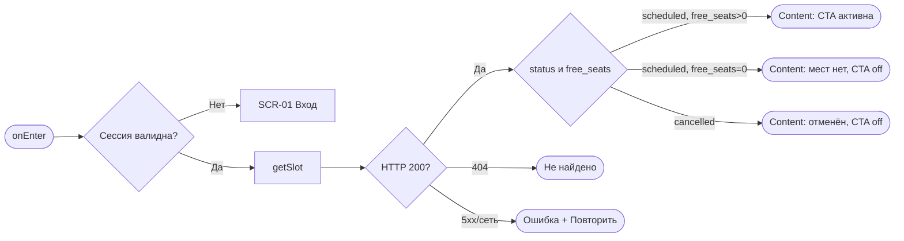
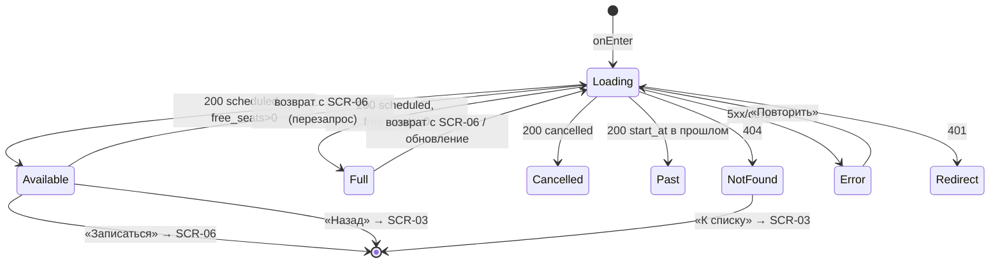

# Карточка класса (детали слота)

**ID:** SCR-05  
**Тип:** Экран  
**Домен:** 03. Каталог классов  
**Приоритет:** Critical  
**Функциональные блоки:** FB-CATALOG-007 (детали слота), FB-CATALOG-008 (доступность мест/проката), FB-BOOKING-000 (вход в запись)  
**Зона авторизации:** АЗ  
**Дизайн-макет:** — (макет не создан, этап дизайна)

---

## Содержание

- [История изменений](#история-изменений)
- [Обзор](#обзор)
- [Навигация](#навигация)
- [Входные данные](#входные-данные)
- [Применяемые логики](#применяемые-логики)
- [Свойства Bottom Sheet](#свойства-bottom-sheet)
- [Инициализация](#инициализация)
- [Используемые запросы](#используемые-запросы)
- [Макет экрана](#макет-экрана)
- [Элементы экрана](#элементы-экрана)
- [Состояния экрана](#состояния-экрана)
- [Действия пользователя](#действия-пользователя)
- [Связанные требования](#связанные-требования)
- [Критерии приёмки](#критерии-приёмки)
---

## История изменений

| Релиз | ТЗ | Описание изменений |
|-------|-----|-------------------|
| 0.1.0 | Черновик | Первичная версия ТЗ экрана «Карточка класса» для клиентского web-приложения «Шеф-стол». |

---

## Обзор

Это витрина одного класса — последняя остановка перед решением «иду / не иду». Клиент уже выбрал слот в списке (SCR-03) и хочет разглядеть детали: удобны ли дата и время (класс займёт около 3 часов), интересна ли программа, по силам ли уровень, кто ведёт, сколько стоит, где студия, остались ли места и можно ли взять экипировку напрокат.

Экран даёт полную, честную картину слота без сюрпризов и мягко готовит к записи (лимит 6 человек на бронь, прокат на стол, оплата офлайн, бесплатная отмена за 24 ч). Единственное «тяжёлое» действие — кнопка **«Записаться»** (→ SCR-06). Слот **read-only** (NFR-8, NFR-10); доступность мест и статус приходят из API и на клиенте не пересчитываются.

### User Story

> Как клиент студии «Шеф-стол», я хочу увидеть все детали выбранного класса и его доступность,
> чтобы уверенно принять решение и перейти к записи либо спокойно вернуться к списку.

### Бизнес-ценность

- Полная и честная картина слота повышает конверсию в запись и снижает отказы (BR-2).
- Заранее показанные правила (24 ч, офлайн-оплата) снижают недопонимание и поздние отмены (BR-3, BR-4).
- Актуальная доступность мест из единой системы поддерживает «0 двойных броней» (BR-1, NFR-4).

---

## Навигация

### Входящая (откуда открывается)

| Источник | Триггер | Условие | Передаваемые параметры |
|----------|---------|---------|------------------------|
| [SCR-03 Список классов](SCR-03_список-классов.md) | Тап по краткой карточке слота | Клиент авторизован | `slotId` |
| [SCR-06 Оформление записи](SCR-06_оформление-записи.md) | Тап «Назад» | Всегда | `slotId` (перезапрос актуальных данных) |
| Deep link | `/classes/{slotId}` | Клиент авторизован | `slotId` |
| Push-уведомление | Тап по уведомлению о классе | `type = class` | `slotId` |

### Исходящая (куда ведёт)

| Назначение | Триггер | Передаваемые параметры |
|------------|---------|------------------------|
| [SCR-06 Оформление записи](SCR-06_оформление-записи.md) | Тап «Записаться» (слот активен, есть места) | `slotId` |
| [SCR-03 Список классов](SCR-03_список-классов.md) | Тап «Назад» | сохранённые фильтры и позиция прокрутки |
| Внешняя карта/маршрут | Тап по адресу/ссылке | адрес студии (новая вкладка) |

---

## Входные данные

| Название | Тип | Возможные значения | Описание |
|----------|-----|-------------------|----------|
| `slotId` | Состояние | UUID | Идентификатор слота, переданный при переходе или из deep link. |
| `returnContext` | Кэш | фильтры + позиция прокрутки | Контекст SCR-03 для возврата «Назад». |

---

## Применяемые логики

| Логика | Элемент/Триггер | Описание |
|--------|-----------------|----------|
| [LOGIC-002 Сессия и авторизация](09_Логики/LOGIC-002_сессия-и-авторизация.md) | Открытие экрана | Route guard; при 401/истёкшей сессии — переход на вход (SCR-01). Клиент видит только read-only слоты (NFR-8). |

---

## Свойства Bottom Sheet

> Не применимо (тип экрана — «Экран»).

---

## Инициализация

> **Примечание:** При открытии экрана запрашиваются полные данные слота по `slotId`. Экран может открыться «холодным» (deep link) без предзагруженных данных из списка — данные всегда берутся из API.

### Диаграмма загрузки



### Запросы при открытии

| № | Запрос | Критичный | Зависит от | Условие |
|---|--------|-----------|------------|---------|
| 1 | [getSlot](#getslot) | Да | — | Всегда (по `slotId`) |

> Полное описание запросов см. в секции [Используемые запросы](#используемые-запросы).

---

## Используемые запросы

> Все API-запросы экрана с полным описанием параметров и обработки ответов.

### getSlot

**Тип:** REST  
**Метод:** GET  
**Спецификация:** [../api/slots/api.yaml](../api/slots/api.yaml) → `getSlot`

**Триггер:** Инициализация; повторно — при возврате с SCR-06 (перезапрос актуальной доступности) и по кнопке «Повторить».

**Параметры:**

| Параметр | Тип | Обязательность | Источник | Описание |
|----------|-----|----------------|----------|----------|
| `slotId` | string (uuid) | Да | `slotId` (path) | Идентификатор слота. |

**Обработка ответа:**

| Результат | Условие | UI-реакция |
|-----------|---------|------------|
| Загрузка | — | Скелет карточки (заголовок, цена, места, шеф); CTA скрыта/неактивна |
| Успех | `status = scheduled` И `free_seats > 0` | Все блоки заполнены; «свободно N из M»; CTA «Записаться» активна |
| Успех | `status = scheduled` И `free_seats = 0` | Данные показаны; CTA отключена + «Мест на этот класс не осталось. Посмотрите другие даты» |
| Успех | `status = cancelled` | Статус-плашка «Отменён студией»; CTA отключена/заменена пояснением; запись запрещена (R-008/FR-18) |
| Успех | `start_at` в прошлом (уже стартовал) | Нейтральное «Запись на этот класс закрыта»; CTA отключена |
| HTTP 401 | Токен невалиден/истёк | Переход на вход (SCR-01) через LOGIC-002 |
| HTTP 404 | Слот не найден/недоступен | «Этот класс не найден или больше не доступен» + переход к списку |
| HTTP 5xx / default | — | «Не удалось загрузить класс» + «Повторить» |
| Сеть | Нет соединения | «Не удалось загрузить класс» + «Повторить», контекст слота сохранён |

---

## Макет экрана

### Структура

```
┌─────────────────────────────────────┐
│ [←] Классы → карточка                │  ← Header + хлебная крошка
├─────────────────────────────────────┤
│ Паста ручной работы     [Опытный]    │  ← Герой: программа + уровень
│ Сб, 12 июля, 18:00 · ~3 ч            │
│ ─────────────────────────────────── │
│ Когда: 18:00–21:00 (~3 ч)            │
│ Программа: что готовим...             │
│ Шеф: Марко                            │
│ Цена: 2500 ₽ / место  (оплата офлайн)│
│ Прокат комплекта: 500 ₽              │
│ Места: свободно 4 из 6                │
│ Экипировка: прокат — свободно 3       │
│ Адрес: наб. Обводного канала, 74 [→] │
│ Важно знать: до 6 чел · отмена 24ч   │
├─────────────────────────────────────┤
│ 2500 ₽ · свободно 4   [ Записаться ] │  ← Sticky CTA (mobile) / сводка (desktop)
└─────────────────────────────────────┘
```

### Компоненты

| Компонент | Описание | Обязательность |
|-----------|----------|----------------|
| Шапка + «Назад» | Навигация назад + хлебная крошка «Классы → карточка» | Да |
| Герой-блок | Программа, маркер уровня, дата/время, длительность | Да |
| Блок «Когда» | Дата, время старта, длительность ≈3 ч, ориентир окончания | Да |
| Блок программы/меню | Что готовим, уровень, для кого | Да (описание — деградирует) |
| Блок «Шеф» | Имя ведущего (фото при наличии) | Да |
| Блок «Цена и оплата» | Цена за место + пометка офлайн; тариф проката отдельной строкой | Да |
| Блок «Места» | «Свободно N из M», акцент «мало/нет» | Да |
| Блок «Экипировка/прокат» | Доступность прокатных комплектов + пояснение правила | Да |
| Блок «Адрес» | Адрес + ориентир, при наличии карта/ссылка | Да (карта — опционально) |
| Блок «Что важно знать» | 3–4 тезиса правил | Да |
| Панель действия (CTA) | «Записаться» (sticky на mobile), якорь цены/мест | Да |
| Статус-плашка | «Отменён студией» + причина | Опционально (по статусу) |

---

## Элементы экрана

> **Примечания:**
> - Экран read-only; поля ввода отсутствуют — колонка «Валидация» = «—».
> - Логика описана текстовыми блоками после таблиц.

### 1. Шапка и герой-блок

| Элемент | Описание | Источник данных | Валидация | Действие |
|---------|----------|-----------------|-----------|----------|
| Кнопка «Назад» | Возврат к списку | `returnContext` | — | Открыть [SCR-03](SCR-03_список-классов.md) с сохранённым контекстом |
| Хлебная крошка | «Классы → карточка» | статичный текст | — | — |
| Название программы | Меню класса | `program.name` из [getSlot](#getslot) | — | — |
| Маркер уровня | «Новичковый»/«Опытный» (текст + иконка/цвет) | `program.type` | — | — |
| Дата/время + длительность | «Сб, 12 июля, 18:00 · ~3 ч» | `start_at`, `program.duration_min` | — | — |

### 2. Основной контент слота

| Элемент | Описание | Источник данных | Валидация | Действие |
|---------|----------|-----------------|-----------|----------|
| Блок «Когда» | Время старта, длительность, ориентир окончания | `start_at`, `program.duration_min` | — | — |
| Описание программы | Что готовим, уровень | `program.name`, `program.type` | — | — |
| Блок «Шеф» | Имя ведущего | `chef.name` | — | — |
| Цена за место | Крупно + «оплата офлайн (наличные/перевод)» | `price` (RUB) | — | — |
| Тариф проката | Стоимость комплекта отдельной строкой | `rental_price` (RUB) | — | — |
| Блок «Места» | «Свободно N из M»; акцент «мало»/«нет» | `free_seats`, `total_seats` | — | — |
| Блок «Экипировка» | Доступность прокатных комплектов + правило на стол | `free_rental_sets` (0..6) | — | — |
| Блок «Адрес» | Адрес студии + ориентир | `address` | — | Открыть внешнюю карту/маршрут (новая вкладка) |
| Блок «Что важно знать» | До 6 чел, прокат на стол, офлайн-оплата, отмена 24 ч | статичный текст (FR-8, FR-10, FR-13, FR-16) | — | — |
| Статус-плашка | «Отменён студией» + причина | `status` | — | — |

**Логика:**
- «Свободно N из M»: `M = total_seats`, `N = free_seats`; к брони доступно `max_seats = min(free_seats, 6)`. При `free_seats = 0` — акцент «Мест нет»; при малом остатке — мягкий акцент «осталось N».
- Экипировка: `free_rental_sets` учитывается отдельно от мест; «своя экипировка» занимает место, но не расходует прокатный фонд. Ситуация «места есть, проката нет» валидна и **не** блокирует запись.
- Статус-плашка видна только при `status = cancelled`; данные слота остаются видимыми для контекста.
- Уровень программы и статусы дублируются текстом/иконкой, не только цветом (доступность).

### 3. Панель действия (CTA)

| Элемент | Описание | Источник данных | Валидация | Действие |
|---------|----------|-----------------|-----------|----------|
| Кнопка «Записаться» | Основное действие, вход в запись | `slotId`, `status`, `free_seats`, `start_at` | — | Открыть [SCR-06](SCR-06_оформление-записи.md) с `slotId` |
| Якорь цены/мест | Цена за место + «свободно N» рядом с CTA | `price`, `free_seats` | — | — |
| Поясняющий текст | Причина недоступности записи | производное от состояния | — | — |

**Логика:**
- CTA «Записаться» ведёт на SCR-06 (шаг 1 UC-2). Финальная проверка мест — на SCR-06 (E3: слот заполнился параллельно → отказ без овербукинга, NFR-4).
- Отключённая CTA остаётся доступной для фокуса с озвучиваемой причиной недоступности (не «пустая» серая кнопка).

**Условия доступности:**
- CTA «Записаться» активна, только если: `status = scheduled` И `free_seats > 0` И `start_at` в будущем.
- CTA отключена с пояснением, если: `free_seats = 0` («мест нет») ИЛИ `status = cancelled` («отменён студией») ИЛИ `start_at` в прошлом («запись закрыта»).

---

## Состояния экрана

### Таблица состояний

| Состояние | Условие | Отображение |
|-----------|---------|-------------|
| Loading | Ожидание `getSlot` | Скелет карточки; CTA скрыта/неактивна |
| Content: места есть | 200 + `scheduled` + `free_seats > 0` | Полные данные; CTA активна; при малом остатке — акцент |
| Content: мест нет | 200 + `scheduled` + `free_seats = 0` | Данные показаны; CTA отключена + пояснение |
| Content: отменён | 200 + `cancelled` | Статус-плашка «Отменён студией» + причина; CTA запрещена |
| Content: прошедший | 200 + `start_at` в прошлом | «Запись на этот класс закрыта»; CTA отключена |
| Not found | 404 | «Этот класс не найден или больше не доступен» + переход к списку |
| Error | 5xx / сеть / таймаут | «Не удалось загрузить класс» + «Повторить» |
| Redirect | 401 | Переход на вход (SCR-01) через LOGIC-002 |

### Диаграмма переходов



---

## Действия пользователя

| Действие | Элемент | Триггер | Результат |
|----------|---------|---------|-----------|
| Перейти к записи | «Записаться» | Tap/Enter | Переход на [SCR-06](SCR-06_оформление-записи.md) с `slotId` |
| Вернуться к списку | «Назад» | Tap/Enter | Переход на [SCR-03](SCR-03_список-классов.md) с сохранённым контекстом |
| Открыть карту | Адрес/ссылка | Tap | Открытие внешней карты/маршрута в новой вкладке |
| Повторить загрузку | «Повторить» | Tap | Повтор `getSlot` |
| Перейти к списку (404) | «К списку» | Tap | Переход на [SCR-03](SCR-03_список-классов.md) |

---

## Связанные требования

### Функциональные (FR-*)

| ID | Название | Приоритет |
|----|----------|-----------|
| [FR-5](../2-requirements/functional-requirements.md) | Карточка слота со всеми параметрами класса | Must |
| [FR-13](../2-requirements/functional-requirements.md) | Показ цены; оплата офлайн, без онлайн-оплаты | Must |
| [FR-18](../2-requirements/functional-requirements.md) | Слот, отменённый студией: запись запрещена | Must |
| [FR-9 / FR-10](../2-requirements/functional-requirements.md) | Лимиты мест и прокатного фонда (анонсируются здесь) | Must |

### Нефункциональные (NFR-*)

| ID | Название | Приоритет |
|----|----------|-----------|
| [NFR-1](../2-requirements/non-functional-requirements.md) | Web-приложение | Высокий |
| [NFR-4](../2-requirements/non-functional-requirements.md) | Нет двойных броней/овербукинга (финальная проверка на SCR-06) | Высокий |
| [NFR-6](../2-requirements/non-functional-requirements.md) | Отзывчивость карточки в пиковые часы | Высокий |
| [NFR-8](../2-requirements/non-functional-requirements.md) | Слот доступен только для чтения; клиент видит только свои/публичные данные | Высокий |
| [NFR-10](../2-requirements/non-functional-requirements.md) | Доступность/статус — источник истины бэкенд | Высокий |

### Use cases / User stories

| ID | Название | Приоритет |
|----|----------|-----------|
| UC-1 | Просмотр деталей класса | Must |
| UC-2 (шаг 1) | Вход в оформление записи | Must |
| US-4 | Детали перед записью | Must |
| US-10 | Цена известна заранее | Must |
| R-008 / R-004 | Запрет записи на отменённый слот; бэкенд — источник истины | Must |

---

## Критерии приёмки

### Позитивные сценарии

| ID | Критерий | Приоритет |
|----|----------|-----------|
| AC-001 | **Дано** активный слот со свободными местами, **Когда** карточка загружена, **Тогда** отображаются все параметры FR-5 (дата/время+длительность, программа+тип, шеф, цена, адрес, всего/свободно мест, доступность проката) и CTA «Записаться» активна | P0 |
| AC-002 | **Дано** карточка с активной CTA, **Когда** клиент жмёт «Записаться», **Тогда** открывается SCR-06 с корректным `slotId` | P0 |
| AC-003 | **Дано** цена слота, **Когда** отображается блок цены, **Тогда** показаны цена за место и пометка «оплата офлайн», без элементов онлайн-оплаты (FR-13) | P0 |
| AC-004 | **Дано** клиент вернулся с SCR-06, **Когда** карточка восстанавливается, **Тогда** данные (в т.ч. свободные места) перезапрашиваются и показываются актуальными | P1 |

### Негативные сценарии

| ID | Критерий | Приоритет |
|----|----------|-----------|
| AC-N01 | **Дано** нет соединения / ответ 5xx, **Когда** открытие карточки, **Тогда** показывается «Не удалось загрузить класс» + «Повторить», контекст слота сохранён | P0 |
| AC-N02 | **Дано** слот `status = cancelled`, **Когда** карточка загружена, **Тогда** показывается статус-плашка «Отменён студией» с причиной, а запись запрещена (CTA отключена/заменена) | P0 |
| AC-N03 | **Дано** deep link на несуществующий слот (404), **Когда** открытие, **Тогда** показывается «Этот класс не найден или больше не доступен» + переход к списку | P1 |
| AC-N04 | **Дано** сессия истекла (401), **Когда** запрос `getSlot`, **Тогда** выполняется переход на вход (SCR-01) через LOGIC-002 | P0 |

### Граничные условия (Edge Cases)

| ID | Критерий | Приоритет |
|----|----------|-----------|
| AC-E01 | **Дано** `free_seats = 0` при `scheduled`, **Когда** карточка загружена, **Тогда** CTA отключена с пояснением «Мест на этот класс не осталось» | P1 |
| AC-E02 | **Дано** места есть, но `free_rental_sets = 0`, **Когда** карточка загружена, **Тогда** прокат помечен недоступным, но CTA «Записаться» остаётся активной (можно «своя экипировка») | P1 |
| AC-E03 | **Дано** `start_at` в прошлом (открыт по старой ссылке), **Когда** карточка загружена, **Тогда** показывается «Запись на этот класс закрыта», CTA отключена | P2 |
| AC-E04 | **Дано** необязательные данные отсутствуют (нет фото шефа/описания/карты), **Когда** карточка рендерится, **Тогда** блоки деградируют аккуратно, а обязательные для решения поля (дата/время, цена, свободно мест, уровень) присутствуют | P2 |
| AC-E05 | **Дано** отменённый слот, у которого в данных были свободные места, **Когда** карточка загружена, **Тогда** приоритет у статуса отмены — запись запрещена | P2 |

---
