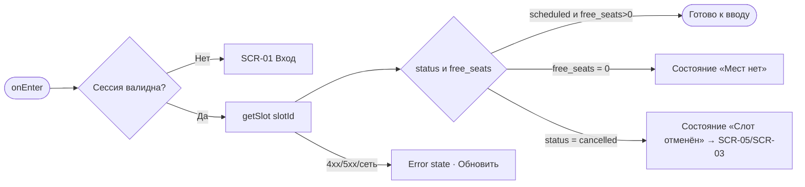
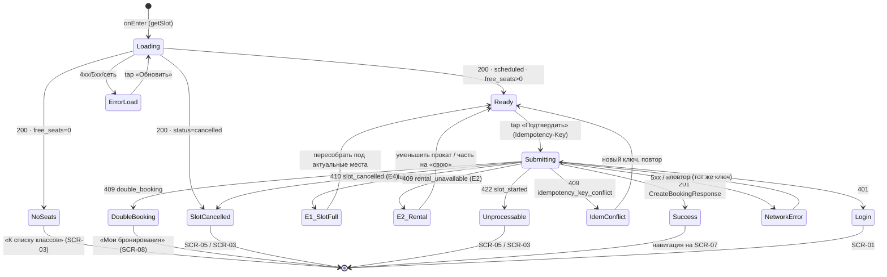

# Оформление записи (бронирование)

**ID:** SCR-06  
**Тип:** Экран  
**Домен:** 03. Запись на класс  
**Приоритет:** Critical  
**Функциональные блоки:** FB-BKG-001 (счётчик мест), FB-BKG-002 (экипировка по местам), FB-BKG-003 (аллергии), FB-BKG-004 (сводка и цена), FB-BKG-005 (подтверждение брони)  
**Зона авторизации:** АЗ  
**Дизайн-макет:** — (макет не создан, этап дизайна)

---

## Содержание

- [История изменений](#история-изменений)
- [Обзор](#обзор)
- [Навигация](#навигация)
- [Входные данные](#входные-данные)
- [Применяемые логики](#применяемые-логики)
- [Свойства Bottom Sheet](#свойства-bottom-sheet)
- [Инициализация](#инициализация)
- [Используемые запросы](#используемые-запросы)
- [Макет экрана](#макет-экрана)
- [Элементы экрана](#элементы-экрана)
- [Состояния экрана](#состояния-экрана)
- [Действия пользователя](#действия-пользователя)
- [Связанные требования](#связанные-требования)
- [Критерии приёмки](#критерии-приёмки)
---

## История изменений

| Релиз | ТЗ | Описание изменений |
|-------|-----|-------------------|
| 0.1.0 | ТЗ SCR-06 «Оформление записи» | Первичная версия (черновик) на основе дизайн-брифа [SCR-06](../3-design-brief/SCR-06_оформление-записи.md). |

---

## Обзор

Экран оформления брони — центральный и самый сложный экран клиентского приложения «Шеф-стол». Здесь клиент превращает интерес к классу в подтверждённую запись: указывает число мест (себя + до 5 гостей за одним столом), для каждого места выбирает экипировку (своя / прокатная), при желании предупреждает шефа об аллергиях одним полем и видит честную живую итоговую цену. По нажатию «Подтвердить запись» вызывается атомарное создание брони на бэкенде с обязательным заголовком `Idempotency-Key`.

Сложная предметная логика (места и прокатный фонд стола считаются раздельно, лимиты проверяет бэкенд) скрыта за понятными подсказками и живой сводкой. Экран сохраняет спокойный, тёплый тон студии даже когда «место увели из-под рук»: отказ бэкенда (E1–E4) — штатная ветка сценария, а не авария. Гарантия «0 двойных броней» и защита от овербукинга — на стороне бэкенда (NFR-4, R-004); клиент полагается на ответы API и никогда не обещает наличие места до ответа сервера.

### User Story

> Как клиент, я хочу выбрать число мест и экипировку, увидеть итоговую цену и подтвердить бронь,
> чтобы забронировать место (и места гостей) за одним столом без риска двойной записи.

### Бизнес-ценность

- Самостоятельная онлайн-запись без ручного посредничества (BR-2), устранение двойных броней (BR-1, метрика M-2 = 0).
- Прозрачная цена и офлайн-оплата снижают барьер записи (BR-4).
- Раздельный учёт мест и прокатного фонда исключает конфликты за столом (FR-9, FR-10, FR-11).

---

## Навигация

### Входящая (откуда открывается)

| Источник | Триггер | Условие | Передаваемые параметры |
|----------|---------|---------|------------------------|
| [SCR-05 Карточка класса](SCR-05_карточка-класса.md) | Тап «Записаться» | `slot.status = scheduled` И `slot.free_seats > 0` | `slot_id` |
| Deep link | `/booking/{slotId}` | Клиент авторизован; слот со свободными местами | `slot_id` |

### Исходящая (куда ведёт)

| Назначение | Триггер | Передаваемые параметры |
|------------|---------|------------------------|
| [SCR-07 Запись создана](SCR-07_запись-создана.md) | Успешный ответ `createBooking` (201) | Объект `CreateBookingResponse` (в state/кэш): `booking.id`, `seats_count`, `rental_count`, `allergies`, `price_total`, `slot`, `is_first_booking`, `reminder_hours` |
| [SCR-05 Карточка класса](SCR-05_карточка-класса.md) | «Назад»; отказ слота (E4) | `slot_id` |
| [SCR-03 Список классов](SCR-03_список-классов.md) | Отказ слота (E4), если возврат к карточке невозможен | — |
| [SCR-01 Вход по телефону](SCR-01_вход-телефон.md) | Сессия недействительна (401) | — |

---

## Входные данные

| Название | Тип | Возможные значения | Описание |
|----------|-----|-------------------|----------|
| `slot_id` | Параметр навигации | UUID | Идентификатор выбранного слота. Обязателен для открытия экрана. |
| `slot` | Кэш (из SCR-05) | Объект `Slot` | Предварительные данные слота, показанные в карточке. На открытии обновляются свежим `getSlot` (см. [Инициализация](#инициализация)). |
| `session` | Состояние / Кэш | `access_token` | Токен авторизации текущего клиента (LOGIC-002). Без валидной сессии экран недоступен (АЗ). |
| `idempotency_key` | Состояние | UUID | Генерируется на клиенте один раз на попытку оформления и переиспользуется при повторной отправке после сбоя (LOGIC-004). |

---

## Применяемые логики

| Логика | Элемент/Триггер | Описание |
|--------|-----------------|----------|
| [LOGIC-002 Сессия и авторизация](09_Логики/LOGIC-002_сессия-и-авторизация.md) | Открытие экрана / любой запрос | Проверка сессии, доступ только авторизованному клиенту, обработка 401. |
| [LOGIC-003 Живой пересчёт брони](09_Логики/LOGIC-003_живой-пересчёт-брони.md) | Счётчик мест, переключатели экипировки, сводка | Лимиты счётчиков мест/проката и живой пересчёт остатков, разбивки экипировки и итоговой цены. |
| [LOGIC-004 Идемпотентное создание брони](09_Логики/LOGIC-004_идемпотентное-создание-брони.md) | Кнопка «Подтвердить запись» | Заголовок `Idempotency-Key`, защита от двойного сабмита, обработка конфликтов E1–E4. |

---

## Свойства Bottom Sheet

Не применимо (экран, не Bottom Sheet).

---

## Инициализация

> **Примечание:** При открытии экран обновляет данные слота свежим запросом `getSlot`, чтобы счётчики (`free_seats`, `free_rental_sets`) и цены были актуальны на момент сборки брони. Кэш из SCR-05 показывается как скелет/плейсхолдер до ответа.

### Диаграмма загрузки



### Запросы при открытии

| № | Запрос | Критичный | Зависит от | Условие |
|---|--------|-----------|------------|---------|
| 1 | [getSlot](#getslot) | Да | — | Всегда (обновление слота на открытии) |

> Полное описание запросов см. в секции [Используемые запросы](#используемые-запросы).

---

## Используемые запросы

> Все API-запросы экрана с полным описанием параметров и обработки ответов. Спецификация — многофайловый REST OpenAPI (`../api/`), домены: **auth**, **slots**, **bookings**, **profile**, **catalog**.

### getSlot

**Тип:** REST  
**Метод:** GET  
**Спецификация:** [../api/slots/api.yaml](../api/slots/api.yaml) → `getSlot`

**Триггер:** Инициализация (открытие экрана)

**Параметры:**

| Параметр | Тип | Обязательность | Источник | Описание |
|----------|-----|----------------|----------|----------|
| `slotId` | string (uuid) | Да | `slot_id` из навигации | Идентификатор слота (path). |

**Обработка ответа:**

| Результат | Условие | UI-реакция |
|-----------|---------|------------|
| Загрузка | — | Скелетон формы; кнопка «Подтвердить» недоступна |
| Успех (200) | `status = scheduled` И `free_seats > 0` | Состояние «Готово к вводу»; счётчики и цены из `Slot` |
| Успех (200) | `free_seats = 0` | Состояние «Мест нет» (родственно E1/E3): сбор брони запрещён, CTA «К списку классов» |
| Успех (200) | `status = cancelled` | Состояние «Слот отменён» (E4): запись недоступна → [SCR-05](SCR-05_карточка-класса.md) / [SCR-03](SCR-03_список-классов.md) |
| HTTP 401 | — | Обработка сессии (LOGIC-002) → [SCR-01](SCR-01_вход-телефон.md) |
| HTTP 404 | — | «Класс не найден» + CTA «К списку классов» |
| HTTP 4xx/5xx | — | Error state с кнопкой «Обновить» |
| Сеть | Нет соединения | Error state с кнопкой «Обновить» |

---

### createBooking

**Тип:** REST  
**Метод:** POST  
**Спецификация:** [../api/bookings/api.yaml](../api/bookings/api.yaml) → `createBooking`

**Триггер:** Тап на кнопку «Подтвердить запись»

**Заголовки:**

| Заголовок | Тип | Обязательность | Источник | Описание |
|-----------|-----|----------------|----------|----------|
| `Idempotency-Key` | string (uuid) | Да | `idempotency_key` из state (LOGIC-004) | UUID попытки. При повторе после сетевого сбоя переиспользуется тот же ключ → тот же ответ, дубль не создаётся. |
| `Authorization` | string (Bearer) | Да | `session.access_token` | Токен текущего клиента (LOGIC-002). |

**Параметры тела (`CreateBookingRequest`):**

| Параметр | Тип | Обязательность | Источник | Описание |
|----------|-----|----------------|----------|----------|
| `slot_id` | string (uuid) | Да | `slot_id` | Идентификатор слота. |
| `seats_count` | integer | Да | Счётчик мест | 1..min(`free_seats`, 6). Себя + до 5 гостей за одним столом. |
| `rental_count` | integer | Да | Переключатели экипировки | 0..`seats_count` и ≤ `free_rental_sets`. Число «прокатных» мест. Своя экипировка занимает место, но не расходует прокатный фонд. |
| `allergies` | string (nullable) | Нет | Поле аллергий | Одно поле на всю бронь, maxLength 500. Пустое значение допустимо. |

**Обработка ответа:**

| Результат | Условие (`code`) | UI-реакция |
|-----------|------------------|------------|
| Загрузка | — | Лоадер на кнопке, форма заблокирована, повторный сабмит невозможен (LOGIC-004) |
| Успех (201) | — | Сохранить `CreateBookingResponse` в state → немедленный переход на [SCR-07](SCR-07_запись-создана.md) |
| HTTP 400 | `bad_request` | Снек «Проверьте параметры записи» + пересчёт формы по свежим лимитам; сабмит разблокирован (норма — не должно случаться при валидной форме) |
| HTTP 401 | `unauthorized` | Сессия недействительна (LOGIC-002) → [SCR-01](SCR-01_вход-телефон.md) |
| HTTP 409 | `slot_full` (E1/E3) | Дружелюбное «Места разобрали, давайте пересоберём»; обновить `available_seats` из `details`, ограничить счётчик; бронь не создана |
| HTTP 409 | `rental_unavailable` (E2) | Пояснение + два выхода: уменьшить число прокатных мест **или** переключить часть мест на «свою»; показать `available_rental_sets` из `details` |
| HTTP 409 | `double_booking` | «Похоже, эта бронь уже оформлена» + CTA «Мои бронирования» ([SCR-08](SCR-08_мои-бронирования.md)); дубль не создаётся |
| HTTP 409 | `idempotency_key_conflict` | Сгенерировать новый `Idempotency-Key`, предложить повторить подтверждение; дубль не создаётся |
| HTTP 410 | `slot_cancelled` (E4) | «Класс отменён студией» → возврат на [SCR-05](SCR-05_карточка-класса.md) / [SCR-03](SCR-03_список-классов.md); повторная запись запрещена |
| HTTP 422 | `slot_started` и пр. | «Класс уже начался, запись недоступна» → [SCR-05](SCR-05_карточка-класса.md) / [SCR-03](SCR-03_список-классов.md) |
| HTTP 5xx | `internal_error` | Снек «Не удалось оформить запись, попробуйте ещё раз»; ничего не забронировано; повтор с тем же ключом |
| Сеть | Нет соединения | Снек «Нет соединения. Проверьте подключение»; повтор с тем же `Idempotency-Key` (LOGIC-004) |

> **Детали ошибок (`details`).** Для `slot_full`/E1/E3 бэкенд может вернуть `available_seats`, для `rental_unavailable`/E2 — `available_rental_sets`. Клиент использует их для точного сообщения и обновления лимитов без разбора текста `message`.

---

**Доступные спецификации** (многофайловый REST OpenAPI, `../api/`):

- `auth/api.yaml` — авторизация, OTP, сессии, push-токены.
- `slots/api.yaml` — слоты (классы), read-only.
- `bookings/api.yaml` — создание, список, детали и отмена броней.
- `profile/api.yaml` — профиль клиента.
- `catalog/api.yaml` — программы и шефы (справочные, read-only).

Реестр доменов: [../api/redocly.yaml](../api/redocly.yaml).

---

## Макет экрана

### Структура

```
┌─────────────────────────────────────┐
│ [←] Оформление записи               │  ← Header
├─────────────────────────────────────┤
│ Шапка слота: программа·дата·шеф·₽   │  ← Контекст (компактно)
│ ─────────────────────────────────── │
│ Число мест   [ − ]  2  [ + ]        │  ← Счётчик (Вы + N гостей)
│ Свободно мест: K · до 6 за столом   │
│ ─────────────────────────────────── │
│ Место 1 «Вы»       (•Своя  ○Прокат) │  ← Список мест + экипировка
│ Место 2 «Гость 2»  (○Своя  •Прокат) │
│ Прокатных комплектов свободно: M    │
│ ─────────────────────────────────── │
│ Аллергии (необязательно) [        ] │  ← Одно поле на бронь
│ ─────────────────────────────────── │
│ Сводка: 2 места · прокат 1 / своя 1 │  ← Живая сводка
│ Оплата на месте · отмена ≥24 ч      │
│ Итого: 7 500 ₽                      │  ← Живая цена
├─────────────────────────────────────┤
│      [ Подтвердить запись ]         │  ← Fixed Bottom (Primary)
└─────────────────────────────────────┘
```

### Компоненты

| Компонент | Описание | Обязательность |
|-----------|----------|----------------|
| Шапка слота | Контекст: программа+тип, дата/время (~3 ч), шеф, адрес, цена за место | Да |
| Счётчик мест | Управление числом участников 1..min(free_seats, 6) | Да |
| Список мест с экипировкой | По ряду на место, переключатель «своя/прокатная», живой остаток проката | Да |
| Поле аллергий | Одно опциональное поле на бронь, maxLength 500 | Да (сам ввод — опционально) |
| Сводка брони | Число мест, разбивка экипировки, аллергии, микротексты оплаты/отмены | Да |
| Итоговая цена | `price·seats_count + rental_price·rental_count`, живой пересчёт | Да |
| Кнопка «Подтвердить запись» | Primary, с состоянием загрузки и защитой от двойного сабмита | Да |

---

## Элементы экрана

> **Примечания:**
> - Колонка «Валидация»: для полей ввода — правило и текст ошибки; для остальных — «—».
> - Логика описывается блоком «**Логика:**» после таблицы.
> - Условия доступности интерактивных элементов — после таблицы.

### 1. Шапка слота

| Элемент | Описание | Источник данных | Валидация | Действие |
|---------|----------|-----------------|-----------|----------|
| Программа + тип | Название меню и тип (новичковый/опытный) | `slot.program` из [getSlot](#getslot) | — | «Подробнее» → [SCR-05](SCR-05_карточка-класса.md) |
| Дата и время старта | Дата/время (~3 ч) | `slot.start_at` | — | — |
| Шеф | Имя шефа | `slot.chef` | — | — |
| Адрес студии | Адрес лофта | `slot.address` | — | — |
| Цена за место | Тариф за одно место | `slot.price` (RUB) | — | — |

### 2. Счётчик числа мест

| Элемент | Описание | Источник данных | Валидация | Действие |
|---------|----------|-----------------|-----------|----------|
| Кнопка «−» | Уменьшить число мест | — | Не ниже 1 | Пересчёт (LOGIC-003) |
| Значение счётчика | Текущее число мест | Состояние | 1..min(`free_seats`, 6) | — |
| Кнопка «+» | Увеличить число мест | — | Не выше min(`free_seats`, 6) | Пересчёт (LOGIC-003) |
| Подпись «Вы + N гостей» | Человекопонятный состав | Производное от счётчика | — | — |
| «Свободно мест: K» | Актуальный остаток мест слота | `slot.free_seats` | — | — |
| Подсказка лимита | «В одной брони — до 6 человек за одним столом» | Константа UI | — | — |

**Логика:**
- Счётчик: [LOGIC-003](09_Логики/LOGIC-003_живой-пересчёт-брони.md) — лимит `min(free_seats, 6)`, первое место — сам клиент; при уменьшении числа мест «схлопываются» последние добавленные ряды экипировки; изменение анонсируется в live-области.

**Условия доступности:**
- Кнопка «+» неактивна с пояснением, если текущее значение = min(`free_seats`, 6).
- Кнопка «−» неактивна, если значение = 1 (клиент всегда занимает место).

### 3. Список мест с выбором экипировки

| Элемент | Описание | Источник данных | Валидация | Действие |
|---------|----------|-----------------|-----------|----------|
| Ряд «Место 1 — Вы» | Первое место — сам клиент | Производное | — | — |
| Ряд «Место N — Гость N» | Гостевые места без имён/контактов | Производное от счётчика | — | — |
| Переключатель «Своя / Прокатная» | Выбор экипировки места (фартук + набор ножей) | Состояние ряда | Число «прокатных» ≤ `free_rental_sets` | Пересчёт (LOGIC-003) |
| «Прокатных комплектов свободно: M» | Живой остаток прокатного фонда стола | `slot.free_rental_sets` | — | — |
| Подпись «прокат не используется» | Когда все места «своя» (A1) | Производное | — | — |

**Логика:**
- Переключатели: [LOGIC-003](09_Логики/LOGIC-003_живой-пересчёт-брони.md) — `rental_count` считается отдельно от мест; при исчерпании проката вариант «Прокатная» недоступен и **объясняется**, а не просто гаснет (см. E2); своя экипировка занимает место, но не расходует фонд.

**Условия доступности:**
- Переключение места на «Прокатная» недоступно с пояснением, если число прокатных мест достигло `free_rental_sets`.

### 4. Поле аллергий

| Элемент | Описание | Источник данных | Валидация | Действие |
|---------|----------|-----------------|-----------|----------|
| Поле «Аллергии» | Одно опциональное поле на всю бронь | Состояние | Необязательное; maxLength 500, обрезка при превышении. Ошибок формата нет | — |
| Подсказка | «Например: орехи, лактоза, глютен. Передадим шефу — он учтёт при готовке» | Константа UI | — | — |

**Момент валидации:** При вводе (ограничение длины) — пустое значение допустимо и не блокирует бронь.

### 5. Сводка брони, цена и подтверждение

| Элемент | Описание | Источник данных | Валидация | Действие |
|---------|----------|-----------------|-----------|----------|
| Число мест | «Вы + N гостей» | Производное | — | — |
| Разбивка экипировки | «прокат — X, своя — Y» | Производное | — | — |
| Аллергии в сводке | Показываются, если заданы | Поле аллергий | — | — |
| Микротекст оплаты | «Оплата на месте — наличными или переводом. Онлайн платить не нужно» | Константа UI | — | — |
| Микротекст отмены | «Отменить бесплатно можно не позднее чем за 24 часа до начала…» | Константа UI | — | — |
| Итоговая цена | `price·seats_count + rental_price·rental_count` | `slot.price`, `slot.rental_price` | — | — |
| Кнопка «Подтвердить запись» | Primary | — | Форма готова и данные загружены | Валидация → [createBooking](#createbooking) |
| Кнопка «Назад» | Secondary | — | — | [SCR-05](SCR-05_карточка-класса.md) (с предупреждением о несохранённой брони) |

**Логика:**
- Сводка и цена: [LOGIC-003](09_Логики/LOGIC-003_живой-пересчёт-брони.md) — любой ввод мгновенно пересчитывает сводку, разбивку, остатки и итог; изменение цены/остатков анонсируется screen reader'ом (live-область).
- Кнопка «Подтвердить запись»: [LOGIC-004](09_Логики/LOGIC-004_идемпотентное-создание-брони.md) — при тапе фиксируется `Idempotency-Key`, кнопка уходит в загрузку, форма блокируется, повторный сабмит невозможен; отправляется [createBooking](#createbooking); обработка E1–E4 согласно таблице ответа.

**Условия доступности:**
- Кнопка «Подтвердить запись» неактивна, если: данные слота ещё грузятся; идёт отправка (защита от двойного сабмита); слот в состоянии «Мест нет» или «Слот отменён».
- Цена и лимиты локально не пересчитываются как «гарантия» — авторитетен бэкенд; UI не обещает «место точно ваше» до ответа 201.

---

## Состояния экрана

### Таблица состояний

| Состояние | Условие | Отображение |
|-----------|---------|-------------|
| Loading (входные данные) | Ожидание `getSlot` | Скелетон формы; «Подтвердить» недоступна |
| Ready (готово к вводу) | 200, `scheduled`, `free_seats > 0` | Форма заполнима, живая сводка и цена |
| Мест нет | 200, `free_seats = 0` | «Мест на этот класс уже не осталось» + CTA «К списку классов» |
| Submitting | Идёт `createBooking` | Лоадер на кнопке, форма заблокирована, защита от двойного сабмита |
| Success | 201 `CreateBookingResponse` | Немедленный переход на [SCR-07](SCR-07_запись-создана.md) |
| E1 slot_full | 409 `slot_full` | «Места разобрали, давайте пересоберём»; обновлён `available_seats`, счётчик ограничен |
| E2 rental_unavailable | 409 `rental_unavailable` | Пояснение + два выхода (уменьшить прокат / часть на «свою»); `available_rental_sets` |
| E3 гонка запросов | 409 `slot_full` при валидной форме | Обновление свободных мест/проката из свежего ответа, предложение пересобрать |
| double_booking | 409 `double_booking` | «Похоже, эта бронь уже оформлена» + CTA «Мои бронирования» |
| idempotency_key_conflict | 409 `idempotency_key_conflict` | Новый ключ, предложение повторить |
| E4 slot_cancelled | 410 `slot_cancelled` | «Класс отменён студией» → [SCR-05](SCR-05_карточка-класса.md)/[SCR-03](SCR-03_список-классов.md) |
| Unprocessable | 422 `slot_started` | «Класс уже начался, запись недоступна» → SCR-05/SCR-03 |
| Network / Error | 5xx / нет сети | Снек «Не удалось оформить запись, попробуйте ещё раз»; ничего не забронировано |
| No access | Сессия недействительна (401) | Переход на [SCR-01](SCR-01_вход-телефон.md) (LOGIC-002) |

### Диаграмма переходов



---

## Действия пользователя

| Действие | Элемент | Триггер | Результат |
|----------|---------|---------|-----------|
| Изменить число мест | Счётчик «−/+» | Tap / клавиши | Живой пересчёт сводки, цены, рядов экипировки (LOGIC-003) |
| Выбрать экипировку места | Радио «Своя/Прокатная» | Tap / клавиши | Пересчёт `rental_count`, остатка проката и цены (LOGIC-003) |
| Указать аллергии | Поле «Аллергии» | Ввод текста | Значение уходит в бронь (обрезка до 500) |
| Подтвердить запись | Кнопка «Подтвердить запись» | Tap | Блокировка формы → [createBooking](#createbooking) с `Idempotency-Key` (LOGIC-004) |
| Вернуться назад | Кнопка «Назад» / [←] | Tap | Предупреждение о несохранённой брони → [SCR-05](SCR-05_карточка-класса.md) |
| Пересобрать после E1/E3 | CTA в сообщении | Tap | Обновление лимитов, возврат в Ready |
| Уменьшить прокат / сменить на «свою» (E2) | CTA в сообщении | Tap | Корректировка `rental_count`, возврат в Ready |
| Перейти к брони (double_booking) | CTA «Мои бронирования» | Tap | [SCR-08](SCR-08_мои-бронирования.md) |
| Уйти при отмене слота (E4) | CTA в сообщении | Tap | [SCR-05](SCR-05_карточка-класса.md) / [SCR-03](SCR-03_список-классов.md) |

---

## Связанные требования

### Функциональные (FR-*)

| ID | Название | Приоритет |
|----|----------|-----------|
| [FR-6](../2-requirements/functional-requirements.md) | Запись на выбранный слот в пределах свободных мест | Must |
| [FR-7](../2-requirements/functional-requirements.md) | Выбор экипировки (своя/прокатная) для каждого места | Must |
| [FR-8](../2-requirements/functional-requirements.md) | Бронь нескольких мест (себя + до 5 гостей), без имён/контактов гостей | Must |
| [FR-9](../2-requirements/functional-requirements.md) | Лимит мест `min(free_seats, 6)` | Must |
| [FR-10](../2-requirements/functional-requirements.md) | Отдельный учёт прокатного фонда | Must |
| [FR-11](../2-requirements/functional-requirements.md) | Запрет записи сверх лимитов; исключение двойной брони и овербукинга | Must |
| [FR-12](../2-requirements/functional-requirements.md) | Аллергии одним полем на всю бронь (опционально) | Must |
| [FR-13](../2-requirements/functional-requirements.md) | Показ цены; офлайн-оплата | Must |

### Нефункциональные (NFR-*)

| ID | Название | Приоритет |
|----|----------|-----------|
| [NFR-4](../2-requirements/non-functional-requirements.md) | «0 двойных броней» и защита от овербукинга (R-004) | Высокий (Must) |
| [NFR-6](../2-requirements/non-functional-requirements.md) | Быстрый отклик подтверждения в пиковые часы | Высокий |
| [NFR-8](../2-requirements/non-functional-requirements.md) | Доступ только к своим данным | Высокий |
| [NFR-10](../2-requirements/non-functional-requirements.md) | Интеграция через API; корректная обработка отказа бэкенда | Высокий |

### Use cases / User stories

| ID | Название | Приоритет |
|----|----------|-----------|
| [UC-2](../2-requirements/use-cases.md) | Запись на класс (себя и гостей): осн. поток, A1, A2, E1–E4 | Must |
| [US-5](../2-requirements/user-stories.md) | Записаться на класс | Must |
| [US-6](../2-requirements/user-stories.md) | Выбор своей/прокатной экипировки | Must |
| [US-7](../2-requirements/user-stories.md) | Бронь нескольких мест одной записью | Must |
| [US-8](../2-requirements/user-stories.md) | Защита от записи сверх лимита | Must |
| [US-9](../2-requirements/user-stories.md) | Аллергии одним полем | Must |
| [US-10](../2-requirements/user-stories.md) | Видеть цену класса | Must |

### Бизнес (BR-*)

| ID | Название | Приоритет |
|----|----------|-----------|
| [BR-1](../2-requirements/business-requirements.md) | Устранение двойных броней | Must |
| [BR-2](../2-requirements/business-requirements.md) | Самостоятельная онлайн-запись | Must |
| [BR-4](../2-requirements/business-requirements.md) | Офлайн-оплата, только показ цены | Must |

---

## Критерии приёмки

### Позитивные сценарии

| ID | Критерий | Приоритет |
|----|----------|-----------|
| AC-001 | **Дано** открыт экран со `scheduled`-слотом, `free_seats = 4`, `free_rental_sets = 3`, **Когда** клиент задаёт 3 места и 2 прокатных, пишет аллергии и жмёт «Подтвердить», **Тогда** `createBooking` отправляется с `seats_count=3`, `rental_count=2`, `allergies` и `Idempotency-Key`, приходит 201 и открывается SCR-07 с созданной бронью | P0 |
| AC-002 | **Дано** форма собрана, **Когда** меняется число мест или экипировка, **Тогда** сводка, разбивка «прокат/своя», остатки и итог `price·seats + rental_price·rental` пересчитываются мгновенно (LOGIC-003) | P0 |
| AC-003 | **Дано** все места «своя» (A1), **Когда** отправка брони, **Тогда** `rental_count = 0`, прокатный фонд не затрагивается, итог = `price·seats_count` | P0 |
| AC-004 | **Дано** часть мест «прокат» (A2), **Когда** пересчёт, **Тогда** остаток проката уменьшается только на число прокатных мест | P1 |
| AC-005 | **Дано** открытие экрана, **Когда** onEnter, **Тогда** выполняется свежий `getSlot`, счётчики и цены берутся из ответа, а не из кэша SCR-05 | P0 |

### Негативные сценарии

| ID | Критерий | Приоритет |
|----|----------|-----------|
| AC-N01 | **Дано** к моменту подтверждения мест меньше запрошенного, **Когда** 409 `slot_full` (E1/E3), **Тогда** показывается «места разобрали, давайте пересоберём», обновляется `available_seats`, счётчик ограничивается, бронь не создана | P0 |
| AC-N02 | **Дано** мест хватает, а прокатных комплектов меньше запрошенных, **Когда** 409 `rental_unavailable` (E2), **Тогда** показываются два выхода (уменьшить прокат / часть на «свою») и `available_rental_sets`; вся бронь не блокируется | P0 |
| AC-N03 | **Дано** слот отменён студией, **Когда** 410 `slot_cancelled` (E4), **Тогда** запись недоступна и клиент уводится на SCR-05/SCR-03; повторная запись запрещена | P0 |
| AC-N04 | **Дано** идёт отправка брони, **Когда** клиент повторно жмёт «Подтвердить», **Тогда** повторный сабмит невозможен (кнопка в загрузке, форма заблокирована) | P0 |
| AC-N05 | **Дано** сетевой сбой при отправке, **Когда** клиент повторяет, **Тогда** используется тот же `Idempotency-Key` и дубль не создаётся (при `double_booking` — CTA «Мои бронирования») | P0 |
| AC-N06 | **Дано** сессия недействительна, **Когда** любой запрос вернул 401, **Тогда** клиент уводится на SCR-01 (LOGIC-002) | P1 |
| AC-N07 | **Дано** повтор `Idempotency-Key` с другим телом, **Когда** 409 `idempotency_key_conflict`, **Тогда** генерируется новый ключ и предлагается повторить, дубль не создаётся | P2 |

### Граничные условия (Edge Cases)

| ID | Критерий | Приоритет |
|----|----------|-----------|
| AC-E01 | **Дано** `free_seats = 0` на открытии, **Когда** загрузка завершена, **Тогда** сбор брони запрещён, показывается «Мест нет» с CTA «К списку классов» | P1 |
| AC-E02 | **Дано** счётчик на верхней границе `min(free_seats, 6)`, **Когда** тап «+», **Тогда** кнопка неактивна и объясняет причину (лимит стола/свободных мест) | P1 |
| AC-E03 | **Дано** в поле аллергий вводится > 500 символов, **Когда** ввод, **Тогда** текст обрезается до 500 | P1 |
| AC-E04 | **Дано** клиент уменьшает число мест после выбора экипировки, **Когда** пересчёт, **Тогда** «схлопываются» последние добавленные ряды, `rental_count` корректируется | P1 |
| AC-E05 | **Дано** экранная читалка, **Когда** меняется цена/остатки, **Тогда** изменение анонсируется через live-область | P2 |
| AC-E06 | **Дано** собранная несохранённая бронь, **Когда** клиент жмёт «Назад», **Тогда** показывается предупреждение о потере данных (на бэкенде изменений нет) | P2 |

---
