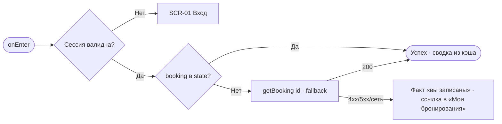
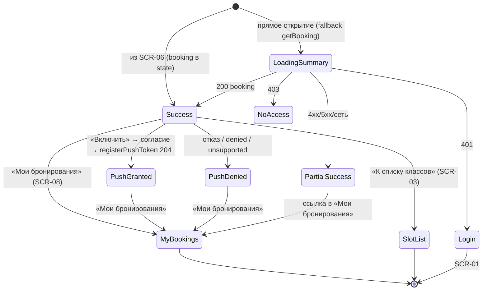

# Запись создана (подтверждение)

**ID:** SCR-07  
**Тип:** Экран  
**Домен:** 03. Запись на класс  
**Приоритет:** Critical  
**Функциональные блоки:** FB-BKG-006 (блок успеха и сводка), FB-BKG-007 (строка оплаты), FB-BKG-008 (запрос push-разрешения), FB-BKG-009 (навигация)  
**Зона авторизации:** АЗ  
**Дизайн-макет:** — (макет не создан, этап дизайна)

---

## Содержание

- [История изменений](#история-изменений)
- [Обзор](#обзор)
- [Навигация](#навигация)
- [Входные данные](#входные-данные)
- [Применяемые логики](#применяемые-логики)
- [Свойства Bottom Sheet](#свойства-bottom-sheet)
- [Инициализация](#инициализация)
- [Используемые запросы](#используемые-запросы)
- [Макет экрана](#макет-экрана)
- [Элементы экрана](#элементы-экрана)
- [Состояния экрана](#состояния-экрана)
- [Действия пользователя](#действия-пользователя)
- [Связанные требования](#связанные-требования)
- [Критерии приёмки](#критерии-приёмки)
---

## История изменений

| Релиз | ТЗ | Описание изменений |
|-------|-----|-------------------|
| 0.1.0 | ТЗ SCR-07 «Запись создана» | Первичная версия (черновик) на основе дизайн-брифа [SCR-07](../3-design-brief/SCR-07_запись-создана.md). |

---

## Обзор

Экран успешного подтверждения брони. Показывается сразу после успешного создания записи на [SCR-06](SCR-06_оформление-записи.md) (ответ `createBooking` = 201). Задача — снять тревогу «получилось ли?», тёплым тоном подтвердить результат, показать сводку брони и итоговую цену с напоминанием про офлайн-оплату, мягко предложить включить push-напоминание за 24 часа до класса (по `reminder_hours`) и предложить развилку: перейти в «Мои бронирования» или к списку классов.

Экран отображает уже созданную бронь как факт — это не черновик и не редактор. Отмена и редактирование здесь недоступны (для этого — детали брони SCR-09). Данные берутся из ответа `createBooking`, сохранённого в state/кэш при переходе с SCR-06; повторное создание брони при обновлении страницы не происходит.

### User Story

> Как клиент, я хочу сразу увидеть подтверждение оформленной брони с ценой и предложением напоминания,
> чтобы убедиться, что запись создана, и не пропустить класс.

### Бизнес-ценность

- Снижение тревоги и отказов на последнем шаге записи (BR-2).
- Push-напоминание за 24 ч снижает неявки (BR-3, FR-19, NFR-9).
- Прозрачная офлайн-оплата без онлайн-платежей (BR-4, FR-13).

---

## Навигация

### Входящая (откуда открывается)

| Источник | Триггер | Условие | Передаваемые параметры |
|----------|---------|---------|------------------------|
| [SCR-06 Оформление записи](SCR-06_оформление-записи.md) | Успешный `createBooking` (201) | Бронь создана бэкендом | Объект `CreateBookingResponse` в state/кэш: `id`, `seats_count`, `rental_count`, `allergies`, `price_total`, `slot`, `is_first_booking`, `reminder_hours` |

### Исходящая (куда ведёт)

| Назначение | Триггер | Передаваемые параметры |
|------------|---------|------------------------|
| [SCR-08 Мои бронирования](SCR-08_мои-бронирования.md) | Тап «Мои бронирования» (первичное) | — |
| [SCR-03 Список классов](SCR-03_список-классов.md) | Тап «К списку классов» (второстепенное) | — |

---

## Входные данные

> Данные берутся преимущественно из состояния/кэша: объект `CreateBookingResponse` передаётся напрямую из [SCR-06](SCR-06_оформление-записи.md) после успешного `createBooking`. Отдельный запрос при открытии по умолчанию не требуется (см. [Инициализация](#инициализация)).

| Название | Тип | Возможные значения | Описание |
|----------|-----|-------------------|----------|
| `booking` | Состояние / Кэш (`CreateBookingResponse` из SCR-06) | Объект брони | Созданная бронь: `id`, `seats_count`, `rental_count`, `allergies`, `price_total`, вложенный `slot`. |
| `is_first_booking` | Состояние / Кэш | `true` / `false` | Признак первой успешной брони клиента — включает приветственный блок. |
| `reminder_hours` | Состояние / Кэш | напр. `[24]` (пусто/отсутствует — не настроено) | За сколько часов до старта придут напоминания; задаётся сервером, не хардкодится клиентом. |
| `session` | Состояние / Кэш | `access_token` | Токен текущего клиента (LOGIC-002); экран доступен только автору брони (NFR-8). |
| `push_permission` | Состояние (Browser API) | `default` / `granted` / `denied` / `unsupported` | Текущее состояние разрешения на уведомления, определяет вид push-блока. |

---

## Применяемые логики

| Логика | Элемент/Триггер | Описание |
|--------|-----------------|----------|
| [LOGIC-002 Сессия и авторизация](09_Логики/LOGIC-002_сессия-и-авторизация.md) | Открытие экрана | Доступ только авторизованному клиенту — автору брони (NFR-8). |
| [LOGIC-009 Регистрация push-токена](09_Логики/LOGIC-009_регистрация-push-токена.md) | Кнопка «Включить напоминания» | Пре-промт → системный запрос разрешения по явному действию → `registerPushToken`; отказ ничего не ломает. |

---

## Свойства Bottom Sheet

Не применимо (экран, не Bottom Sheet).

---

## Инициализация

> **Примечание:** При открытии экран не отправляет обязательных запросов — параметры брони уже есть в state/кэше (`CreateBookingResponse` из [SCR-06](SCR-06_оформление-записи.md)). Заголовок успеха показывается сразу. `registerPushToken` вызывается не при открытии, а только по явному действию (LOGIC-009). Опциональный fallback `getBooking` возможен, если по какой-то причине объект брони в state отсутствует (например, прямое открытие/обновление страницы).

### Диаграмма загрузки



### Запросы при открытии

| № | Запрос | Критичный | Зависит от | Условие |
|---|--------|-----------|------------|---------|
| — | Нет обязательных запросов | — | — | Данные из state/кэша (`CreateBookingResponse`) |
| 1 | [getBooking](#getbooking) | Нет | — | Только fallback: `booking` отсутствует в state (прямое открытие/обновление) |

> Полное описание запросов см. в секции [Используемые запросы](#используемые-запросы).

---

## Используемые запросы

> Многофайловый REST OpenAPI (`../api/`), домены: **auth**, **slots**, **bookings**, **profile**, **catalog**.

### registerPushToken

**Тип:** REST  
**Метод:** POST  
**Спецификация:** [../api/auth/api.yaml](../api/auth/api.yaml) → `registerPushToken`

**Триггер:** Тап «Включить напоминания» → согласие в системном диалоге браузера (LOGIC-009)

**Параметры тела (`PushTokenRequest`):**

| Параметр | Тип | Обязательность | Источник | Описание |
|----------|-----|----------------|----------|----------|
| `token` | string | Да | Web Push / Browser API | Полученный push-токен браузера текущего клиента. |

**Обработка ответа:**

| Результат | Условие | UI-реакция |
|-----------|---------|------------|
| Загрузка | — | Лоадер на кнопке «Включить напоминания» |
| Успех (204) | — | Блок сменяется на «Напоминание включено, сообщим за 24 часа» (по `reminder_hours`) |
| HTTP 400 | `bad_request` | Мягкая строка «Не удалось включить напоминания»; работа приложения не нарушается |
| HTTP 401 | `unauthorized` | Обработка сессии (LOGIC-002) → [SCR-01](SCR-01_вход-телефон.md) |
| HTTP 5xx | `internal_error` | Мягкая строка «Не удалось включить напоминания, попробуйте позже»; без ошибки-блокера |
| Сеть | Нет соединения | Мягкая строка про соединение; бронь и её факт не затрагиваются |

> Отказ пользователя в системном диалоге (или `denied`/`unsupported`) — **не ошибка** (NFR-9): показывается спокойная строка про «Мои бронирования», без повторного давления.

---

### getBooking

**Тип:** REST  
**Метод:** GET  
**Спецификация:** [../api/bookings/api.yaml](../api/bookings/api.yaml) → `getBooking`

**Триггер:** Инициализация — **только fallback**, когда `booking` отсутствует в state (прямое открытие/обновление страницы)

**Параметры:**

| Параметр | Тип | Обязательность | Источник | Описание |
|----------|-----|----------------|----------|----------|
| `bookingId` | string (uuid) | Да | `booking.id` из state / URL | Идентификатор созданной брони (path). |

**Обработка ответа:**

| Результат | Условие | UI-реакция |
|-----------|---------|------------|
| Загрузка | — | Короткий скелет карточки; заголовок успеха показан сразу |
| Успех (200) | `data` не пуст | Отобразить сводку брони |
| HTTP 401 | — | Обработка сессии (LOGIC-002) → [SCR-01](SCR-01_вход-телефон.md) |
| HTTP 403 | — | Чужая бронь недоступна (NFR-8): без раскрытия данных |
| HTTP 4xx/5xx | — | Факт «вы записаны» остаётся виден; за деталями — ссылка в [SCR-08](SCR-08_мои-бронирования.md) |
| Сеть | Нет соединения | Аналогично: факт брони под сомнение не ставится (она уже создана) |

---

**Доступные спецификации** (многофайловый REST OpenAPI, `../api/`):

- `auth/api.yaml` — авторизация, OTP, сессии, push-токены.
- `slots/api.yaml` — слоты (классы), read-only.
- `bookings/api.yaml` — создание, список, детали и отмена броней.
- `profile/api.yaml` — профиль клиента.
- `catalog/api.yaml` — программы и шефы (справочные, read-only).

Реестр доменов: [../api/redocly.yaml](../api/redocly.yaml).

---

## Макет экрана

### Структура

```
┌─────────────────────────────────────┐
│              ✓ (иллюстрация)         │  ← Блок успеха
│         Готово, вы записаны!         │
│  (Рады знакомству! — если 1-я бронь) │
├─────────────────────────────────────┤
│ Программа + тип                     │  ← Карточка брони (сводно)
│ Дата и время (~3 ч) · Адрес         │
│ Вы + N гостей · прокат X / своя Y   │
│ Аллергии: … (если заданы)           │
├─────────────────────────────────────┤
│ К оплате на месте: 7 500 ₽          │  ← Строка оплаты
│ Наличными или переводом             │
├─────────────────────────────────────┤
│ 🔔 Напомнить за 24 часа до класса?  │  ← Push-блок
│      [ Включить напоминания ]       │
├─────────────────────────────────────┤
│   [ Мои бронирования ]  (primary)   │  ← Навигация
│   [ К списку классов ]  (secondary) │
└─────────────────────────────────────┘
```

### Компоненты

| Компонент | Описание | Обязательность |
|-----------|----------|----------------|
| Блок успеха | Тёплый маркер завершённости + заголовок «Вы записаны!» | Да |
| Приветственный блок | Показывается при `is_first_booking = true` | Опционально |
| Карточка брони (сводно) | Программа+тип, дата/время, адрес, число мест, экипировка, аллергии | Да |
| Строка оплаты | Итоговая цена + напоминание про офлайн-оплату | Да |
| Push-блок | Дружелюбный запрос разрешения по `reminder_hours` (LOGIC-009) | Да |
| Кнопка «Мои бронирования» | Primary | Да |
| Кнопка «К списку классов» | Secondary | Да |

---

## Элементы экрана

> **Примечания:**
> - Колонка «Валидация»: для полей ввода — правило и текст ошибки; здесь полей ввода нет → «—».
> - Логика описывается блоком «**Логика:**» после таблицы.
> - Условия доступности интерактивных элементов — после таблицы.

### 1. Блок успеха

| Элемент | Описание | Источник данных | Валидация | Действие |
|---------|----------|-----------------|-----------|----------|
| Иллюстрация/иконка успеха | Визуальный маркер завершённости в духе студии | Константа UI | — | — |
| Заголовок «Готово, вы записаны!» | Тёплое подтверждение результата | Константа UI | — | — |
| Приветствие первой брони | «Рады знакомству! Ждём вас за столом» | `is_first_booking` из state | — | — |

**Условия доступности:**
- Приветственный блок виден только если `is_first_booking = true`.

### 2. Карточка брони (сводно)

| Элемент | Описание | Источник данных | Валидация | Действие |
|---------|----------|-----------------|-----------|----------|
| Программа + тип | Название меню и тип | `booking.slot.program` | — | — |
| Дата и время старта | Дата/время (~3 ч) | `booking.slot.start_at` | — | — |
| Адрес студии | Адрес лофта | `booking.slot.address` | — | — |
| Число мест | «Вы + N гостей» | `booking.seats_count` | — | — |
| Экипировка сводно | «прокат — N, своя — M» | `booking.rental_count` (своя = `seats_count − rental_count`) | — | — |
| Аллергии | Показываются, если заданы | `booking.allergies` | — | — |

**Логика:**
- Разбивка экипировки: своя = `seats_count − rental_count`, прокат = `rental_count`; без имён гостей (их не собирали). Значения должны совпадать с подтверждёнными на SCR-06 (источник — созданная бронь из API).

### 3. Строка оплаты

| Элемент | Описание | Источник данных | Валидация | Действие |
|---------|----------|-----------------|-----------|----------|
| Итоговая цена | «К оплате на месте: <итог>» | `booking.price_total` (RUB) | — | — |
| Напоминание про офлайн-оплату | «Наличными или переводом, онлайн платить не нужно» | Константа UI | — | — |
| Микротекст про отмену (опц.) | Короткое упоминание правила 24 ч со ссылкой на детали | Константа UI | — | [SCR-09 Детали брони](SCR-09_детали-брони-отмена.md) |

**Логика:**
- Никаких кнопок «оплатить» и статусов «оплачено/не оплачено» (FR-13, BR-4).

### 4. Запрос push-разрешения

| Элемент | Описание | Источник данных | Валидация | Действие |
|---------|----------|-----------------|-----------|----------|
| Заголовок «Напомнить за 24 часа до класса?» | Пояснение ценности напоминания | `reminder_hours` (напр. `[24]`) | — | — |
| Кнопка «Включить напоминания» | Явное действие → системный диалог | — | — | LOGIC-009 → [registerPushToken](#registerpushtoken) |
| Строка «Напоминание включено» | Состояние после согласия | `push_permission = granted` | — | — |
| Спокойная строка «найдёте бронь в „Мои бронирования“» | При отказе/недоступности | `push_permission = denied`/`unsupported` | — | — |

**Логика:**
- Кнопка «Включить напоминания»: [LOGIC-009](09_Логики/LOGIC-009_регистрация-push-токена.md) — сначала свой дружелюбный пре-промт, затем системный диалог браузера **по явному нажатию** (не автоматически); при согласии — `registerPushToken`, блок меняется на «включено». Отказ — не ошибка (NFR-9).

**Условия доступности:**
- Push-блок в режиме «Включить напоминания» виден только при `push_permission = default` и поддержке push браузером.
- При `granted` — режим «включено»; при `denied`/`unsupported` — спокойная строка без кнопки и без повторного давления.

### 5. Навигация

| Элемент | Описание | Источник данных | Валидация | Действие |
|---------|----------|-----------------|-----------|----------|
| Кнопка «Мои бронирования» | Primary — естественное продолжение | — | — | [SCR-08](SCR-08_мои-бронирования.md) |
| Кнопка «К списку классов» | Secondary | — | — | [SCR-03](SCR-03_список-классов.md) |

**Условия доступности:**
- Обе кнопки доступны всегда в состоянии «Успех»; возврата «назад в форму» нет (бронь уже оформлена).

---

## Состояния экрана

### Таблица состояний

| Состояние | Условие | Отображение |
|-----------|---------|-------------|
| Success (основное) | Бронь создана; `booking` в state | Блок успеха + сводка + цена + push-блок + навигация |
| Loading (сводки) | Fallback `getBooking` выполняется | Заголовок успеха сразу + короткий скелет карточки |
| Первая бронь | `is_first_booking = true` | Дополнительный приветственный блок |
| Push: не запрашивалось | `push_permission = default` | Предложение «Включить напоминания» |
| Push: включено | `push_permission = granted` | «Напоминание включено, сообщим за 24 часа» |
| Push: отказано/не поддерживается | `push_permission = denied`/`unsupported` | Спокойная строка про «Мои бронирования», без ошибки |
| Ошибка загрузки сводки (редко) | Fallback `getBooking` 4xx/5xx/сеть | Факт «вы записаны» виден; за деталями — ссылка в SCR-08 |
| No access | Чужая бронь (403) / сессия недействительна (401) | Данные не раскрываются; 401 → [SCR-01](SCR-01_вход-телефон.md) (LOGIC-002) |

### Диаграмма переходов



---

## Действия пользователя

| Действие | Элемент | Триггер | Результат |
|----------|---------|---------|-----------|
| Включить напоминания | Кнопка «Включить напоминания» | Tap | Пре-промт → системный диалог → при согласии `registerPushToken`, блок «включено» (LOGIC-009) |
| Отклонить напоминания | Системный диалог / «не сейчас» | Tap / закрытие | Спокойная строка про «Мои бронирования»; приложение работает штатно (NFR-9) |
| Перейти к своим броням | Кнопка «Мои бронирования» | Tap | [SCR-08](SCR-08_мои-бронирования.md) |
| Вернуться к списку классов | Кнопка «К списку классов» | Tap | [SCR-03](SCR-03_список-классов.md) |
| Открыть детали брони (опц.) | Ссылка про отмену 24 ч | Tap | [SCR-09](SCR-09_детали-брони-отмена.md) |

---

## Связанные требования

### Функциональные (FR-*)

| ID | Название | Приоритет |
|----|----------|-----------|
| [FR-13](../2-requirements/functional-requirements.md) | Показ цены; офлайн-оплата (без онлайн-оплаты и «оплачено») | Must |
| [FR-19](../2-requirements/functional-requirements.md) | Регистрация push-токена и напоминание за 24 ч; отказ не ломает работу | Should |

### Нефункциональные (NFR-*)

| ID | Название | Приоритет |
|----|----------|-----------|
| [NFR-8](../2-requirements/non-functional-requirements.md) | Доступ только к своей брони | Высокий |
| [NFR-9](../2-requirements/non-functional-requirements.md) | Push за 24 ч; при отсутствии разрешения — штатная работа без push | Средний |

### Use cases / User stories

| ID | Название | Приоритет |
|----|----------|-----------|
| [UC-2](../2-requirements/use-cases.md) | Запись на класс — шаг 7 (подтверждение с ценой, офлайн-оплата) | Must |
| [US-5](../2-requirements/user-stories.md) | Записаться на класс (появляется подтверждение) | Must |
| [US-10](../2-requirements/user-stories.md) | Видеть цену класса | Must |
| [US-14](../2-requirements/user-stories.md) | Получать напоминание о предстоящей записи | Should |

### Бизнес (BR-*)

| ID | Название | Приоритет |
|----|----------|-----------|
| [BR-3](../2-requirements/business-requirements.md) | Снижение неявок (напоминания) | Must |
| [BR-4](../2-requirements/business-requirements.md) | Офлайн-оплата, только показ цены | Must |

---

## Критерии приёмки

### Позитивные сценарии

| ID | Критерий | Приоритет |
|----|----------|-----------|
| AC-001 | **Дано** успешный `createBooking` (201) на SCR-06, **Когда** открывается SCR-07, **Тогда** сразу виден тёплый маркер успеха и сводка брони из `CreateBookingResponse` (state/кэш) без обязательного запроса | P0 |
| AC-002 | **Дано** созданная бронь, **Когда** показана сводка, **Тогда** отображаются программа+тип, дата/время (~3 ч), адрес, «Вы + N гостей», разбивка «прокат N / своя M» и аллергии при наличии, без имён гостей | P0 |
| AC-003 | **Дано** созданная бронь, **Когда** показана строка оплаты, **Тогда** виден `price_total` и «оплата на месте», без кнопок оплаты и статусов «оплачено» | P0 |
| AC-004 | **Дано** `is_first_booking = true`, **Когда** открытие, **Тогда** показывается приветственный блок | P1 |
| AC-005 | **Дано** `reminder_hours = [24]` и `push_permission = default`, **Когда** клиент жмёт «Включить напоминания» и соглашается, **Тогда** вызывается `registerPushToken` (204) и блок меняется на «Напоминание включено» (LOGIC-009) | P0 |
| AC-006 | **Дано** экран успеха, **Когда** тап «Мои бронирования» / «К списку классов», **Тогда** переход на SCR-08 / SCR-03 соответственно | P0 |

### Негативные сценарии

| ID | Критерий | Приоритет |
|----|----------|-----------|
| AC-N01 | **Дано** клиент отклонил системный запрос (или `denied`), **Когда** обработка push, **Тогда** показывается спокойная строка про «Мои бронирования», ошибки нет, приложение работает штатно (NFR-9) | P0 |
| AC-N02 | **Дано** браузер без поддержки push (`unsupported`), **Когда** рендер push-блока, **Тогда** блок деградирует мягко, без битых кнопок | P1 |
| AC-N03 | **Дано** `registerPushToken` вернул 5xx/сеть, **Когда** обработка, **Тогда** мягкая строка «не удалось включить», факт брони не затронут | P1 |
| AC-N04 | **Дано** попытка открыть чужую бронь, **Когда** fallback `getBooking` вернул 403, **Тогда** данные не раскрываются (NFR-8) | P1 |
| AC-N05 | **Дано** сессия недействительна, **Когда** любой запрос вернул 401, **Тогда** клиент уводится на SCR-01 (LOGIC-002) | P1 |

### Граничные условия (Edge Cases)

| ID | Критерий | Приоритет |
|----|----------|-----------|
| AC-E01 | **Дано** обновление страницы SCR-07, **Когда** повторный рендер, **Тогда** новая бронь не создаётся и системный запрос push не дублируется, если разрешение уже обработано | P0 |
| AC-E02 | **Дано** `booking` отсутствует в state (прямое открытие), **Когда** onEnter, **Тогда** выполняется fallback `getBooking` по `id`; при ошибке факт «вы записаны» остаётся виден со ссылкой в «Мои бронирования» | P1 |
| AC-E03 | **Дано** `reminder_hours` пусто/отсутствует, **Когда** рендер push-блока, **Тогда** формулировка не хардкодит «24 часа», а опирается на серверное значение (или блок скрыт) | P2 |
| AC-E04 | **Дано** экранная читалка, **Когда** открытие и смена состояния push-блока, **Тогда** заголовок успеха и смена состояния (включено/отклонено) анонсируются | P2 |
| AC-E05 | **Дано** все места «своя» (`rental_count = 0`), **Когда** сводка, **Тогда** экипировка отображается как «своя — M», без строки проката | P2 |

---
