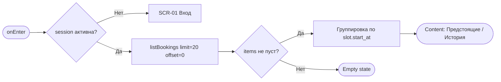
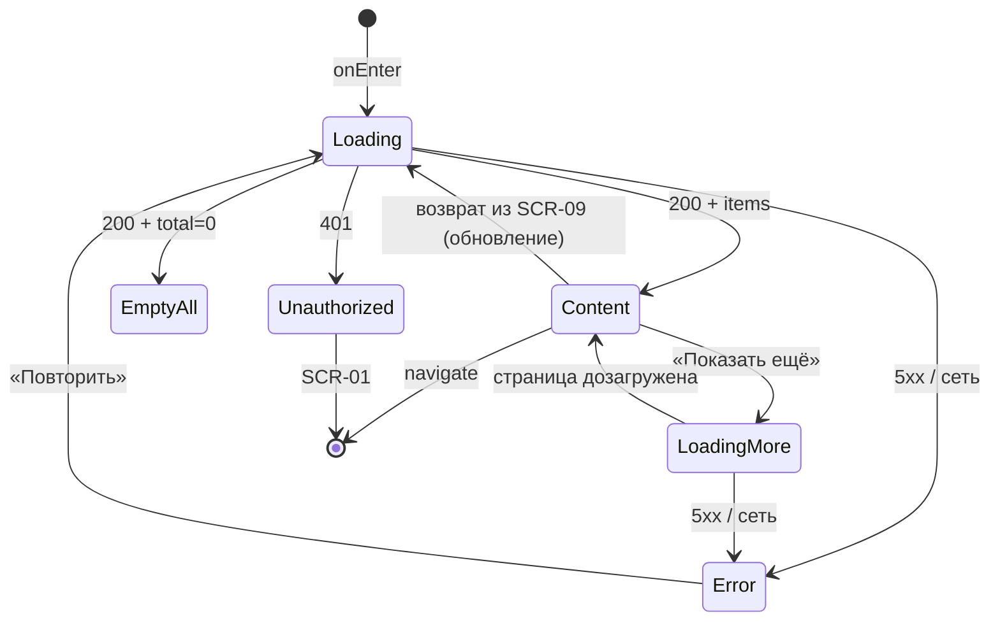

# Мои бронирования (список)

**ID:** SCR-08  
**Тип:** Экран  
**Домен:** 05. Мои бронирования и отмены  
**Приоритет:** Critical  
**Функциональные блоки:** FB-BOOKINGS-001 (список броней), FB-BOOKINGS-002 (группировка предстоящие/история), FB-BOOKINGS-003 (статусы броней)  
**Зона авторизации:** АЗ  
**Дизайн-макет:** — (макет не создан, этап дизайна)

---

## Содержание

- [История изменений](#история-изменений)
- [Обзор](#обзор)
- [Навигация](#навигация)
- [Входные данные](#входные-данные)
- [Применяемые логики](#применяемые-логики)
- [Инициализация](#инициализация)
- [Используемые запросы](#используемые-запросы)
- [Макет экрана](#макет-экрана)
- [Элементы экрана](#элементы-экрана)
- [Состояния экрана](#состояния-экрана)
- [Действия пользователя](#действия-пользователя)
- [Связанные требования](#связанные-требования)
- [Критерии приёмки](#критерии-приёмки)

---

## История изменений

| Релиз | ТЗ | Описание изменений |
|-------|-----|-------------------|
| 0.1.0 | SCR-08 «Мои бронирования» | Первичная версия ТЗ (Черновик) на основе [дизайн-брифа SCR-08](../3-design-brief/SCR-08_мои-бронирования.md). |

---

## Обзор

Экран «Мои бронирования» — личный «дневник классов» клиента студии «Шеф-стол». Сюда человек приходит с простым вопросом: «Что у меня забронировано, когда и всё ли в силе?». Экран показывает **только собственные брони клиента** (NFR-8) единым списком, разделённым на **предстоящие** и **историю**. Предстоящие классы — в приоритете, потому что по ним нужно действовать; прошедшие и отменённые брони не исчезают, а сохраняются как история (FR-14, FR-18).

Экран только показывает данные и ведёт вглубь одной брони — к деталям и отмене ([SCR-09](SCR-09_детали-брони-отмена.md)). Сама отмена, оплата и редактирование брони здесь не живут.

Данные приходят единым запросом [`listBookings`](#listbookings). Группировка предстоящие/история и метка «Прошедший» вычисляются на клиенте от `slot.start_at` (не хранятся отдельным статусом) — см. [LOGIC-006](09_Логики/LOGIC-006_группировка-броней.md).

### User Story

> Как клиент студии «Шеф-стол», я хочу видеть список своих бронирований со статусами и параметрами классов,
> чтобы контролировать предстоящие и прошедшие классы и вовремя замечать отмены студией.

*(US-11, US-13)*

### Бизнес-ценность

- Клиент в пару секунд понимает, что у него забронировано и всё ли в силе, — снижает неявки и звонки в студию.
- Отмены студией (`studio_cancelled`) сразу заметны — клиент не приходит к закрытой двери.
- История броней сохраняется целиком (FR-14) — прозрачность и доверие к студии.

---

## Навигация

### Входящая (откуда открывается)

| Источник | Триггер | Условие | Передаваемые параметры |
|----------|---------|---------|------------------------|
| Пункт навигации «Мои брони» | Тап по пункту меню | Сессия активна | — |
| [SCR-07 Подтверждение записи](SCR-07_запись-создана.md) | Тап «Мои брони» / автопереход после записи | Всегда | — |
| [SCR-09 Детали брони и отмена](SCR-09_детали-брони-отмена.md) | Возврат «Назад» после отмены/без действия | Всегда | — |
| Push-уведомление | Тап по напоминанию за 24 ч | `type = booking_reminder` | `booking_id` (для перехода вглубь) |
| Push-уведомление | Тап по сообщению об отмене студией | `type = studio_cancelled` | `booking_id` |
| Deep link | `/bookings` | Сессия активна | — |

### Исходящая (куда ведёт)

| Назначение | Триггер | Передаваемые параметры |
|------------|---------|------------------------|
| [SCR-09 Детали брони и отмена](SCR-09_детали-брони-отмена.md) | Тап по карточке брони | `booking_id` (`item.id`) |
| [SCR-03 Список классов](SCR-03_список-классов.md) | Тап по ссылке из пустого состояния | — |
| [SCR-01 Вход](SCR-01_вход-телефон.md) | Сессия истекла / 401 | — |

---

## Входные данные

| Название | Тип | Возможные значения | Описание |
|----------|-----|-------------------|----------|
| `session` | Состояние (кэш) | активна / истекла | Токен текущего клиента. При отсутствии/истечении — переход на [SCR-01](SCR-01_вход-телефон.md), см. [LOGIC-002](09_Логики/LOGIC-002_сессия-и-авторизация.md). |
| `activeTab` | Состояние (UI) | `upcoming` / `history` | Активная вкладка. По умолчанию `upcoming`. |
| `focusBookingId` | Параметр перехода | `uuid` / `null` | Опциональный `booking_id` из push для последующего перехода в [SCR-09](SCR-09_детали-брони-отмена.md). |

---

## Применяемые логики

| Логика | Элемент/Триггер | Описание |
|--------|-----------------|----------|
| [LOGIC-002 Сессия и авторизация](09_Логики/LOGIC-002_сессия-и-авторизация.md) | Инициализация / 401 | Проверка сессии; при истечении — редирект на вход, данные не показываются. |
| [LOGIC-006 Группировка броней](09_Логики/LOGIC-006_группировка-броней.md) | Разбиение списка на вкладки | Группировка предстоящие/история и вычисление метки «Прошедший» по `slot.start_at`. |
| [LOGIC-008 Пагинация списков](09_Логики/LOGIC-008_пагинация-списков.md) | Кнопка «Показать ещё» / догрузка | Постраничная догрузка `limit`/`offset` по `meta.total`. |

---

## Инициализация

> **Примечание:** При открытии экрана отправляется один запрос [`listBookings`](#listbookings) без фильтра по статусу — возвращаются брони всех статусов (история не скрывается, FR-14). Группировка на вкладки — на клиенте.

### Диаграмма загрузки



### Запросы при открытии

| № | Запрос | Критичный | Зависит от | Условие |
|---|--------|-----------|------------|---------|
| 1 | [listBookings](#listbookings) | Да | — | Сессия активна |

> Полное описание запросов см. в секции [Используемые запросы](#используемые-запросы).

---

## Используемые запросы

> Все API-запросы экрана с полным описанием параметров и обработки ответов.

### listBookings

**Тип:** REST  
**Метод:** GET `/bookings`  
**Спецификация:** [../api/bookings/api.yaml](../api/bookings/api.yaml) → `listBookings`

**Триггер:** Инициализация экрана; догрузка страницы (кнопка «Показать ещё»), см. [LOGIC-008](09_Логики/LOGIC-008_пагинация-списков.md).

**Параметры:**

| Параметр | Тип | Обязательность | Источник | Описание |
|----------|-----|----------------|----------|----------|
| `status` | array<string> | Нет | — | Не передаётся: нужны брони всех статусов, включая `cancelled`, `late_cancel`, `studio_cancelled` (FR-14, FR-18). |
| `limit` | integer | Нет | Константа UI | Размер страницы (по умолчанию 20, 1..100). |
| `offset` | integer | Нет | Состояние пагинации | Смещение выборки (по умолчанию 0). Растёт при догрузке. |

**Ответ:** `BookingListResponse { items: BookingSummary[], meta: PaginationMeta }`. Сортировка — по `slot.start_at` по убыванию (задаётся сервером).

**Обработка ответа:**

| Результат | Условие | UI-реакция |
|-----------|---------|------------|
| Загрузка | — | Скелетоны карточек (структура списка сохранена, вкладки видны) |
| Успех | `items` не пуст | Группировка по `slot.start_at` → вкладки «Предстоящие»/«История» |
| Успех | `items` пуст (`meta.total = 0`) | Общий Empty state со ссылкой на [SCR-03](SCR-03_список-классов.md) |
| Успех | одна из вкладок пуста | Подсказка в пустой вкладке, вторая вкладка наполнена |
| HTTP 401 | `code = unauthorized` | Переход на [SCR-01](SCR-01_вход-телефон.md) (сессия истекла), данные не показываем ([LOGIC-002](09_Логики/LOGIC-002_сессия-и-авторизация.md)) |
| HTTP 5xx | `default` | Error state «Не удалось загрузить бронирования» + кнопка «Повторить»; ранее показанные данные по возможности не затираются |
| Сеть | Нет соединения | Error state с кнопкой «Повторить» |

---

## Макет экрана

### Структура

```
┌───────────────────────────────────────────┐
│  Мои бронирования                          │  ← Header
├───────────────────────────────────────────┤
│  [ Предстоящие ]   История                 │  ← Tabs (segmented)
├───────────────────────────────────────────┤
│  ┌───────────────────────────────────────┐ │
│  │ [Активна · предстоит]                 │ │  ← Карточка брони
│  │ Паста с нуля · новичковый             │ │
│  │ завтра, 12 июл 18:00 (≈3 ч)           │ │
│  │ Шеф Мария · наб. Обводного канала, 74 │ │
│  │ 3 места · 2 свои, 1 прокат            │ │
│  └───────────────────────────────────────┘ │
│  ┌───────────────────────────────────────┐ │
│  │ [Отменён студией]                     │ │  ← Акцентная карточка
│  │ Причина: срыв поставки продуктов      │ │
│  │ Повторная запись недоступна           │ │
│  │ Том ям · 20 июл 19:00                 │ │
│  └───────────────────────────────────────┘ │
│  ...                                        │  ← Scrollable
│  [ Показать ещё ]                           │  ← Пагинация (опц.)
└───────────────────────────────────────────┘
```

### Компоненты

| Компонент | Описание | Обязательность |
|-----------|----------|----------------|
| Заголовок «Мои бронирования» | Название раздела | Да |
| Переключатель «Предстоящие / История» | Вкладки/сегменты; по умолчанию «Предстоящие» | Да |
| Карточка брони | Кликабельная сводка одной брони → [SCR-09](SCR-09_детали-брони-отмена.md) | Да |
| Статус-бейдж | Метка статуса (текст + иконка, не только цвет) | Да |
| Плашка «Отменён студией» | Причина + пометка о запрете повторной записи | Опционально (при `studio_cancelled`) |
| Пустое состояние | Тёплый текст + ссылка на [SCR-03](SCR-03_список-классов.md) | Да |
| Скелетоны загрузки | Плейсхолдеры карточек | Да |
| Блок ошибки + «Повторить» | При сбое загрузки | Да |
| Кнопка «Показать ещё» | Догрузка следующей страницы | Опционально (при `meta.total > загружено`) |

---

## Элементы экрана

> **Примечания:**
> - **Валидация:** полей ввода на экране нет → «—».
> - **Логика:** описана текстовым блоком после таблицы.

### 1. Переключатель вкладок

| Элемент | Описание | Источник данных | Валидация | Действие |
|---------|----------|-----------------|-----------|----------|
| Вкладка «Предстоящие» | Активные и будущие брони (`slot.start_at` в будущем) | Клиентская группировка | — | Переключить `activeTab = upcoming` |
| Вкладка «История» | Прошедшие, отменённые клиентом, поздние отмены, отменённые студией | Клиентская группировка | — | Переключить `activeTab = history` |

**Логика:**
- Разбиение по вкладкам: [LOGIC-006](09_Логики/LOGIC-006_группировка-броней.md) — бронь относится к «Предстоящим», если `slot.start_at` в будущем; иначе — в «Историю». Отменённые клиентом/студией и поздние отмены всегда попадают в «Историю».
- Сортировка: предстоящие — по `slot.start_at` по возрастанию (ближайшее сверху); история — по убыванию (недавнее сверху). Сервер отдаёт по убыванию — для предстоящих клиент переворачивает порядок.

### 2. Карточка брони

| Элемент | Описание | Источник данных | Валидация | Действие |
|---------|----------|-----------------|-----------|----------|
| Программа и тип | Что готовим и уровень | `item.slot.program.name`, `item.slot.program.type` | — | — |
| Дата и время старта | Начало класса (≈3 ч); для предстоящих — относительная подсказка + точная дата | `item.slot.start_at` | — | — |
| Шеф | Кто ведёт класс | `item.slot.chef.name` | — | — |
| Адрес студии (кратко) | Куда идти (полный — в деталях) | `item.slot.address` | — | — |
| Число мест | Например «3 места: вы + 2 гостя» | `item.seats_count` | — | — |
| Сводка экипировки | «N свои, M прокат» / «вся своя» / «вся прокатная» | `item.seats_count`, `item.rental_count` | — | — |
| Статус-бейдж | Метка статуса брони | `item.status` (+ `slot.start_at` для «Прошедший») | — | — |
| Карточка целиком | Кликабельная область | `item.id` | — | Открыть [SCR-09](SCR-09_детали-брони-отмена.md) с `booking_id = item.id` |

**Логика:**
- Сводка экипировки вычисляется от `seats_count`/`rental_count`: `rental_count = 0` → «вся своя»; `rental_count = seats_count` → «вся прокатная»; иначе → «`seats_count − rental_count` свои, `rental_count` прокат». Разбивку по конкретным гостям не показываем (FR-8).
- Статус UI **не пересчитывает** (NFR-4, NFR-10): отображается `item.status` из API. Единственное производное — метка «Прошедший» по `slot.start_at` для активной брони с прошедшим временем старта ([LOGIC-006](09_Логики/LOGIC-006_группировка-броней.md)).
- Длинные значения (название программы, адрес, причина отмены) аккуратно обрезаются; полный текст — в [SCR-09](SCR-09_детали-брони-отмена.md).

### 3. Статус-бейдж

| Статус (`item.status`) | Метка | Тон / вид | Примечание |
|------------------------|-------|-----------|------------|
| `active` (старт в будущем) | «Активна · предстоит» | Позитивный/нейтральный акцент | Бронь в силе, класс впереди |
| `active` (старт в прошлом) | «Прошедшая» | Приглушённый, справочный | «Прошлость» вычислена от `slot.start_at`, не хранится статусом |
| `cancelled` | «Отменена клиентом» | Нейтрально-приглушённый | Ранняя отмена (≥24 ч), места освобождены (FR-16) |
| `late_cancel` | «Поздняя отмена» | Спокойно-нейтральный, без укора | Отмена <24 ч, место не освобождалось, штрафов нет (FR-17) |
| `studio_cancelled` | «Отменён студией» | Заметный акцент (не «ошибка-красный») | Класс снят студией, есть `cancel_reason`, повторная запись запрещена (FR-18) |

**Логика:**
- Метка `studio_cancelled` сопровождается блоком причины (см. §4) и всегда попадает в «Историю».
- Статус различим не только цветом — текст и/или иконка (доступность для дальтоников); скринридер озвучивает статус вместе с брони.

### 4. Блок «Отменён студией» (в акцентной части карточки)

| Элемент | Описание | Источник данных | Валидация | Действие |
|---------|----------|-----------------|-----------|----------|
| Причина отмены | Короткий текст причины от студии | `item.cancel_reason` | — | — |
| Пометка о запрете повтора | «Повторная запись на этот класс недоступна» | Константа UI | — | — |

**Логика:**
- Блок показывается только при `item.status = studio_cancelled` и наличии `item.cancel_reason`. Никаких кнопок повторной записи на этот слот (R-008, UC-4 E1).

### 5. Пустые состояния и служебные блоки

| Элемент | Описание | Источник данных | Валидация | Действие |
|---------|----------|-----------------|-----------|----------|
| Пустое состояние (нет броней) | «У вас пока нет бронирований» + ссылка «Посмотреть классы» | `meta.total = 0` | — | Открыть [SCR-03](SCR-03_список-классов.md) |
| Пустая вкладка | Подсказка «Нет предстоящих классов — загляните в Классы» | Группировка | — | Открыть [SCR-03](SCR-03_список-классов.md) |
| Блок ошибки | «Не удалось загрузить бронирования» + «Повторить» | Ошибка [listBookings](#listbookings) | — | Повторить [listBookings](#listbookings) |
| Кнопка «Показать ещё» | Догрузка следующей страницы | `meta` | — | [listBookings](#listbookings) с новым `offset` |

**Условия доступности:**
- Кнопка «Показать ещё» видна, если загружено меньше, чем `meta.total` ([LOGIC-008](09_Логики/LOGIC-008_пагинация-списков.md)).
- Экран не отображает никакие данные при истёкшей сессии — вместо этого переход на [SCR-01](SCR-01_вход-телефон.md) (NFR-8).

---

## Состояния экрана

### Таблица состояний

| Состояние | Условие | Отображение |
|-----------|---------|-------------|
| Loading | Ожидание [listBookings](#listbookings) | Скелетоны карточек, вкладки видны |
| Content | 200 + `items` не пуст | Карточки по вкладкам, предстоящие в приоритете |
| Empty (всё) | 200 + `meta.total = 0` | «У вас пока нет бронирований» + ссылка на [SCR-03](SCR-03_список-классов.md) |
| Empty (вкладка) | 200 + одна вкладка пуста | Подсказка в пустой вкладке, вторая наполнена |
| LoadingMore | Догрузка страницы | Лоадер у кнопки «Показать ещё», список не «прыгает» |
| Error | 5xx / сеть | «Не удалось загрузить бронирования» + «Повторить» |
| Unauthorized | 401 / сессия истекла | Переход на [SCR-01](SCR-01_вход-телефон.md), данные не показываем |

### Диаграмма переходов



---

## Действия пользователя

| Действие | Элемент | Триггер | Результат |
|----------|---------|---------|-----------|
| Переключить вкладку | Сегменты «Предстоящие/История» | Tap / Enter / Space | Смена `activeTab`, пересборка списка ([LOGIC-006](09_Логики/LOGIC-006_группировка-броней.md)) |
| Открыть бронь | Карточка брони | Tap / Enter / Space | Переход на [SCR-09](SCR-09_детали-брони-отмена.md) с `booking_id` |
| Догрузить список | «Показать ещё» | Tap / Enter | [listBookings](#listbookings) с новым `offset` ([LOGIC-008](09_Логики/LOGIC-008_пагинация-списков.md)) |
| Перейти к классам | Ссылка из пустого состояния | Tap / Enter | Переход на [SCR-03](SCR-03_список-классов.md) |
| Повторить загрузку | «Повторить» | Tap / Enter | Повторный [listBookings](#listbookings) |

---

## Связанные требования

### Функциональные (FR-*)

| ID | Название | Приоритет |
|----|----------|-----------|
| [FR-14](../2-requirements/functional-requirements.md) | Список бронирований со статусом, параметрами слота, числом мест и экипировкой; отменённые и поздние отмены остаются в списке | Must |
| [FR-17](../2-requirements/functional-requirements.md) | Поздняя отмена (<24 ч) фиксируется статусом «поздняя отмена» — отражается меткой в списке | Must |
| [FR-18](../2-requirements/functional-requirements.md) | Брони, отменённые студией: статус «Отменён студией» с причиной, запрет повторной записи | Must |

### Нефункциональные (NFR-*)

| ID | Название | Приоритет |
|----|----------|-----------|
| [NFR-1](../2-requirements/non-functional-requirements.md) | Клиентский интерфейс — web-приложение (адаптив desktop/mobile web) | Высокий |
| [NFR-4](../2-requirements/non-functional-requirements.md) | UI не пересчитывает статусы/освобождение мест — полагается на ответы API | Высокий |
| [NFR-8](../2-requirements/non-functional-requirements.md) | Клиент видит только свои брони; чужие данные недоступны | Высокий |
| [NFR-10](../2-requirements/non-functional-requirements.md) | Взаимодействие с бэкендом через API; статусы — из контракта | Высокий |

### Use cases / User stories

| ID | Название | Приоритет |
|----|----------|-----------|
| [UC-3](../2-requirements/use-cases.md) | Отмена записи (шаг 1 — выбор предстоящей брони) | Must |
| [UC-4](../2-requirements/use-cases.md) | Отмена класса студией (шаг 4 — отображение «Отменён студией») | Must |
| [US-11](../2-requirements/user-stories.md) | Видеть список своих бронирований | Must |
| [US-13](../2-requirements/user-stories.md) | Видеть брони, отменённые студией | Must |

---

## Критерии приёмки

### Позитивные сценарии

| ID | Критерий | Приоритет |
|----|----------|-----------|
| AC-001 | **Дано** у клиента есть активная предстоящая бронь, **Когда** он открывает «Мои бронирования», **Тогда** во вкладке «Предстоящие» показана карточка с меткой «Активна · предстоит», программой, датой/временем, шефом, адресом, числом мест и сводкой экипировки | P0 |
| AC-002 | **Дано** список загружен, **Когда** клиент тапает по карточке брони, **Тогда** открывается [SCR-09](SCR-09_детали-брони-отмена.md) с переданным `booking_id` | P0 |
| AC-003 | **Дано** есть отменённые/поздние отмены, **Когда** клиент открывает вкладку «История», **Тогда** они отображаются с корректными метками «Отменена клиентом» / «Поздняя отмена» и не исчезают из списка (FR-14) | P0 |
| AC-004 | **Дано** у клиента есть бронь `studio_cancelled` с `cancel_reason`, **Когда** он открывает экран, **Тогда** карточка показана акцентно с причиной и пометкой «Повторная запись недоступна», без кнопки повторной записи (FR-18) | P0 |
| AC-005 | **Дано** клиент отменил бронь на [SCR-09](SCR-09_детали-брони-отмена.md), **Когда** он возвращается в список, **Тогда** бронь отражается с новым статусом в «Истории» без ручного обновления | P1 |
| AC-006 | **Дано** загружено меньше броней, чем `meta.total`, **Когда** клиент тапает «Показать ещё», **Тогда** дозагружается следующая страница и добавляется в список ([LOGIC-008](09_Логики/LOGIC-008_пагинация-списков.md)) | P1 |

### Негативные сценарии

| ID | Критерий | Приоритет |
|----|----------|-----------|
| AC-N01 | **Дано** нет соединения / сервер вернул 5xx, **Когда** открытие экрана, **Тогда** показан error state «Не удалось загрузить бронирования» с кнопкой «Повторить» | P0 |
| AC-N02 | **Дано** сессия истекла (401), **Когда** открытие экрана, **Тогда** данные не показываются, происходит переход на [SCR-01](SCR-01_вход-телефон.md) (NFR-8, [LOGIC-002](09_Логики/LOGIC-002_сессия-и-авторизация.md)) | P0 |
| AC-N03 | **Дано** у клиента нет ни одной брони (`meta.total = 0`), **Когда** открытие экрана, **Тогда** показано тёплое пустое состояние со ссылкой «Посмотреть классы» → [SCR-03](SCR-03_список-классов.md) | P1 |

### Граничные условия (Edge Cases)

| ID | Критерий | Приоритет |
|----|----------|-----------|
| AC-E01 | **Дано** активная бронь, время старта которой уже прошло, **Когда** отрисовка карточки, **Тогда** бронь попадает в «Историю» с меткой «Прошедшая» (вычислено от `slot.start_at`, не из статуса) | P1 |
| AC-E02 | **Дано** есть история, но нет предстоящих, **Когда** открыта вкладка «Предстоящие», **Тогда** показана подсказка пустой вкладки, а «История» остаётся наполненной | P1 |
| AC-E03 | **Дано** очень длинные название программы / адрес / причина отмены, **Когда** отрисовка карточки, **Тогда** текст аккуратно обрезается без ломки макета (полный текст — в [SCR-09](SCR-09_детали-брони-отмена.md)) | P2 |
| AC-E04 | **Дано** бронь с `rental_count = 0` и бронь с `rental_count = seats_count`, **Когда** отрисовка сводки экипировки, **Тогда** показано «вся своя» и «вся прокатная» соответственно | P2 |

---
