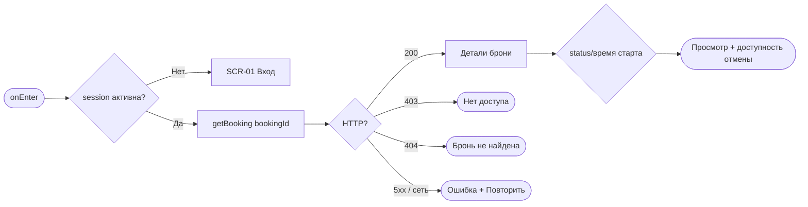
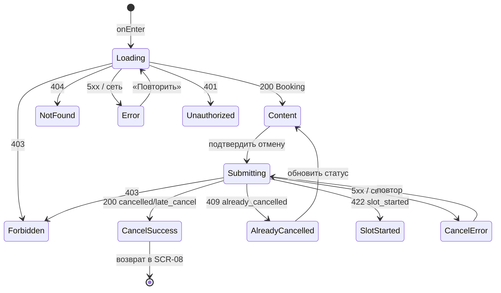

# Детали брони и отмена

**ID:** SCR-09  
**Тип:** Экран  
**Домен:** 05. Мои бронирования и отмены  
**Приоритет:** Critical  
**Функциональные блоки:** FB-BOOKINGS-004 (детали брони), FB-BOOKINGS-005 (правило отмены 24 ч), FB-BOOKINGS-006 (отмена брони)  
**Зона авторизации:** АЗ  
**Дизайн-макет:** — (макет не создан, этап дизайна)

---

## Содержание

- [История изменений](#история-изменений)
- [Обзор](#обзор)
- [Навигация](#навигация)
- [Входные данные](#входные-данные)
- [Применяемые логики](#применяемые-логики)
- [Инициализация](#инициализация)
- [Используемые запросы](#используемые-запросы)
- [Макет экрана](#макет-экрана)
- [Элементы экрана](#элементы-экрана)
- [Диалог подтверждения отмены](#диалог-подтверждения-отмены)
- [Состояния экрана](#состояния-экрана)
- [Действия пользователя](#действия-пользователя)
- [Связанные требования](#связанные-требования)
- [Критерии приёмки](#критерии-приёмки)

---

## История изменений

| Релиз | ТЗ | Описание изменений |
|-------|-----|-------------------|
| 0.1.0 | SCR-09 «Детали брони и отмена» | Первичная версия ТЗ (Черновик) на основе [дизайн-брифа SCR-09](../3-design-brief/SCR-09_детали-брони-отмена.md). |

---

## Обзор

Экран «Детали брони и отмена» — «карточка одной брони» студии «Шеф-стол». Здесь клиент видит всё о конкретной записи (что готовим, когда, где, кто шеф, сколько мест, экипировка, аллергии, цена) и, если нужно, отменяет её целиком. Экран всегда про **одну** бронь и строго **свою** (NFR-8): чужую бронь открыть нельзя — `getBooking` на чужую вернёт 403.

Отмена в этом домене чувствительная из-за политики 24 часов: продукты закупаются заранее, поэтому поздняя отмена (менее 24 ч до старта) не освобождает место, но и не штрафует деньгами (FR-17). Экран **заранее и честно** показывает, будет отмена ещё бесплатной (ранней) или уже поздней — см. [LOGIC-005](09_Логики/LOGIC-005_правило-отмены-24-часа.md). Окончательный вердикт (тип отмены) выносит сервер в момент запроса [`cancelBooking`](#cancelbooking).

Отмена — только целиком (FR-15): частичная отмена места или гостя не поддерживается.

### User Story

> Как клиент студии «Шеф-стол», я хочу видеть детали своей брони и при необходимости отменить её целиком,
> заранее понимая, будет отмена бесплатной или поздней, чтобы решать осознанно и без сюрпризов.

*(US-12, US-13)*

### Бизнес-ценность

- Клиент отменяет вовремя и понимает последствия — меньше конфликтов и «сюрпризов» на месте.
- Честный индикатор политики 24 ч (FR-16/FR-17) снижает недовольство и звонки в студию.
- Отмена студией (`studio_cancelled`) с причиной сохраняет доверие: клиент видит, что случилось и что записаться снова на этот слот нельзя (FR-18).

---

## Навигация

### Входящая (откуда открывается)

| Источник | Триггер | Условие | Передаваемые параметры |
|----------|---------|---------|------------------------|
| [SCR-08 Мои бронирования](SCR-08_мои-бронирования.md) | Тап по карточке брони | Всегда | `booking_id` |
| Push-уведомление | Тап по напоминанию за 24 ч | `type = booking_reminder` | `booking_id` |
| Push-уведомление | Тап по сообщению об отмене студией | `type = studio_cancelled` | `booking_id` |
| Deep link | `/bookings/{bookingId}` | Сессия активна | `bookingId` |

### Исходящая (куда ведёт)

| Назначение | Триггер | Передаваемые параметры |
|------------|---------|------------------------|
| [SCR-08 Мои бронирования](SCR-08_мои-бронирования.md) | «Назад» / успешная отмена | — (список обновляется) |
| [SCR-03 Список классов](SCR-03_список-классов.md) | «Записаться снова» (кроме `studio_cancelled`) | — |
| [SCR-01 Вход](SCR-01_вход-телефон.md) | Сессия истекла / 401 | — |

---

## Входные данные

| Название | Тип | Возможные значения | Описание |
|----------|-----|-------------------|----------|
| `booking_id` | Параметр перехода | `uuid` | Идентификатор открываемой брони (обязателен). |
| `session` | Состояние (кэш) | активна / истекла | Токен клиента; при истечении — [SCR-01](SCR-01_вход-телефон.md), см. [LOGIC-002](09_Логики/LOGIC-002_сессия-и-авторизация.md). |
| `now` | Состояние (клиентское время) | текущий момент | Используется для **подсказки** политики 24 ч (не для вердикта — истину выносит сервер). |

---

## Применяемые логики

| Логика | Элемент/Триггер | Описание |
|--------|-----------------|----------|
| [LOGIC-002 Сессия и авторизация](09_Логики/LOGIC-002_сессия-и-авторизация.md) | Инициализация / 401 | Проверка сессии; при истечении — редирект на вход. |
| [LOGIC-005 Правило отмены 24 часа](09_Логики/LOGIC-005_правило-отмены-24-часа.md) | Индикатор политики + гейтинг кнопки «Отменить бронь» | Определяет ранняя/поздняя отмена по времени до `slot.start_at`, текст подсказки и доступность действия; истина по типу — на сервере. |
| [LOGIC-006 Группировка броней](09_Логики/LOGIC-006_группировка-броней.md) | Вычисление метки «Прошедший» | «Прошлость» брони — производная от `slot.start_at`, не хранится статусом. |

---

## Инициализация

> **Примечание:** При открытии экрана отправляется один запрос [`getBooking`](#getbooking) по `booking_id`. Ответ содержит вложенные данные слота/программы/шефа.

### Диаграмма загрузки



### Запросы при открытии

| № | Запрос | Критичный | Зависит от | Условие |
|---|--------|-----------|------------|---------|
| 1 | [getBooking](#getbooking) | Да | — | Сессия активна, есть `booking_id` |

> Полное описание запросов см. в секции [Используемые запросы](#используемые-запросы).

---

## Используемые запросы

> Все API-запросы экрана с полным описанием параметров и обработки ответов.

### getBooking

**Тип:** REST  
**Метод:** GET `/bookings/{bookingId}`  
**Спецификация:** [../api/bookings/api.yaml](../api/bookings/api.yaml) → `getBooking`

**Триггер:** Инициализация экрана.

**Параметры:**

| Параметр | Тип | Обязательность | Источник | Описание |
|----------|-----|----------------|----------|----------|
| `bookingId` | string (uuid) | Да | `booking_id` из перехода | Идентификатор открываемой брони. |

**Ответ:** `Booking` — `id`, `slot_id`, `client_id`, `seats_count`, `rental_count`, `allergies?`, `status`, `price_total`, `created_at`, `cancelled_at?`, `cancel_reason?`, `slot` (полный `Slot`).

**Обработка ответа:**

| Результат | Условие | UI-реакция |
|-----------|---------|------------|
| Загрузка | — | Скелетоны блоков деталей |
| Успех | 200 + `Booking` | Отобразить детали, статус и доступность отмены (см. §[Элементы](#элементы-экрана)) |
| HTTP 401 | `code = unauthorized` | Переход на [SCR-01](SCR-01_вход-телефон.md), детали не показываем ([LOGIC-002](09_Логики/LOGIC-002_сессия-и-авторизация.md)) |
| HTTP 403 | `code = forbidden` | «Нет доступа» — чужую бронь открыть нельзя (NFR-8); возврат в [SCR-08](SCR-08_мои-бронирования.md) |
| HTTP 404 | `code = not_found` | «Бронь не найдена» + «Назад» в [SCR-08](SCR-08_мои-бронирования.md) |
| HTTP 5xx | `default` | Error state «Не удалось загрузить бронь» + «Повторить»/«Назад» |
| Сеть | Нет соединения | Error state с кнопкой «Повторить» |

---

### cancelBooking

**Тип:** REST  
**Метод:** POST `/bookings/{bookingId}/cancel`  
**Спецификация:** [../api/bookings/api.yaml](../api/bookings/api.yaml) → `cancelBooking`

**Триггер:** Тап «Отменить бронь» в [диалоге подтверждения](#диалог-подтверждения-отмены).

**Параметры:**

| Параметр | Тип | Обязательность | Источник | Описание |
|----------|-----|----------------|----------|----------|
| `bookingId` | string (uuid) | Да | `booking.id` | Идентификатор отменяемой брони. |

> Тело запроса пустое. Сервер сам определяет тип отмены по времени до `slot.start_at`: **≥24 ч → `cancelled`** (места и прокат возвращаются, FR-16); **<24 ч → `late_cancel`** (не возвращаются, штрафов нет, FR-17). Ровно 24 ч трактуется как ранняя. Частичная отмена не поддерживается (FR-15).

**Обработка ответа:**

| Результат | Условие | UI-реакция |
|-----------|---------|------------|
| Загрузка | — | Лоадер на кнопке и в диалоге; действие заблокировано от повторных нажатий (защита от двойной отмены) |
| Успех | 200 + `status = cancelled`, есть `cancelled_at` | Статус «Отменена клиентом»; подтверждение «Бронь отменена, места освобождены»; спокойный возврат в [SCR-08](SCR-08_мои-бронирования.md) |
| Успех | 200 + `status = late_cancel`, есть `cancelled_at` | Статус «Поздняя отмена»; мягкое пояснение «Место не освободится, денег мы не возьмём» (FR-17); возврат в [SCR-08](SCR-08_мои-бронирования.md) |
| HTTP 409 | `code = already_cancelled` | Снек «Бронь уже отменена»; обновить данные ([getBooking](#getbooking)), показать текущий статус, кнопку отмены скрыть (UC-3 E2) |
| HTTP 422 | `code = slot_started` | Снек «Класс уже начался — отменить нельзя»; кнопку отмены сделать недоступной (UC-3 E1) |
| HTTP 403 | `code = forbidden` | «Нет доступа» — не своя бронь (NFR-8); возврат в [SCR-08](SCR-08_мои-бронирования.md) |
| HTTP 401 | `code = unauthorized` | Переход на [SCR-01](SCR-01_вход-телефон.md) |
| HTTP 5xx | `default` | Снек «Не удалось отменить, попробуйте ещё раз»; бронь остаётся в прежнем статусе, диалог позволяет повтор |
| Сеть | Нет соединения | Снек «Нет соединения. Проверьте подключение»; статус не меняется |

---

## Макет экрана

### Структура

```
┌───────────────────────────────────────────┐
│ [←] Детали брони                           │  ← Header
├───────────────────────────────────────────┤
│  [ Статус: Активна · предстоит ]           │  ← Шапка статуса
│                                             │
│  Паста с нуля · новичковый                  │  ← Параметры слота
│  12 июл 2026, 18:00 (≈3 ч)                  │
│  Шеф Мария                                  │
│  наб. Обводного канала, 74, лофт «Шеф-стол» │
│  ─────────────────────────────────────     │
│  Состав: 3 места (вы + 2 гостя)             │  ← Состав брони
│  Экипировка: 2 свои, 1 прокат               │
│  Аллергии: орехи, лактоза                   │
│  ─────────────────────────────────────     │
│  Цена: 11 500 ₽                             │  ← Цена
│  Оплата на месте: наличные или перевод      │
│  ─────────────────────────────────────     │
│  ⓘ Бесплатная отмена — до 11 июл 18:00      │  ← Индикатор 24 ч
├───────────────────────────────────────────┤
│         [ Отменить бронь ]                  │  ← Fixed bottom (деструктивная)
└───────────────────────────────────────────┘
```

### Компоненты

| Компонент | Описание | Обязательность |
|-----------|----------|----------------|
| Шапка со статусом | Крупная метка статуса брони (тот же набор, что в [SCR-08](SCR-08_мои-бронирования.md)) | Да |
| Блок параметров слота | Программа/тип, дата/время (≈3 ч), шеф, полный адрес (read-only) | Да |
| Блок состава брони | Число мест, экипировка (сводно + разбивка), аллергии (если есть) | Да |
| Блок цены | `price_total` + строка «Оплата на месте» (FR-13) | Да |
| Индикатор политики 24 ч | Подсказка «бесплатно до …» / «отмена будет поздней» | Опционально (только для активной предстоящей) |
| Кнопка «Отменить бронь» | Первичное деструктивное действие (осторожный стиль) | Опционально (по статусу/времени) |
| Диалог подтверждения | Модальное подтверждение отмены | Опционально (по действию) |
| Плашка «Отменён студией» | Причина + запрет повторной записи | Опционально (при `studio_cancelled`) |
| Ссылка «Записаться снова» | Мягкая ссылка в [SCR-03](SCR-03_список-классов.md) | Опционально (не для `studio_cancelled`) |

---

## Элементы экрана

> **Примечания:**
> - **Валидация:** полей ввода на экране нет → «—».
> - **Логика:** описана текстовым блоком после таблицы.

### 1. Шапка статуса

| Элемент | Описание | Источник данных | Валидация | Действие |
|---------|----------|-----------------|-----------|----------|
| Метка статуса | Крупная читаемая метка | `booking.status` (+ `slot.start_at` для «Прошедшая») | — | — |

**Логика:**
- Статус задаёт доступность действий ниже. Соответствие метки статусу — идентично [SCR-08 §3](SCR-08_мои-бронирования.md): `active` (старт в будущем) → «Активна · предстоит»; `active` (старт в прошлом) → «Прошедшая»; `cancelled` → «Отменена клиентом»; `late_cancel` → «Поздняя отмена»; `studio_cancelled` → «Отменён студией».
- Статус различим не только цветом (текст/иконка); изменение статуса после отмены анонсируется доступно.

### 2. Параметры слота (read-only)

| Элемент | Описание | Источник данных | Валидация | Действие |
|---------|----------|-----------------|-----------|----------|
| Программа и тип | Что готовим и уровень | `booking.slot.program.name`, `booking.slot.program.type` | — | — |
| Дата и время старта | Начало класса (≈3 ч), с точной датой | `booking.slot.start_at` | — | — |
| Шеф | Кто ведёт класс | `booking.slot.chef.name` | — | — |
| Адрес студии (полный) | Куда идти | `booking.slot.address` | — | — |

**Логика:**
- Все параметры справочные (read-only) — клиент их не меняет (NFR-8, NFR-10).

### 3. Состав брони

| Элемент | Описание | Источник данных | Валидация | Действие |
|---------|----------|-----------------|-----------|----------|
| Число мест | «3 места: вы + 2 гостя» | `booking.seats_count` | — | — |
| Экипировка | Сводно и разбивкой: «2 свои, 1 прокат» | `booking.seats_count`, `booking.rental_count` | — | — |
| Аллергии | Одним полем на всю бронь | `booking.allergies` | — | — |

**Логика:**
- Экипировка вычисляется от `seats_count`/`rental_count`: свои = `seats_count − rental_count`, прокат = `rental_count`. Разбивки по конкретным людям нет (FR-8).
- Блок аллергий показывается, только если `booking.allergies` не пусто; иначе — скрыт либо помечен «не указаны» (FR-12). Поле одно на бронь, без разбивки по людям.

### 4. Цена

| Элемент | Описание | Источник данных | Валидация | Действие |
|---------|----------|-----------------|-----------|----------|
| Стоимость | Итоговая цена брони, ₽ | `booking.price_total` | — | — |
| Строка оплаты | «Оплата на месте: наличные или перевод» | Константа UI | — | — |

**Логика:**
- `price_total` — производное поле от тарифов слота (`slot.price·seats_count + slot.rental_price·rental_count`, FR-13); UI показывает готовое значение и не пересчитывает. Никакой онлайн-оплаты и отметок «оплачено/нет» (FR-13).

### 5. Индикатор политики 24 часов

| Элемент | Описание | Источник данных | Валидация | Действие |
|---------|----------|-----------------|-----------|----------|
| Подсказка «бесплатно до …» | Показ при ≥24 ч до старта | `booking.slot.start_at`, `now` | — | — |
| Предупреждение «отмена будет поздней» | Показ при <24 ч до старта | `booking.slot.start_at`, `now` | — | — |

**Логика:**
- [LOGIC-005](09_Логики/LOGIC-005_правило-отмены-24-часа.md): если до старта **≥24 ч** — «Бесплатная отмена — до {дата/время}» / «До бесплатной отмены осталось {N}»; если **<24 ч** — «Осталось меньше 24 часов — отмена будет поздней: место не освободится, но денег мы не возьмём». Тон мягкий, объясняющий (продукты уже закуплены), без давления.
- Индикатор — **подсказка**, а не вердикт: окончательный тип отмены определяет сервер в момент [`cancelBooking`](#cancelbooking). Относительные формулировки дублируются точной датой/временем.
- Индикатор показывается только для активной предстоящей брони (`status = active` и `slot.start_at` в будущем).

### 6. Кнопка «Отменить бронь»

| Элемент | Описание | Источник данных | Валидация | Действие |
|---------|----------|-----------------|-----------|----------|
| Кнопка «Отменить бронь» | Первичное деструктивное действие (вся бронь целиком) | — | — | Открыть [диалог подтверждения](#диалог-подтверждения-отмены) |
| Микротекст | «Отменяется вся бронь; частичная отмена места/гостя не поддерживается» | Константа UI (FR-15) | — | — |

**Условия доступности:**
- Кнопка **видна и активна**, только если `status = active` И `slot.start_at` в будущем (класс не стартовал).
- Кнопка **недоступна** с пояснением «Класс уже начался/прошёл — отменить нельзя», если `slot.start_at` в прошлом (UC-3 E1).
- Кнопки отмены **нет** при `status ∈ {cancelled, late_cancel, studio_cancelled}` — только просмотр (UC-3 E2, FR-18).

**Логика:**
- Гейтинг доступности: [LOGIC-005](09_Логики/LOGIC-005_правило-отмены-24-часа.md). Кнопка требует подтверждения в диалоге и не срабатывает случайно.

### 7. Блок «Отменён студией»

| Элемент | Описание | Источник данных | Валидация | Действие |
|---------|----------|-----------------|-----------|----------|
| Плашка причины | Причина отмены студией | `booking.cancel_reason` | — | — |
| Пометка о запрете | «Повторная запись на этот класс недоступна» | Константа UI | — | — |

**Логика:**
- Блок показывается только при `status = studio_cancelled`; причина обязательна к показу (FR-18). Кнопки отмены нет (отменять нечего). Ссылку «Записаться снова» на этот слот не предлагаем (UC-4 E1, R-008).

### 8. Действие «Записаться снова» и «Назад»

| Элемент | Описание | Источник данных | Валидация | Действие |
|---------|----------|-----------------|-----------|----------|
| Ссылка «Записаться снова» | Мягкая ссылка в каталог | — | — | Открыть [SCR-03](SCR-03_список-классов.md) |
| Кнопка «Назад» | Возврат в список | — | — | Открыть [SCR-08](SCR-08_мои-бронирования.md) |

**Условия доступности:**
- «Записаться снова» доступна для прошедших и отменённых клиентом броней (`cancelled`, `late_cancel`, «Прошедшая»); **недоступна** для `studio_cancelled`.

---

## Диалог подтверждения отмены

> Модальное подтверждение (Bottom Sheet / dialog). Открывается по кнопке «Отменить бронь». Доступный модальный паттерн: фокус переводится в диалог и запирается в нём, Esc = «Не отменять», после закрытия фокус возвращается на кнопку.

### Свойства

| Свойство | Значение |
|----------|----------|
| Высота | Динамическая (по контенту) |
| Закрытие свайпом | Да (mobile web) |
| Закрытие по тапу вне области | Да (= «Не отменять») |
| Затемнение фона | Да |
| Кнопка закрытия | Да («Не отменять») |

### Содержимое диалога

| Элемент | Описание | Источник данных | Действие |
|---------|----------|-----------------|----------|
| Заголовок | «Отменить бронь?» | Константа UI | — |
| Пояснение последствий | При ≥24 ч: «Места и прокатные комплекты освободятся»; при <24 ч: «Место не освободится, но денег мы не возьмём» | [LOGIC-005](09_Логики/LOGIC-005_правило-отмены-24-часа.md), `slot.start_at`, `now` | — |
| Кнопка «Отменить бронь» | Подтверждение (деструктивная) | — | [cancelBooking](#cancelbooking) |
| Кнопка «Не отменять» | Закрытие без изменений | — | Закрыть диалог |

**Логика:**
- В диалоге ещё раз явно указано, ранняя это отмена или поздняя, и что произойдёт. При подтверждении → [`cancelBooking`](#cancelbooking).
- Кнопка подтверждения и вся форма блокируются на время запроса (защита от двойной отмены).
- **Гонка с порогом 24 ч:** если между показом подсказки и подтверждением порог перешёл, сервер может вернуть статус, отличный от ожидаемого. Диалог/экран честно сообщают фактический результат по ответу (например, «Отмена оказалась поздней»), а не молча применяют обещанное ранее.

---

## Состояния экрана

### Таблица состояний

| Состояние | Условие | Отображение |
|-----------|---------|-------------|
| Loading | Ожидание [getBooking](#getbooking) | Скелетоны блоков деталей |
| Content | 200 + `Booking` | Полные детали, статус, доступность отмены |
| Submitting | Идёт [cancelBooking](#cancelbooking) | Лоадер на кнопке/в диалоге, действие заблокировано |
| CancelSuccess | 200 (`cancelled`/`late_cancel`) | Подтверждение + новый статус, возврат в [SCR-08](SCR-08_мои-бронирования.md) |
| CancelError | 5xx / сеть при отмене | Снек «Не удалось отменить…», статус прежний, повтор доступен |
| AlreadyCancelled | 409 `already_cancelled` | Снек + обновление статуса, кнопка отмены скрыта (UC-3 E2) |
| SlotStarted | 422 `slot_started` | Снек, кнопка отмены недоступна (UC-3 E1) |
| Forbidden | 403 | «Нет доступа», возврат в [SCR-08](SCR-08_мои-бронирования.md) (NFR-8) |
| NotFound | 404 | «Бронь не найдена» + «Назад» |
| Error (load) | 5xx / сеть при загрузке | «Не удалось загрузить бронь» + «Повторить»/«Назад» |
| Unauthorized | 401 | Переход на [SCR-01](SCR-01_вход-телефон.md) |

### Диаграмма переходов



---

## Действия пользователя

| Действие | Элемент | Триггер | Результат |
|----------|---------|---------|-----------|
| Открыть диалог отмены | «Отменить бронь» | Tap / Enter / Space | Открывается [диалог подтверждения](#диалог-подтверждения-отмены) |
| Подтвердить отмену | «Отменить бронь» (в диалоге) | Tap / Enter | [cancelBooking](#cancelbooking); блокировка от повтора |
| Отменить действие | «Не отменять» / Esc / тап вне | Tap / Esc | Диалог закрыт, бронь без изменений |
| Записаться снова | Ссылка «Записаться снова» | Tap / Enter | Переход на [SCR-03](SCR-03_список-классов.md) (кроме `studio_cancelled`) |
| Вернуться в список | «Назад» | Tap / Enter | Переход на [SCR-08](SCR-08_мои-бронирования.md) |
| Повторить загрузку | «Повторить» | Tap / Enter | Повторный [getBooking](#getbooking) |

---

## Связанные требования

### Функциональные (FR-*)

| ID | Название | Приоритет |
|----|----------|-----------|
| [FR-14](../2-requirements/functional-requirements.md) | Отображение брони со статусом, параметрами слота, числом мест и экипировкой | Must |
| [FR-15](../2-requirements/functional-requirements.md) | Отмена возможна только целиком; частичная отмена не поддерживается | Must |
| [FR-16](../2-requirements/functional-requirements.md) | Ранняя отмена (≥24 ч, включая ровно 24 ч) освобождает места и прокатные комплекты | Must |
| [FR-17](../2-requirements/functional-requirements.md) | Поздняя отмена (<24 ч) — статус «поздняя отмена», без освобождения и без штрафов | Must |
| [FR-18](../2-requirements/functional-requirements.md) | «Отменён студией» с причиной; повторная запись на слот запрещена | Must |
| [FR-13](../2-requirements/functional-requirements.md) | Показ цены; оплата офлайн, без онлайн-оплаты и отметок «оплачено» | Must |

### Нефункциональные (NFR-*)

| ID | Название | Приоритет |
|----|----------|-----------|
| [NFR-1](../2-requirements/non-functional-requirements.md) | Web-приложение; адаптив desktop/mobile web | Высокий |
| [NFR-4](../2-requirements/non-functional-requirements.md) | UI не пересчитывает освобождение мест/статус — полагается на ответ API | Высокий |
| [NFR-5](../2-requirements/non-functional-requirements.md) | Согласованность мест/фонда при отменах обеспечивается бэкендом | Высокий |
| [NFR-8](../2-requirements/non-functional-requirements.md) | Доступ только к своей брони; чужая бронь → 403 | Высокий |
| [NFR-10](../2-requirements/non-functional-requirements.md) | Взаимодействие через API; истина по времени/типу отмены — на сервере | Высокий |

### Use cases / User stories

| ID | Название | Приоритет |
|----|----------|-----------|
| [UC-3](../2-requirements/use-cases.md) | Отмена записи (осн. поток; A1 поздняя; E1 стартовал; E2 уже отменена) | Must |
| [UC-4](../2-requirements/use-cases.md) | Отмена класса студией (причина, запрет повторной записи) | Must |
| [US-12](../2-requirements/user-stories.md) | Отменить свою запись до старта | Must |
| [US-13](../2-requirements/user-stories.md) | Видеть брони, отменённые студией | Must |

---

## Критерии приёмки

### Позитивные сценарии

| ID | Критерий | Приоритет |
|----|----------|-----------|
| AC-001 | **Дано** активная бронь со стартом ≥24 ч, **Когда** клиент открывает экран, **Тогда** показаны все параметры (слот, состав, аллергии если есть, цена + офлайн-оплата) и индикатор «Бесплатная отмена — до …» ([LOGIC-005](09_Логики/LOGIC-005_правило-отмены-24-часа.md)) | P0 |
| AC-002 | **Дано** активная бронь ≥24 ч, **Когда** клиент подтверждает отмену, **Тогда** [cancelBooking](#cancelbooking) возвращает `status = cancelled` с `cancelled_at`, статус меняется на «Отменена клиентом», показано подтверждение, возврат в [SCR-08](SCR-08_мои-бронирования.md) (FR-16) | P0 |
| AC-003 | **Дано** активная бронь со стартом <24 ч, **Когда** клиент открывает экран, **Тогда** показано предупреждение «отмена будет поздней: место не освободится, штрафов нет», а после подтверждения приходит `status = late_cancel` (FR-17) | P0 |
| AC-004 | **Дано** бронь `studio_cancelled` с `cancel_reason`, **Когда** клиент открывает экран, **Тогда** показана плашка причины и пометка «Повторная запись недоступна», кнопки отмены и «Записаться снова» на этот слот нет (FR-18, UC-4 E1) | P0 |
| AC-005 | **Дано** прошедшая/отменённая клиентом бронь, **Когда** просмотр, **Тогда** данные видны, кнопки отмены нет, доступна мягкая ссылка «Записаться снова» → [SCR-03](SCR-03_список-классов.md) | P1 |

### Негативные сценарии

| ID | Критерий | Приоритет |
|----|----------|-----------|
| AC-N01 | **Дано** класс уже стартовал/прошёл, **Когда** клиент пытается отменить (или сервер вернул 422 `slot_started`), **Тогда** кнопка отмены недоступна с пояснением «Класс уже начался — отменить нельзя», данные брони видны (UC-3 E1) | P0 |
| AC-N02 | **Дано** бронь уже отменена, **Когда** повторная отмена (сервер вернул 409 `already_cancelled`), **Тогда** показан снек «Бронь уже отменена», статус обновлён, кнопка отмены скрыта (UC-3 E2) | P0 |
| AC-N03 | **Дано** клиент открывает чужую бронь, **Когда** [getBooking](#getbooking)/[cancelBooking](#cancelbooking) возвращает 403 `forbidden`, **Тогда** данные не показываются, сообщение «Нет доступа», возврат в [SCR-08](SCR-08_мои-бронирования.md) (NFR-8) | P0 |
| AC-N04 | **Дано** сеть/сервер недоступны при отмене, **Когда** подтверждение, **Тогда** снек «Не удалось отменить, попробуйте ещё раз», бронь остаётся в прежнем статусе, повтор доступен | P0 |
| AC-N05 | **Дано** сессия истекла (401), **Когда** открытие/отмена, **Тогда** детали не показываются, переход на [SCR-01](SCR-01_вход-телефон.md) | P0 |

### Граничные условия (Edge Cases)

| ID | Критерий | Приоритет |
|----|----------|-----------|
| AC-E01 | **Дано** до старта ровно 24 ч, **Когда** клиент отменяет, **Тогда** сервер трактует отмену как раннюю (`cancelled`), места освобождаются (FR-16) | P1 |
| AC-E02 | **Дано** порог 24 ч перешёл между показом подсказки и подтверждением, **Когда** сервер возвращает `late_cancel` вместо ожидаемого `cancelled`, **Тогда** экран честно сообщает фактический результат, а не обещанный ранее | P1 |
| AC-E03 | **Дано** бронь без указанных аллергий (`allergies` пусто), **Когда** просмотр состава, **Тогда** блок аллергий скрыт либо помечен «не указаны», без выдуманной пустоты (FR-12) | P2 |
| AC-E04 | **Дано** идёт запрос отмены, **Когда** клиент повторно жмёт «Отменить бронь», **Тогда** повторный запрос не отправляется (кнопка заблокирована, защита от двойной отмены) | P1 |
| AC-E05 | **Дано** запрошена несуществующая бронь, **Когда** [getBooking](#getbooking) возвращает 404, **Тогда** показано «Бронь не найдена» с кнопкой «Назад» в [SCR-08](SCR-08_мои-бронирования.md) | P2 |

---
