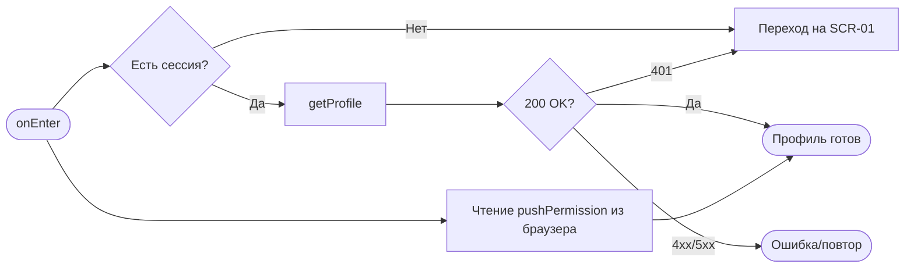
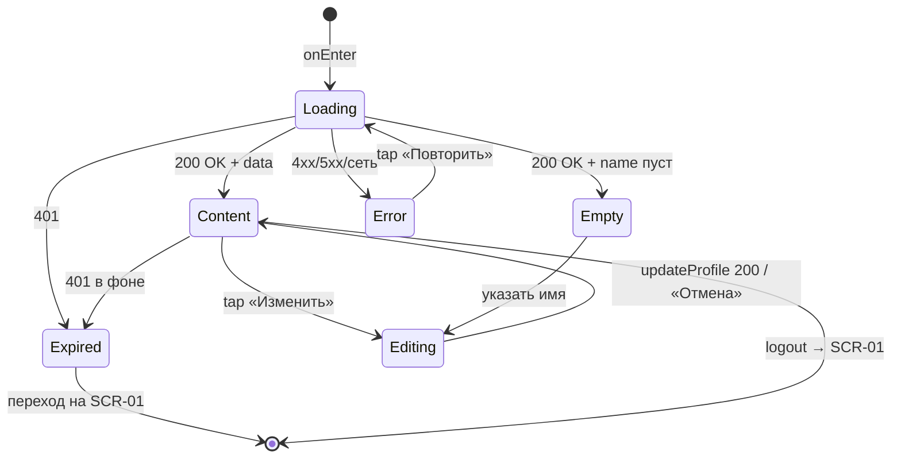

# Профиль

**ID:** SCR-10  
**Тип:** Экран  
**Домен:** 06. Профиль и уведомления  
**Приоритет:** High  
**Статус:** Черновик  
**Функциональные блоки:** —  
**Зона авторизации:** АЗ  
**Дизайн-макет:** — (макет не создан, этап дизайна)

---

## Содержание

- [История изменений](#история-изменений)
- [Обзор](#обзор)
- [Навигация](#навигация)
- [Входные данные](#входные-данные)
- [Применяемые логики](#применяемые-логики)
- [Свойства Bottom Sheet](#свойства-bottom-sheet)
- [Инициализация](#инициализация)
- [Используемые запросы](#используемые-запросы)
- [Макет экрана](#макет-экрана)
- [Элементы экрана](#элементы-экрана)
- [Состояния экрана](#состояния-экрана)
- [Действия пользователя](#действия-пользователя)
- [Связанные требования](#связанные-требования)
- [Критерии приёмки](#критерии-приёмки)

---

## История изменений

| Релиз | ТЗ | Описание изменений |
|-------|-----|-------------------|
| 0.1.0 | [SCR-10 Профиль](SCR-10_профиль.md) | Первичная версия ТЗ на основе [дизайн-брифа SCR-10](../3-design-brief/SCR-10_профиль.md) |

---

## Обзор

Профиль — тихий, служебный уголок «Шеф-стола». Клиент заходит сюда, чтобы быстро убедиться, что система знает его правильно: то самое имя, которым к нему обращаются, и тот самый номер, на который придёт код входа и напоминание за 24 часа до класса. При необходимости имя можно поправить (`updateProfile`), номер телефона неизменяем — он идентификатор входа и канал OTP.

Вторая задача экрана — быть честным местом про уведомления и сессию: отсюда клиент управляет push-напоминаниями (тумблер, [LOGIC-009](09_Логики/LOGIC-009_регистрация-push-токена.md)) и отсюда же спокойно выходит из аккаунта ([LOGIC-002](09_Логики/LOGIC-002_сессия-и-авторизация.md)). Экран доступен только авторизованному клиенту и показывает данные **только текущего пользователя** (NFR-7, NFR-8); при истёкшей сессии старые данные не показываются, происходит уход на вход.

### User Story

> Как авторизованный клиент, я хочу видеть и при необходимости поправить своё имя, управлять напоминаниями и выйти из аккаунта,
> чтобы держать свои данные и уведомления под контролем.

### Бизнес-ценность

- Прозрачность данных клиента (имя, телефон) и доверие к контакту для кода/напоминаний.
- Управление push-напоминаниями за 24 ч до класса (FR-19, NFR-9).
- Безопасный выход и строгий доступ только к своим данным (NFR-7, NFR-8).

---

## Навигация

### Входящая (откуда открывается)

| Источник | Триггер | Условие | Передаваемые параметры |
|----------|---------|---------|------------------------|
| Основная навигация | Тап «Профиль» | Есть действующая сессия | — |
| [SCR-07 Запись создана](SCR-07_запись-создана.md) | Тап по подсказке про уведомления | Клиент отложил решение о push | — |
| Открытие приложения | Профиль — последний активный раздел | Есть действующая сессия | — |

### Исходящая (куда ведёт)

| Назначение | Триггер | Передаваемые параметры |
|------------|---------|------------------------|
| [SCR-03 Классы](SCR-03_список-классов.md) | Навигация | — |
| [SCR-08 Мои брони](SCR-08_мои-бронирования.md) | Навигация | — |
| [SCR-01 Вход](SCR-01_вход-телефон.md) | Выход из аккаунта (logout) / истёкшая сессия | — |

---

## Входные данные

| Название | Тип | Возможные значения | Описание |
|----------|-----|-------------------|----------|
| `hasSession` | Кэш (токены) | `true` / `false` | Признак действующей сессии. Если `false` — route guard уводит на [SCR-01](SCR-01_вход-телефон.md) ([LOGIC-002](09_Логики/LOGIC-002_сессия-и-авторизация.md)). |
| `pushPermission` | Состояние (браузер) | `granted` / `denied` / `default` / `unsupported` | Текущее состояние разрешения на web-push; определяет вид блока «Уведомления» ([LOGIC-009](09_Логики/LOGIC-009_регистрация-push-токена.md)). |

---

## Применяемые логики

| Логика | Элемент/Триггер | Описание |
|--------|-----------------|----------|
| [LOGIC-002 Сессия и авторизация](09_Логики/LOGIC-002_сессия-и-авторизация.md) | Route guard, кнопка «Выйти» | Проверка сессии при входе на экран; logout (инвалидация токенов, очистка локальной сессии) с уходом на [SCR-01](SCR-01_вход-телефон.md). |
| [LOGIC-009 Регистрация push-токена](09_Логики/LOGIC-009_регистрация-push-токена.md) | Тумблер «Напоминания» | Запрос разрешения на push и `registerPushToken`; отключение — `deletePushToken`; обработка `denied`/`unsupported`. |

---

## Свойства Bottom Sheet

Не применимо — экран, не Bottom Sheet.

---

## Инициализация

> При открытии экран запрашивает профиль (`getProfile`) и считывает текущее состояние разрешения на push из браузера (без сети). Данные показываются только для текущей сессии.

### Диаграмма загрузки



### Запросы при открытии

| № | Запрос | Критичный | Зависит от | Условие |
|---|--------|-----------|------------|---------|
| 1 | [getProfile](#getprofile) | Да | — | Всегда (есть сессия) |

> Полное описание запросов см. в секции [Используемые запросы](#используемые-запросы).

---

## Используемые запросы

> Все API-запросы экрана с полным описанием параметров и обработки ответов.

### getProfile

**Тип:** REST  
**Метод:** GET  
**Спецификация:** [../api/profile/api.yaml](../api/profile/api.yaml) → `getProfile`  
**Security:** bearerAuth

**Триггер:** Инициализация экрана

**Параметры:**

| Параметр | Тип | Обязательность | Источник | Описание |
|----------|-----|----------------|----------|----------|
| — | — | — | Заголовок `Authorization: Bearer <access_token>` | Идентификация клиента только по токену; чужой id недопустим (NFR-8). |

**Обработка ответа:**

| Результат | Условие | UI-реакция |
|-----------|---------|------------|
| Загрузка | — | Скелетон на месте имени и телефона |
| Успех 200 | `Client` | Отобразить имя и телефон (телефон в аккуратном формате) |
| Успех 200 | `name` пуст | Нейтральный плейсхолдер имени + предложение указать имя (не ошибка) |
| HTTP 401 | Сессия недействительна | «Сессия завершилась, войдите снова» → [SCR-01](SCR-01_вход-телефон.md) ([LOGIC-002](09_Логики/LOGIC-002_сессия-и-авторизация.md)) |
| HTTP 5xx | `default` (InternalError) | Error state «Не удалось загрузить профиль» + кнопка «Повторить» |
| Сеть | Нет соединения | Error state «Не удалось загрузить профиль» + кнопка «Повторить» |

---

### updateProfile

**Тип:** REST  
**Метод:** PATCH  
**Спецификация:** [../api/profile/api.yaml](../api/profile/api.yaml) → `updateProfile`  
**Security:** bearerAuth

**Триггер:** Сохранение отредактированного имени

**Параметры:**

| Параметр | Тип | Обязательность | Источник | Описание |
|----------|-----|----------------|----------|----------|
| `name` | string | Да | Поле «Имя» (режим редактирования) | Имя клиента, 1–100 символов (`UpdateProfileRequest.name`). Телефон здесь не меняется. |

**Обработка ответа:**

| Результат | Условие | UI-реакция |
|-----------|---------|------------|
| Загрузка | — | Индикатор на кнопке «Сохранить», поле заблокировано |
| Успех 200 | `Client` с новым `name` | Выйти из режима редактирования, показать обновлённое имя, снек «Имя обновлено» |
| HTTP 400 | `code = validation_error` | Подсветить поле, «Имя должно быть от 1 до 100 символов» |
| HTTP 401 | Сессия недействительна | Увести на [SCR-01](SCR-01_вход-телефон.md) |
| HTTP 5xx | `default` | Снек «Не удалось сохранить. Попробуйте позже», введённое имя сохранено |
| Сеть | Нет соединения | Снек «Нет соединения. Проверьте подключение» |

---

### registerPushToken

**Тип:** REST  
**Метод:** POST  
**Спецификация:** [../api/auth/api.yaml](../api/auth/api.yaml) → `registerPushToken`  
**Security:** bearerAuth

**Триггер:** Включение тумблера «Напоминания» и выдача разрешения браузером ([LOGIC-009](09_Логики/LOGIC-009_регистрация-push-токена.md))

**Параметры:**

| Параметр | Тип | Обязательность | Источник | Описание |
|----------|-----|----------------|----------|----------|
| `token` | string | Да | Web Push API браузера | Токен push-уведомлений (`PushTokenRequest.token`). |
| `platform` | string | Да | Константа | `web` (основной таргет, NFR-1). |

**Обработка ответа:**

| Результат | Условие | UI-реакция |
|-----------|---------|------------|
| Загрузка | — | Тумблер в промежуточном состоянии |
| Успех 204 | — | Статус «Напоминания включены — напомним о классе за 24 часа» |
| HTTP 400 | `validation_error` | Снек «Не удалось включить напоминания», тумблер возвращается в выкл |
| HTTP 401 | Сессия недействительна | Увести на [SCR-01](SCR-01_вход-телефон.md) |
| HTTP 5xx | `default` | Снек «Произошла ошибка. Попробуйте позже», тумблер возвращается в выкл |
| Сеть | Нет соединения | Снек «Нет соединения. Проверьте подключение» |

---

### deletePushToken

**Тип:** REST  
**Метод:** DELETE  
**Спецификация:** [../api/auth/api.yaml](../api/auth/api.yaml) → `deletePushToken`  
**Security:** bearerAuth

**Триггер:** Выключение тумблера «Напоминания» ([LOGIC-009](09_Логики/LOGIC-009_регистрация-push-токена.md))

**Параметры:**

| Параметр | Тип | Обязательность | Источник | Описание |
|----------|-----|----------------|----------|----------|
| `token` | string | Да | Текущий push-токен браузера | Токен для снятия регистрации (`PushTokenDeleteRequest.token`). |
| `platform` | string | Да | Константа | `web`. |

**Обработка ответа:**

| Результат | Условие | UI-реакция |
|-----------|---------|------------|
| Загрузка | — | Тумблер в промежуточном состоянии |
| Успех 204 | — | Статус «Напоминания выключены» |
| HTTP 401 | Сессия недействительна | Увести на [SCR-01](SCR-01_вход-телефон.md) |
| HTTP 404 | Токен уже отсутствует | Трактовать как успех (идемпотентно), статус «выключены» |
| HTTP 5xx | `default` | Снек «Произошла ошибка. Попробуйте позже», тумблер возвращается во вкл |
| Сеть | Нет соединения | Снек «Нет соединения. Проверьте подключение» |

---

### logout

**Тип:** REST  
**Метод:** POST  
**Спецификация:** [../api/auth/api.yaml](../api/auth/api.yaml) → `logout`  
**Security:** bearerAuth

**Триггер:** Подтверждение выхода в диалоге «Выйти из аккаунта?»

**Параметры:**

| Параметр | Тип | Обязательность | Источник | Описание |
|----------|-----|----------------|----------|----------|
| — | — | — | Refresh-токен из сессии (инвалидируется сервером) | Тело/заголовок по контракту; клиент очищает локальную сессию ([LOGIC-002](09_Логики/LOGIC-002_сессия-и-авторизация.md)). |

**Обработка ответа:**

| Результат | Условие | UI-реакция |
|-----------|---------|------------|
| Загрузка | — | Индикатор на кнопке «Выйти», действия заблокированы |
| Успех 204 | — | Очистить локальную сессию → переход на [SCR-01](SCR-01_вход-телефон.md) |
| HTTP 401 | Сессия уже недействительна | Всё равно очистить локально → [SCR-01](SCR-01_вход-телефон.md) |
| HTTP 5xx / сеть | — | Снек «Не удалось выйти. Попробуйте ещё раз»; при повторной ошибке допускается локальная очистка сессии |

---

**Доступные спецификации** (REST, многофайловый OpenAPI, `../api/`):

- `auth/api.yaml` — авторизация, OTP, токены, push-токены
- `slots/api.yaml` — слоты классов (read-only)
- `bookings/api.yaml` — бронирования и отмены
- `profile/api.yaml` — профиль клиента
- `catalog/api.yaml` — программы/меню и шефы (read-only справочники)

---

## Макет экрана

### Структура

```
┌─────────────────────────────────────┐
│  Ваш профиль                        │  ← Заголовок раздела
├─────────────────────────────────────┤
│  Имя                                │
│  Иван                    [ Изменить]│  ← Данные профиля
│  Телефон                            │
│  +7 900 123-45-67                   │
├─────────────────────────────────────┤
│  Уведомления                        │
│  Напоминания за 24 ч   [ ●——  вкл ] │  ← Тумблер push
│  (подсказка при denied/unsupported) │
├─────────────────────────────────────┤
│  Классы  ·  Мои брони               │  ← Навигация (опц.)
├─────────────────────────────────────┤
│         [ Выйти из аккаунта ]       │  ← Logout (приглушён)
│  Данные видны только вам             │  ← Приватная сноска (опц.)
└─────────────────────────────────────┘
```

### Компоненты

| Компонент | Описание | Обязательность |
|-----------|----------|----------------|
| Заголовок раздела | «Ваш профиль» / обращение по имени | Да |
| Блок данных профиля | Имя (с «Изменить») и телефон (только просмотр) | Да |
| Блок «Уведомления» | Тумблер push + подсказки по состояниям | Да |
| Навигация в разделы | «Классы» / «Мои брони» | Опционально |
| Кнопка «Выйти из аккаунта» | Служебное действие с подтверждением | Да |
| Приватная сноска | Короткий текст о приватности данных | Опционально |
| Область ошибки/статуса | Ошибка загрузки и повтор | Да |

---

## Элементы экрана

### 1. Данные профиля

| Элемент | Описание | Источник данных | Валидация | Действие |
|---------|----------|-----------------|-----------|----------|
| Значение «Имя» | Имя клиента (просмотр) | `name` из [getProfile](#getprofile) | — | Тап «Изменить» → режим редактирования |
| Кнопка «Изменить» | Переход к редактированию имени | — | — | Показать поле ввода имени |
| Поле «Имя» (режим редактирования) | Редактируемое имя | `name` | 1–100 символов. Ошибка: «Имя должно быть от 1 до 100 символов» | — |
| Кнопка «Сохранить» | Сохранение имени | — | — | [updateProfile](#updateprofile) |
| Кнопка «Отмена» | Выход из редактирования без изменений | — | — | Вернуть просмотр |
| Значение «Телефон» | Номер клиента (только просмотр) | `phone` из [getProfile](#getprofile) | — | Копирование (редактирование недоступно) |

**Момент валидации:** имя — при сохранении.

**Логика:**
- Кнопка «Сохранить» активна, если имя непустое, 1–100 символов и отличается от исходного.
- Телефон не редактируется: он идентификатор входа и канал OTP.

**Условия доступности:**
- Кнопки «Сохранить»/«Отмена» видны только в режиме редактирования.

### 2. Уведомления

| Элемент | Описание | Источник данных | Валидация | Действие |
|---------|----------|-----------------|-----------|----------|
| Тумблер «Напоминания за 24 ч» | Вкл/выкл push-напоминаний | `pushPermission` + факт регистрации токена | — | Вкл → [registerPushToken](#registerpushtoken); Выкл → [deletePushToken](#deletepushtoken) |
| Статус/подсказка | Текст по состоянию разрешения | `pushPermission` | — | При `denied` — инструкция включить в настройках браузера |

**Логика:**
- Тумблер «Напоминания»: [LOGIC-009](09_Логики/LOGIC-009_регистрация-push-токена.md) — при включении запрашивается разрешение браузера; при `granted` → `registerPushToken`; при `denied` показывается инструкция (системный диалог повторно не вызвать); при `unsupported` тумблер недоступен с честным текстом «Напоминания недоступны в этом браузере».

**Условия доступности:**
- Тумблер скрыт/недоступен при `pushPermission = unsupported`.

### 3. Навигация и выход

| Элемент | Описание | Источник данных | Валидация | Действие |
|---------|----------|-----------------|-----------|----------|
| Ссылка «Классы» | Переход в список классов | — | — | [SCR-03](SCR-03_список-классов.md) |
| Ссылка «Мои брони» | Переход к бронированиям | — | — | [SCR-08](SCR-08_мои-бронирования.md) |
| Кнопка «Выйти из аккаунта» | Завершение сессии | — | — | Диалог подтверждения → [logout](#logout) |

**Логика:**
- Кнопка «Выйти»: показывает диалог «Выйти из аккаунта?»; при подтверждении → [logout](#logout) → очистка сессии ([LOGIC-002](09_Логики/LOGIC-002_сессия-и-авторизация.md)) → [SCR-01](SCR-01_вход-телефон.md). Отмена оставляет клиента в Профиле.

**Условия доступности:**
- Кнопка «Выйти» доступна всегда, включая состояние ошибки загрузки профиля.

---

## Состояния экрана

### Таблица состояний

| Состояние | Условие | Отображение |
|-----------|---------|-------------|
| Загрузка | `getProfile` в процессе | Скелетон на месте имени и телефона |
| Готово | 200 + данные | Имя, телефон, блок уведомлений, навигация, выход |
| Редактирование имени | Тап «Изменить» | Поле ввода имени, «Сохранить»/«Отмена» |
| Пусто (имя не задано) | 200 + `name` пуст | Нейтральный плейсхолдер + предложение указать имя |
| Ошибка / повтор | 4xx (кроме 401) / 5xx / сеть | «Не удалось загрузить профиль» + «Повторить»; выход остаётся доступен |
| Сессия истекла | 401 | «Сессия завершилась, войдите снова» → [SCR-01](SCR-01_вход-телефон.md), старые ПДн не показываются |

### Диаграмма переходов



---

## Действия пользователя

| Действие | Элемент | Триггер | Результат |
|----------|---------|---------|-----------|
| Редактировать имя | «Изменить» / «Сохранить» | Tap | [updateProfile](#updateprofile), обновление имени |
| Копировать телефон | Значение «Телефон» | Выделение/копирование | Номер скопирован (редактирование недоступно) |
| Включить/выключить напоминания | Тумблер «Напоминания» | Tap | [registerPushToken](#registerpushtoken) / [deletePushToken](#deletepushtoken) ([LOGIC-009](09_Логики/LOGIC-009_регистрация-push-токена.md)) |
| Перейти в раздел | «Классы» / «Мои брони» | Tap | [SCR-03](SCR-03_список-классов.md) / [SCR-08](SCR-08_мои-бронирования.md) |
| Выйти из аккаунта | «Выйти из аккаунта» | Tap → подтверждение | [logout](#logout) → [SCR-01](SCR-01_вход-телефон.md) |

---

## Связанные требования

### Функциональные (FR-*)

Источник: [functional-requirements.md](../2-requirements/functional-requirements.md)

| ID | Название | Приоритет |
|----|----------|-----------|
| FR-1 | Лёгкая регистрация/вход (имя клиента; редактирование имени) | Must |
| FR-19 | Push-напоминание о записи за 24 ч; регистрация push-токена | Should |
| FR-20 | Просмотр данных профиля (имя, телефон) | Should |

### Нефункциональные (NFR-*)

Источник: [non-functional-requirements.md](../2-requirements/non-functional-requirements.md)

| ID | Название | Приоритет |
|----|----------|-----------|
| NFR-7 | Приватность персональных данных | — |
| NFR-8 | Доступ клиента только к своим данным (403/401 на чужие) | — |
| NFR-9 | Штатная работа без push при отказе в разрешении | — |
| NFR-10 | Корректная обработка ответов/ошибок API | — |

### Use cases / User stories

Источники: [use-cases.md](../2-requirements/use-cases.md), [user-stories.md](../2-requirements/user-stories.md)

| ID | Название | Приоритет |
|----|----------|-----------|
| US-15 | Просмотр своего профиля (имя, телефон) | Should |

---

## Критерии приёмки

### Позитивные сценарии

| ID | Критерий | Приоритет |
|----|----------|-----------|
| AC-001 | **Дано** авторизованный клиент, **Когда** открыт Профиль, **Тогда** `getProfile` возвращает и экран показывает имя и телефон текущего пользователя | P0 |
| AC-002 | **Дано** режим редактирования имени, **Когда** введено корректное имя и нажато «Сохранить», **Тогда** `updateProfile` → 200 и отображается обновлённое имя | P1 |
| AC-003 | **Дано** push поддерживается и разрешён, **Когда** клиент включает тумблер «Напоминания», **Тогда** `registerPushToken` → 204 и статус «Напоминания включены» | P1 |
| AC-004 | **Дано** напоминания включены, **Когда** клиент выключает тумблер, **Тогда** `deletePushToken` → 204 и статус «Напоминания выключены» | P1 |
| AC-005 | **Дано** открыт Профиль, **Когда** клиент подтверждает выход, **Тогда** `logout` завершает сессию и происходит переход на SCR-01 | P0 |

### Негативные сценарии

| ID | Критерий | Приоритет |
|----|----------|-----------|
| AC-N01 | **Дано** ошибка сети/5xx при загрузке, **Когда** открытие экрана, **Тогда** показан error state «Не удалось загрузить профиль» с кнопкой «Повторить» | P0 |
| AC-N02 | **Дано** сессия истекла (401), **Когда** запрос профиля, **Тогда** старые ПДн не показываются и происходит уход на SCR-01 с сообщением о завершении сессии | P0 |
| AC-N03 | **Дано** пустое или слишком длинное имя, **Когда** сохранение, **Тогда** показана ошибка валидации, запрос не уходит | P1 |
| AC-N04 | **Дано** разрешение на push ранее отклонено (`denied`), **Когда** клиент включает тумблер, **Тогда** показана инструкция включить уведомления в настройках браузера, а не неработающая кнопка | P1 |

### Граничные условия (Edge Cases)

| ID | Критерий | Приоритет |
|----|----------|-----------|
| AC-E01 | **Дано** браузер не поддерживает web-push (`unsupported`), **Когда** открыт блок уведомлений, **Тогда** тумблер недоступен и показан честный текст «Напоминания недоступны в этом браузере», экран не ломается (NFR-9) | P1 |
| AC-E02 | **Дано** у клиента пустое имя, **Когда** открыт Профиль, **Тогда** показан нейтральный плейсхолдер и предложение указать имя (не ошибка) | P2 |
| AC-E03 | **Дано** ошибка загрузки профиля, **Когда** экран в error state, **Тогда** кнопка «Выйти из аккаунта» остаётся доступной | P1 |
| AC-E04 | **Дано** `deletePushToken` вернул 404 (токена уже нет), **Когда** выключение тумблера, **Тогда** это трактуется как успех (идемпотентно), статус «выключены» | P2 |

---
